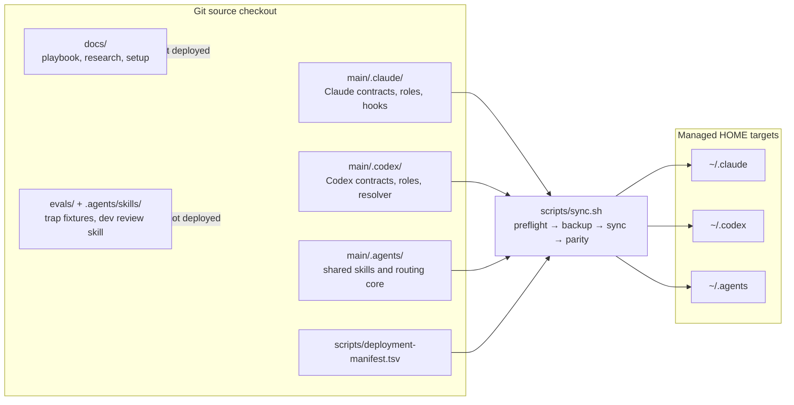
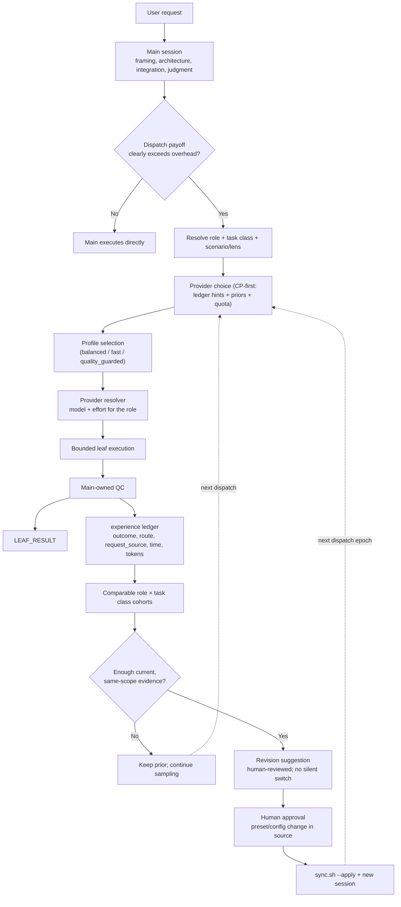

# agent-harness

`agent-harness` 是 Claude Code、Codex 與跨 agent 共用資源的全域配置管理專案。它把原本散落在
`~/.claude`、`~/.codex`、`~/.agents` 的手寫契約、leaf roles、skills、routing 與監控機制納入
Git，讓配置可以 review、測試、部署、回滾，而不會覆蓋憑證、session 或其他機器狀態。

這個專案主要解決四件事：

- **品質優先的派工**：main 保留架構與最終判斷；leaf 只處理有界、可驗收的工作。
- **可調整但不漂移的 routing**：benchmark 是先驗，本機 reviewed dispatch-outcome 證據才負責修正選擇。
- **跨平台一致契約**：Claude、Codex 與 Claude→Codex bridge 使用對應角色與相同品質語意。
- **可恢復的全域部署**：source checkout 是真相源；同步前先驗證，套用時備份，套用後比對。

## 系統全貌

### 配置與部署拓撲



`scripts/deployment-manifest.tsv` 是唯一的 source→HOME 映射。`scripts/sync.sh` 與 weekly integrity
共用這份清單，避免部署與漂移檢查各維護一套路徑。

### 派工與資料回饋迴路



## 執行模型

### Main 與七個 leaf roles

Main 不是派工器而已；它負責需求定義、歧義、架構、風險、切界、整合、最終驗證與對使用者
負責。直接執行是預設，只有平行性、context 保護、fresh-context independence 或較低成本角色
明顯值得派工開銷時才使用 leaf。

| Role | 使用時機 | 權限邊界 |
|---|---|---|
| `explore` | 大範圍定位，或具明確 lens 的有界專案 review | 唯讀；不設計、不實作、不做最終判斷 |
| `mech-executor` | pattern 與完成條件已完整 | 只做機械套用；遇到例外就停止 |
| `executor` | 封閉範圍內仍需要局部判斷的實作 | 可寫入；不擴大產品或架構範圍 |
| `plan-verifier` | material Plan 需要 fresh-context 挑戰 | 唯讀；只回 `READY`／`REVISE` |
| `verifier` | 高影響聲稱需要獨立反證 | 唯讀；只回 `CONFIRMED`／`REFUTED`／`INCONCLUSIVE` |
| `security-reviewer` | 核准前的 trust-boundary 與 abuse-path 分析 | 唯讀；不實作 |
| `security-executor` | 已核准安全契約的實作 | 可寫入；不得重開需求或弱化控制 |

Claude 與 Codex 各有一份自足角色契約；leaf 不讀 main orchestration 文件，也不能再派下一層。

### Role、task class 與 scenario 分離

不用為每種題材新增 agent：

- **Role** 決定權限、工具與責任。
- **Task class** 決定 experience-ledger 的比較 cohort，例如 `recon`、`review`、`impl`、`verify`。
- **Scenario／lens** 寫進 brief，決定這次要攻擊的接縫，例如 `semantic-seams`、
  `state-concurrency`、`contract-boundaries`、`test-validity`。

`explore + recon` 預設 spot QC；對抗式 `explore + review` 預設 full QC，兩者不混算。
完整 brief 與停止條件見
[Briefs and Stops](main/.claude/skills/baton-dispatch/references/briefs-and-stops.md)。

### Routing 語意

三個 profile 都先滿足角色品質門檻，再最佳化第二目標：

| Profile | 用途 |
|---|---|
| `balanced` | 能力、時間、成本與 token 的日常平衡 |
| `fast` | 通過品質門檻後，優先較低時間／輸出成本 |
| `quality_guarded` | 高風險、高影響或高度不確定工作，提高能力餘裕 |

不同 surface 的套用方式不同：

| Surface | Routing 套用方式 |
|---|---|
| Main session | 使用者在 task/session 開始前選擇；專案不會在執行中偷換模型 |
| Claude named roles | deployment preset；一次原子更新全部 frontmatter pins，重新部署並開新 session |
| Native Codex leaf | 每次派工由 resolver 回傳 model／effort／invocation |
| Claude→Codex bridge | 每次派工以 `claude-bridge` surface 解析；不套用 Claude pins |

實際模型、effort、benchmark 快照與 availability evidence 在
[Claude routing](main/.claude/model-routing.toml) 和 [Codex routing](main/.codex/model-routing.toml)。
數據口徑與選擇理由見[研究摘要](docs/harness-engineering-research.md)。

### 結構化派工回報

Main 必須把派工與 QC 結果獨立成固定紀錄，不混在一般對話中：

```text
[LEAF_DISPATCH] task=semantic seam review | role=explore | class=review | request_source=claude-code | route=balanced/claude/claude-sonnet-5/low | reason=context-protection
[LEAF_RESULT] task=semantic seam review | outcome=accepted | qc=full | ledger=logged
```

`request_source` 可區分 `claude-code`、`codex`、`claude-code-plugin-codex`。相同中性 task label 會寫入
machine-local experience ledger，方便人類回顧與 telemetry 對照。

## 機制與護欄

| 機制 | 解決的問題 | 真相源 |
|---|---|---|
| Routing validator／pin check | 阻止不完整 profile、品質門檻以下 route 與 Claude pin 漂移 | `main/.claude/scripts/model-routing`、`main/.codex/scripts/model-routing` |
| Runtime guard | 需要新版能力的 reviewer 在版本過舊或未知時停止 | [runtime-guard.py](main/.claude/hooks/runtime-guard.py) |
| Delegation audit | 記錄 start/stop 並偵測 leaf 再派 leaf | [delegation-audit.py](main/.claude/hooks/delegation-audit.py) |
| Experience pending／ledger | 將 dispatch、route、source、token、時間與 QC outcome 綁在一起 | [experience-ledger](main/.agents/skills/experience-ledger/SKILL.md) |
| Weekly integrity | 檢查 source／HOME 漂移、pins、delegation alarm 與 ledger 狀態；覆蓋不完整（如 resolver 缺失）即列 finding 並扣住週章 | [weekly-integrity.py](main/.claude/hooks/weekly-integrity.py) |
| Commit test gate | 紅測試套件不得 commit；解析指令實際指向的每個 repo，逃生口 `AGENT_SKIP_TEST_GATE=1` | [commit-test-gate.py](main/.claude/hooks/commit-test-gate.py) |
| Gate-line QC／trap evals | 機械稽核 leaf 報告的 INTENT/TWINS/AUTH owed lines；行為 trap fixtures 作回歸資產 | [gate_lines.py](main/.agents/scripts/gate_lines.py)、[evals/traps/](evals/traps/) |
| RTK／Headroom | 控制工具輸出與大型唯讀 context；不可冒充模型配額 | [RTK](main/.claude/RTK.md)、[Headroom runtime](main/.agents/docs/headroom-runtime.md) |

Hooks 與監控預設 fail-open，避免本機診斷工具故障阻塞正常工作。兩個刻意 fail-closed 的例外：runtime guard 的 PreToolUse gate（版本過舊或未知時擋受限 reviewer 派工）與 commit test gate（紅套件或逾時直接擋 commit）；真正的 correctness gate 仍由 focused tests、contract tests、主 session QC 與必要時的獨立 verifier 負責。

## Repository 佈局

| 路徑 | 真相源與職責 | 部署目標 |
|---|---|---|
| [`main/.claude/`](main/.claude/README.md) | Claude Code 契約、roles、skills、hooks、prompts、routing | `~/.claude/` |
| [`main/.codex/`](main/.codex/README.md) | Codex 契約、roles、resolver、bridge、可攜 config 片段 | `~/.codex/` |
| [`main/.agents/`](main/.agents/README.md) | 兩端共用 skills、routing core 與 runtime 知識 | `~/.agents/` |
| [`docs/`](docs/README.md) | 方法論、研究、部署說明與歷史決策；不回寫全域 | — |
| [`evals/`](evals/) | 行為 trap fixtures 與機械 grader；只在 repo 內取證 | — |
| [`.agents/skills/`](.agents/skills/) | repo 內部維運 skills（如 harness-review）；dev-only | — |
| [`scripts/`](scripts/) | 單一 manifest 驅動的部署與驗證入口 | 執行工具 |

## 快速開始

完整前置需求、machine-local merge 與回滾方式見 [配置與部署說明](docs/setup.md)。最短安全流程：

```bash
# 1. 在 source checkout 檢查所有 preflight 與預計同步內容
scripts/sync.sh

# 2. review dry-run 後才回寫全域配置；套用前會建立備份
scripts/sync.sh --apply

# 3. 開新的 Claude Code / Codex session，讓契約與 roles 重新載入
```

首次部署（或 merge 檔變更）還需要兩個 sync 永不自動執行的 machine-local merge：
`main/.codex/config.merge.toml` → `~/.codex/config.toml`（`agents.max_depth`、角色註冊、信任設定，
見 [main/.codex/DEPLOY.md](main/.codex/DEPLOY.md)）；`main/.claude/examples/headroom-mcp.merge.json` →
`~/.claude/mcp_servers.json`（選用 Headroom 時）。

Claude profile 若要持久切換，先在 source checkout 執行：

```bash
main/.claude/scripts/model-routing activate-profile --profile <balanced|fast|quality_guarded> --dry-run
main/.claude/scripts/model-routing activate-profile --profile <balanced|fast|quality_guarded>
scripts/sync.sh --apply
```

Codex leaf 不需改檔，派工前直接解析：

```bash
main/.codex/scripts/model-routing resolve --priority balanced --role executor
main/.codex/scripts/model-routing resolve --surface claude-bridge --priority quality-guarded --role verifier
```

## 管理邊界

專案只管理可攜、手寫且可 review 的配置。以下保留為 machine-local，不會被 Git 或自動部署覆蓋：

- credentials、auth、sessions、history、cache 與 telemetry ledger
- `main/.claude/mcp_servers.json` 中的本機路徑
- `main/.codex/config.toml` 中的 proxy、信任、登入與其他機器狀態
- manifest 外的其他全域 skills

可攜片段只提供 merge 來源：

- `main/.claude/examples/headroom-mcp.merge.json` 手動併入 `~/.claude/mcp_servers.json`
- `main/.codex/config.merge.toml` 手動併入 `~/.codex/config.toml`

## 文件導覽

從 [docs/README.md](docs/README.md) 依工作目的進入：

- [Harness Engineering Playbook](docs/harness-engineering.md)：跨專案設計與維運方法。
- [研究摘要](docs/harness-engineering-research.md)：Artificial Analysis、成本模型、本機實驗與證據限制。
- [配置與部署](docs/setup.md)：bootstrap、dry-run、apply、驗收與回滾。
- [常駐契約瘦身規範](docs/contract-slimming.md)：CLAUDE.md 與 AGENTS.md 的內容判定、預算與驗收。
- [目前 orchestration plan](main/.claude/plans/orchestration-plan.md)：現況、未決項與短決策紀錄。

文件採單一職責：runtime 規則放 contracts，角色能力放 agent files，按需流程放 skills，方法與
研究放 docs；README 只提供全貌與入口，不複製細節真相源。

## 驗證

```bash
python3 -m unittest discover -s main/.claude/tests -v
main/.claude/scripts/model-routing validate
main/.claude/scripts/model-routing check-pins
main/.codex/scripts/model-routing validate
git diff --check
scripts/sync.sh
```

`scripts/sync.sh` 的 dry-run 會先執行 preflight；任何 contract、routing、JSON、shell 或部署
manifest 驗證失敗，都會在寫入前停止。

## License

[MIT](LICENSE)。
