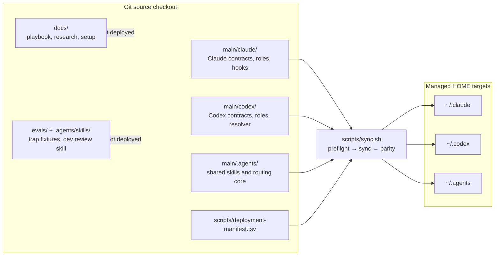

# agent-harness

`agent-harness` 把原本散落在 `~/.claude`, `~/.codex`, `~/.agents` 的手寫契約, leaf roles,
skills, routing 與監控機制納入 Git —— 讓全域 agent 配置可以 review, 測試, 部署, 回滾, 而
**不會覆蓋憑證, session 或其他機器狀態**.

它解決四件事:

- **品質優先的派工**: main 保留架構與最終判斷; leaf 只處理有界, 可驗收的工作.
- **可調整但不漂移的 routing**: benchmark 是先驗, 本機 reviewed dispatch-outcome 證據才負責修正選擇.
- **跨平台一致契約**: Claude, Codex 與 Claude→Codex bridge 使用對應角色與相同品質語意.
- **可恢復的全域部署**: source checkout 是真相源; 同步前先驗證, 套用後比對; 回滾靠 git 重新部署.

## 架構速覽

一條路進, 一條路出: **`scripts/deployment-manifest.tsv` 是唯一的 source→HOME 映射**,
`scripts/sync.sh` 與 weekly integrity 共用它, 所以部署與漂移檢查不會各維護一套路徑.


```mermaid
flowchart LR
    subgraph repo["Git source checkout"]
        claude["main/claude/<br/>Claude contracts, roles, hooks"]
        codex["main/codex/<br/>Codex contracts, roles, resolver"]
        shared["main/.agents/<br/>shared skills and routing core"]
        docs["docs/<br/>playbook, research, setup"]
        devonly["evals/ + .agents/skills/<br/>trap fixtures, dev review skill"]
        manifest["scripts/deployment-manifest.tsv"]
    end

    sync["scripts/sync.sh<br/>preflight → sync → parity"]

    subgraph home["Managed HOME targets"]
        homeClaude["~/.claude"]
        homeCodex["~/.codex"]
        homeAgents["~/.agents"]
    end

    claude --> sync --> homeClaude
    codex --> sync --> homeCodex
    shared --> sync --> homeAgents
    manifest --> sync
    docs -. "guides; not deployed" .-> repo
    devonly -. "repo-only; not deployed" .-> repo
```

設計本身分四層, 由內而外包住 —— 內層決定的事, 外層都建立在上面:

| 層 | 管什麼 | 細節 |
|---|---|---|
| **Graph** | 多個 agent 之間的協作: 誰先做, 誰並行, 做完給誰 | [graph-engineering](docs/architecture/graph-engineering.md) |
| **Loop** | 單一 agent 反覆進行: 規劃 → 執行 → 驗證 → 重試 | [loop-engineering](docs/architecture/loop-engineering.md) |
| **Harness** | 模型周圍: 工具, 權限, 監控, 防護欄 | [harness-engineering](docs/architecture/harness-engineering.md) |
| **Context** | 模型看到什麼 | [context-engineering](docs/architecture/context-engineering.md) |

另有四件不屬於任何一層. 三件是**問出來的**: **證據** (憑什麼算數), **授權** (每一道機制停
在誰手上) 與**成本** (這樣做值不值得). 一件是**每一層都要走過的同一條管線**: **部署** (規則
怎麼真的到機器上). 什麼算一層的判準, 完整資料流, 兩條軸與升級評估的五個問題在
[架構總覽](docs/architecture/architecture.md).

### Repository 佈局

| 路徑 | 真相源與職責 | 部署目標 |
|---|---|---|
| [`main/claude/`](main/claude/README.md) | Claude Code 契約, roles, skills, hooks, prompts, routing | `~/.claude/` |
| [`main/codex/`](main/codex/README.md) | Codex 契約, roles, resolver, bridge, 可攜 config 片段 | `~/.codex/` |
| [`main/.agents/`](main/.agents/README.md) | 兩端共用 skills, routing core 與 runtime 知識 | `~/.agents/` |
| [`docs/`](docs/README.md) | 方法論, 研究, 部署說明與歷史決策; 不回寫全域 | — |
| [`evals/`](evals/) | 行為 trap fixtures 與機械 grader; 只在 repo 內取證 | — |
| [`.agents/skills/`](.agents/skills/) | repo 內部維運 skills (如 harness-review); dev-only | — |
| [`scripts/`](scripts/) | 單一 manifest 驅動的部署與驗證入口 | 執行工具 |

## 快速部署

完整前置需求, machine-local merge 與回滾方式見 [配置與部署說明](docs/setup.md). 最短安全流程:

```bash
# 1. 在 source checkout 檢查所有 preflight 與預計同步內容
scripts/sync.sh

# 2. review dry-run 後才回寫全域配置
scripts/sync.sh --apply

# 3. 開新的 Claude Code / Codex session, 讓契約與 roles 重新載入
```

`sync.sh --apply` 依 manifest 併入 `main/codex/config.merge.toml` (`merge-toml`, 見
[main/codex/DEPLOY.md](main/codex/DEPLOY.md)); 不由 sync 管理的只有選用 Headroom
proxy 與 MCP. legacy fallback 見 [配置說明](docs/setup.md).

Claude profile 若要持久切換, 先在 source checkout 執行:

```bash
main/claude/scripts/model-routing activate-profile --profile <balanced|fast|quality_guarded> --dry-run
main/claude/scripts/model-routing activate-profile --profile <balanced|fast|quality_guarded>
scripts/sync.sh --apply
```

Codex leaf 不需改檔, 派工前直接解析:

```bash
main/codex/scripts/model-routing resolve --priority balanced --role executor
main/codex/scripts/model-routing resolve --surface claude-bridge --priority quality-guarded --role verifier
```

## 機制與護欄

| 機制 | 解決的問題 | 真相源 |
|---|---|---|
| Routing validator/pin check | 阻止不完整 profile, 品質門檻以下 route 與 Claude pin 漂移 | `main/claude/scripts/model-routing`, `main/codex/scripts/model-routing` |
| Alias generation check | `opus` 指向哪個世代由 CLI 決定; 以 leaf transcript 的真實 model id 驗證 config 的宣稱 | [model-routing.py](main/claude/scripts/model-routing.py) |
| Runtime guard | 需要新版能力的 reviewer 在版本過舊或未知時停止 | [runtime-guard.py](main/claude/hooks/runtime-guard.py) |
| Capability-aware verifier | Claude 的 no-write role 不提供 Bash; 需要執行命令的獨立驗證改派 Codex read-only sandbox | [provider-routing](main/claude/skills/provider-routing/SKILL.md) |
| Verifier 額度 | 規則是每個 top-level task 一個 outcome verifier, 機制擋的是同一個 prompt 內的第二個 Claude `verifier` (跨 prompt 少擋, 不誤擋; 走 `codex:codex-rescue` 的 Codex verifier 不計額度, bridge 名稱不分角色); artifact 所有權仍屬判斷, 刻意不做成假 gate | [verifier-quota.py](main/claude/hooks/verifier-quota.py), [dispatch-lifecycle](docs/dispatch-lifecycle.md) |
| Delegation audit | 記錄 start/stop 並偵測 leaf 再派 leaf | [delegation-audit.py](main/claude/hooks/delegation-audit.py) |
| Denial log | 五個 gate 會留下拒絕紀錄, 攔截時各留一行 (gate, 短代碼 reason, session), 讓「多常擋人」數得出來; git 側的 pre-commit 不走這條路徑, 它在 git 自己的邊界上. 只記錄, 不做決策, 且記錄失敗不影響攔截 | [denial_log.py](main/claude/hooks/denial_log.py), [hook 系統](docs/hook-system.md) |
| Experience pending/ledger | 將 dispatch, route, source, token, 時間與 QC outcome 綁在一起 | [experience-ledger](main/.agents/skills/experience-ledger/SKILL.md) |
| Bridge 存活對帳 | bridge job 比 launcher 長命; 重啟前擋下同一 prompt 的雙寫 | [dispatch-lifecycle](docs/dispatch-lifecycle.md), [bridge-jobs](main/codex/scripts/bridge-jobs) |
| Weekly integrity | 檢查 source/HOME 漂移, pins, delegation alarm 與 ledger 狀態; 覆蓋不完整 (如 resolver 缺失) 即列 finding 並扣住週章 | [weekly-integrity.py](main/claude/hooks/weekly-integrity.py) |
| Commit test gate | 紅測試套件不得 commit. 兩道互補的閘: Bash hook 在執行前解析指令實際指向的每個 repo (指不出目標即擋), git pre-commit 則在 argv 邊界涵蓋本 repo 經 git hook 路徑的 commit (wrapper, function, PATH 覆蓋). 兩者都是本機閘: `--no-verify`, `-c core.hooksPath=…`, `commit-tree` 能自行停用 hook, 藏進 wrapper 就兩邊都看不見, 只有 CI 關得掉. 逃生口 `AGENT_SKIP_TEST_GATE=1` | [commit-test-gate.py](main/claude/hooks/commit-test-gate.py), [githooks/pre-commit](main/claude/githooks/pre-commit) |
| Gate-line QC/trap evals | 機械稽核 leaf 報告的 INTENT/TWINS/AUTH owed lines; 行為 trap fixtures 作回歸資產 | [gate_lines.py](main/.agents/scripts/gate_lines.py), [evals/traps/](evals/traps/) |
| RTK/Headroom | 控制工具輸出與大型唯讀 context; 不可冒充模型配額 | [RTK](main/claude/RTK.md), [Headroom runtime](main/.agents/docs/headroom-runtime.md) |

診斷型 hook (delegation audit, experience pending, weekly integrity) 一律 fail-open, 避免本機工具故障阻塞正常工作. 刻意 fail-closed 的是六個有界 gate: commit test gate 的 Bash 與 git pre-commit 兩側 (紅套件或逾時擋 commit), leaf-redispatch (leaf 嘗試再派工), runtime guard 的 PreToolUse gate (版本過舊或未知時擋受限 reviewer 派工), verifier 額度 (同一個 prompt 內的第二個 outcome verifier), 與 managed-target-guard (寫入 manifest 整份託管的 HOME 檔案). 它們各自只在狹窄條件下攔截; 真正的 correctness gate 仍由 focused tests, contract tests, 主 session QC 與必要時的獨立 verifier 負責. hook 系統的完整語意見 [hook 系統](docs/hook-system.md).

## 管理邊界

專案只管理可攜, 手寫且可 review 的配置. 以下保留為 machine-local, 不會被 Git 或自動部署覆蓋:

- credentials, auth, sessions, history, cache 與 telemetry ledger
- `~/.claude.json` MCP entries
- `~/.codex/config.toml` 中的 provider, proxy, 信任, 登入與其他機器狀態
- manifest 外的其他全域 skills

可攜片段只提供 merge 來源:

- `main/codex/config.merge.toml` 由 `sync.sh` 以 `merge-toml` 併入 `~/.codex/config.toml`

## 驗證

```bash
main/.agents/scripts/python3-run -m unittest discover -s main/claude/tests -v
main/claude/scripts/model-routing validate
main/claude/scripts/model-routing check-pins
main/claude/scripts/model-routing check-aliases
main/codex/scripts/model-routing validate
git diff --check
scripts/sync.sh
```

十一支只報不擋的工具, 不在上面的驗收鏈裡, 因為它們回答的是「現在長什麼樣」而不是「這次改動對不對」:

```bash
scripts/evidence-check.py         # SHA 引用是否還解得開; trap 結果列的量測面指紋是否還是出貨版本
scripts/docs-size-report.py       # docs/ 體積, 分現行指引與紀錄兩層 (這層沒有字數預算, 見 docs/README.md 規則 8)
scripts/resident-pool-report.py   # 這台機器實際的常駐 skill 描述量, 與預算蓋到的比例
scripts/zh-tw-usage-report.py     # 本 repo 自己的中文有沒有用到它出貨在校正的中國用語
scripts/codename-gloss-report.py  # 說明類文件有沒有直接丟出內部代號而不解釋
scripts/denial-report.py          # 這些閘實際擋了多少次, 擋在什麼理由上
scripts/context-inflow-report.py  # 真實工作階段裡, 窗口實際被什麼填滿 (常駐只佔約 15%)
scripts/memory-freshness-report.py # CLI 記憶裡指涉的路徑與連結是否還解得開
scripts/machine-state-check.py     # 跑套件 (或任一指令) 會不會改到 repo 以外的東西
scripts/upstream-pin-report.py     # 蒸餾來源的上游有沒有動過我們記下的那個 pin
scripts/budget-drift-report.py     # 字數天花板被調高過幾次, 調在哪幾份, 現在誰貼著上限
```

`scripts/contract-operator-delta.py` 刻意不在這張表: 它是契約精簡流程裡的佐證步驟, 不是
「現在長什麼樣」的儀器.

`scripts/sync.sh` 的 dry-run 會先執行 preflight; 任何 contract, routing, JSON, shell 或部署
manifest 驗證失敗, 都會在寫入前停止.

## 文件導覽

由上而下讀懂整套設計, 從[架構總覽](docs/architecture/architecture.md)開始 —— 它給完整資料流,
四層地圖與升級評估, 再指向每一層. 其餘依工作目的從 [docs/README.md](docs/README.md) 進入:

- [Engineering playbook](docs/engineering-playbook.md): 可跨專案複用的設計與驗證方法, 以及每條通則的完整論證.
- [研究摘要](docs/research/README.md): benchmark 快照, 成本模型, 本機實驗與證據限制.
- [配置與部署](docs/setup.md): bootstrap, dry-run, apply, 驗收與回滾.
- [常駐契約瘦身規範](docs/contract-slimming.md): CLAUDE.md 與 AGENTS.md 的內容判定, 預算與驗收.
- [Orchestration 不變量](docs/plans/orchestration-state.md): 八條必須成立的性質與各自的擁有者.

文件採單一職責: runtime 規則放 contracts, 角色能力放 agent files, 按需流程放 skills, 方法與
研究放 docs; 本文只提供全貌與入口, 不複製細節真相源.

## License

[MIT](LICENSE).
