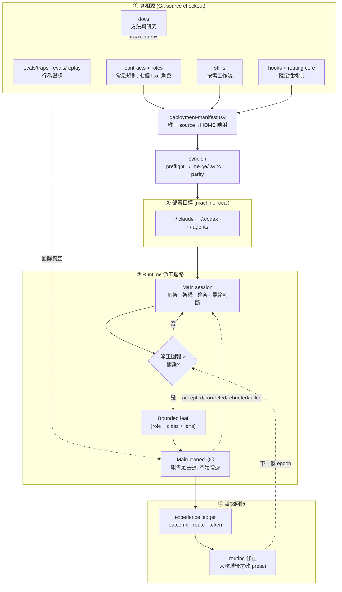

# Harness 架構總覽

這份文件由上而下走一遍 agent-harness 的設計: 先看完整架構圖與核心想法, 再看**規則的
座標系**與**升級評估的五個問題** —— 那兩節是本文的模型, 用來判斷一個改動該放哪裡, 以及
它憑什麼算數 —— 然後才是派工與 QC, 生命週期與驗證, hook 系統, 最後指向各附檔. 主文只講
骨幹與為什麼; 每一層的細節都在專門文檔裡, 這裡用白話說明它們各自回答什麼問題.

想直接動手部署的人看 [setup](setup.md); 想改 runtime 行為的人記得真相源是
`main/` 下的契約與 skill, 不是本文.

## 一. 完整架構圖

四個區塊對應四個關注點, 各有專門文檔: **部署** (①→②, [setup](setup.md)),
**派工與 QC** (③, [qc-explainer](qc-explainer.md)), **生命週期驗證**
(③ 的狀態, [dispatch-lifecycle](dispatch-lifecycle.md)), **證據回饋**
(④, [experience-ledger](../main/.agents/skills/experience-ledger/SKILL.md)).

## 二. 核心想法與研究指引

一句話: **把配置當程式管理** — 原本散在 `~/.claude`, `~/.codex`, `~/.agents` 的手寫契約
納入 Git, 可以 review, 測試, 部署, 回滾, 而不覆蓋憑證與機器狀態. 四個支柱:

1. **品質優先的派工**: main 保留架構與最終判斷, leaf 只做有界, 可驗收的工作. 直接執行是
   預設, 只有平行性, context 保護, fresh-context 獨立性或較低成本角色明顯值得開銷時才派工.
2. **可調整但不漂移的 routing**: benchmark 只是外部先驗, 本機 reviewed dispatch-outcome
   證據才負責修正選擇 — 而且改 preset 一定經人核准, 不在執行中偷換.
3. **跨平台一致契約**: Claude, Codex 與 Claude→Codex bridge 用對應角色與相同品質語意.
4. **可恢復的部署**: source 是真相源, 同步前 preflight, 套用後 parity, 回滾靠 git 重新部署.

方法論本身 (為什麼常駐檔要瘦, 規則什麼時候該進契約 vs skill vs hook) 在
[playbook](harness-engineering.md); 支撐它的 benchmark 快照, 成本口徑與研究缺口在
[研究摘要](research/README.md). 一個貫穿全域的判準: **常駐內容是注意力稅,
每條新規則稀釋所有其他規則**, 所以規則只寫模型推不出來的東西, 其餘走漸進揭露與確定性機制.

## 三. 規則的座標系

前兩節說的是「有什麼」. 這一節說的是**任何一條規則進來時要先回答的兩個問題**: 它放在
哪裡, 以及它憑什麼算數. 兩個問題各自是一條軸, 而評估一個升級就是在這兩條軸上挑一個
座標, 然後說清楚挑錯了會怎樣.

### 軸一: 在哪裡付費

同一句話寫在不同層, 付費次數完全不同: 常駐是每一回合一次, 拉取是有人打開時一次, 機械是零.
這條軸決定的就是**誰付, 付幾次**:

| 層 | 什麼時候付 | 放什麼 | 由什麼量 |
|---|---|---|---|
| **常駐** | 每一回合都在 context 裡 | 兩份契約; 每支 skill 與 role 的 `name` + `description` | [prompt-surface-census.py](../scripts/prompt-surface-census.py) 的 `resident` 桶; 字數上限由 contract tests 擋 |
| **派工** | 該 skill 或 role 真的被載入時 | skill 本文, role 本文, `references/` | 同一支腳本的 `dispatch` 與 `roles` 兩桶 |
| **拉取** | 有人打開它時付一次, 而且可以不看完 | `docs/` | [docs-size-report.py](../scripts/docs-size-report.py), 只報不擋 |
| **機械** | 毫秒級, 完全不佔注意力 | hooks, tests, 報告腳本 | 測試套件自己 |

數字不抄在這裡, 因為抄了就會過期 —— 跑那兩支腳本, 它們讀的是當下的 checkout. 三件跟
直覺不一樣的事值得先知道:

- **skill 的 `description` 是常駐的, 本文不是.** 把一句話從本文搬進 description 是漲常駐,
  不是搬家. 而 Codex 上 `allow_implicit_invocation: false` 的 skill 連 description 都不
  注入, 兩半都算派工成本 —— 所以兩端不是同一張表.
- **role 的 `description` 同樣常駐.** 兩家 CLI 都在每個 session 列出所有已註冊角色, 那份
  清單就是選角面.
- **`docs/` 沒有字數預算**, 因為它是拉取成本. 但它分兩層: 只有現行指引那一層必須是真的,
  紀錄那一層刻意保留被後來證據推翻的段落.

### 軸二: 憑什麼算數

這條軸決定的是**這條規則有多大機率真的發生**. 每一級在本機都有數據, 而數據的方向不好看:

| 強度 | 形式 | 實際買到什麼 | 本機證據 |
|---|---|---|---|
| **散文** | 契約或 skill 裡的一句話 | 權重, 不是強制力 | 系統提示與契約正面衝突時, 四條規則裡三條輸得乾乾淨淨 (注入勝 5/5), 贏的那條也只有 3/5 (2026-08-14 replay `p1b`) |
| **措辭** | 同一條規則的不同寫法 | 觸發頻率, 幅度可以到三倍 | 2026-08-16: 改一句話, 遵守率三倍; 但它改變的是觸發頻率, 不是規則的範圍 |
| **承載物** | 必填欄位, 固定格式行 | 可被機械檢查的事實 | 派工五狀態每一狀態都有實體承載物; 沒有承載欄位的規則驗不了 |
| **閘** | hook, test | 條件成立必攔, 但條件很窄 | 六個有界 gate, 每個都有逃生口 |
| **儀器** | 只報不擋的腳本 | 可觀測性, 零強制力 | 清單與各自回答什麼問題在[根 README](../README.md) |

**這條軸上最貴的錯誤是把散文當成閘.** s11 的 90 個 run, 加上 replay `d1`/`d2` 的 21 個
run, 都在問同一件事 —— 在契約裡提到一支 skill 會不會讓它比較容易被載入 —— 答案是零位移.
但尺並沒有瞎: 2026-08-15 的反向對照拿掉語言子句, 中文輸出從 5/5 掉到 0/5. 子句確實有
效, 只是它的作用面不是直覺猜的那一面.

## 四. 升級評估: 五個問題

一個提案要能被評估, 得先變成**可以錯**的形狀. 這五個問題就是那個形狀; 少一個, 它還是
偏好而不是結論.

1. **座標**: 落在哪一格? 動到誰的預算? (軸一 × 軸二)
2. **證據**: 手上的證據在哪一階? 這一類改動最低要求哪一階? (見下表)
3. **推翻條件**: 什麼觀察會讓它變成錯的? 寫不出來的提案不進場.
4. **降級方案**: 推翻條件成立時退到哪裡? 事前寫死, 不是事後決定.
5. **回歸閘**: 哪一個檢查在修好之前應該是紅的? 沒紅過的測試不是證據.

第 3 與第 4 不是形式主義. 兩批方向的推翻條件查核結果: 第一批七條裡**五條的原始理由不
成立**, 第二批查了四條, **四條全部不成立** (見[落地紀錄](research/README.md#方向與落地紀錄)).
那不是規劃品質差, 是推翻條件在做它該做的事 —— 真正該擔心的是某一批全部命中.

### 每一類改動的最低證據

證據階梯本身 (L0 讀文件 → L5 真實消費端) 在
[evidence-ladder](../main/.agents/skills/evidence-ladder/SKILL.md). 這張表只回答「這一類
改動最低要站到哪一階」:

| 改動 | 最低證據 | 為什麼是這一階 |
|---|---|---|
| 改常駐子句的**措辭** | 事前登記的本機 A/B | 遵守率對措辭敏感到三倍; 而點估計翻倍都可能過不了事前門檻 |
| **新增**常駐子句 | 先證明「刪掉它模型會犯錯」, 再做預算換算 | 每條新規則稀釋所有其他規則, 而矛盾比稀釋更貴 |
| 新增或改動 **gate** | pipe-test + 蓄意錯誤驗證 + 逃生口 | 抓不到蓄意錯誤的機制等於不存在 |
| 換 **model/effort pin** | 同 role, 同 task class, 同 route cell 的本機 ledger | 外部榜單只做先驗, 本機結果覆蓋它 |
| 新增 **role** | 同 cohort 證明現有角色契約不足 | 不要為題材開角色; role, task class, lens 是三條獨立的軸 |
| 改**部署映射** | manifest 列 + preflight + parity + 目標端證據 | repo 說了不等於部署了 |
| 改**文件敘述** | 分層判定: 現行指引必須是真的, 紀錄保留原措辭與原日期 | 一份紀錄被改成今天的數字, 就不再是證據 |

### 四種「看起來過了」

這個模型是從這四種失效長出來的, 每一種在本 repo 都真的發生過:

| 看起來 | 實際上 | 本機案例 |
|---|---|---|
| 規則寫進去了 | 不代表它會生效 | 字串測試只證明規則存在; 行為得靠 trap 量 |
| 測試綠 | 不代表那道閘紅得起來 | 文件涵蓋閘用 `fnmatch` 比對, 而 `*` 會跨 `/`, 於是每條 pattern 都是遞迴的, 三週內 77k 字的實驗紀錄悄悄進了現行指引 |
| 儀器沒響 | 不代表沒問題 | 中國用語掃描第一次跑出 60 筆, 其中 57 筆是同一個誤判 —— 未校準的儀器等於永久告警 |
| 文件寫了 | 不代表部署了 | repo 政策, 可部署狀態, 機器狀態, 執行中狀態是四類證據, 任一類都不能拿來證明另一類 |

## 五. QC 派發架構

coding agent 最有據可查的失敗不是「做不出來」, 而是「宣稱做完了, 但沒有」. 所以 QC 的
定位不是不信任 leaf 的能力, 而是把**「報告是一組待證主張」**這件事制度化: 每次派工結束,
main 依序做收件分級 → 機械稽核 owed lines → 抓詐欺清單 (含強制 grep 覆核) → 四級裁決入帳.

派工的三個維度刻意分開, 不要為每個題材新增 agent:

| 維度 | 決定什麼 | 例 |
|---|---|---|
| **Role** | 權限, 工具, 判斷與停止邊界 | 七個固定角色 (explore 唯讀, executor 可寫…) |
| **Task class** | ledger 的可比較 cohort | recon · review · impl · verify · security |
| **Scenario/lens** | 這次要攻擊的接縫 | semantic-seams · state-concurrency · test-validity |

有約束力的 QC 規則字面在 [baton-dispatch](../main/claude/skills/baton-dispatch/SKILL.md)
與 [leaf-dispatch](../main/codex/skills/leaf-dispatch/SKILL.md); 白話的「為什麼可以信」在
[qc-explainer](qc-explainer.md). 關鍵設計取捨: leaf 契約只放少量決策點強制行
(INTENT/TWINS/AUTH, 有 A/B 實驗背書). 謊言與遺漏的攔截責任放在 QC 機制 — 因為機制勝過
提醒, 工具不會忘記設旗標, grep 不會被漂亮的報告說服.

## 六. 生命週期與驗證收斂

一次派工從解析路由到寫進 ledger 有五個狀態, 每個狀態都要有**實體承載物**, 不能只是散文
約定 — 沒有承載欄位的規則無法驗證. 這是本 harness 反覆用來抓自己漏洞的準則:

| 狀態 | 承載物 |
|---|---|
| resolved → launched → running → collected → logged | resolver JSON · dispatch_id · provider job 狀態 · LEAF_RESULT · ledger 記錄 |

兩個「不成立的推論」就是靠這準則抓出來的: **launcher 死了 ≠ 派工死了** (bridge job 比
launcher 長命, 重啟前要對帳, 否則同一 prompt 雙寫), **派工者說的 route ≠ 實際跑的 route**
(bridge 路由改由 provider 自己的 rollout 背書). 完整的狀態, 承載物與驗證清單在
[dispatch-lifecycle](dispatch-lifecycle.md).

驗證收斂的總原則: **最短驗證迴路優先**. 秒級檢查前移到 hook; 中等成本由 agent 明確執行;
慢速或主觀驗收由人執行, agent 供證據.

Fresh verifier 放在完整主張可反駁的最小整合邊界, 每個 top-level task 至多一個.
[verifier-quota](../main/claude/hooks/verifier-quota.py) 機械攔得住的只有同一個 prompt
內的第二個 Claude `verifier`. 跨 prompt 重複, 以及走 `codex:codex-rescue` bridge 的
Codex verifier (bridge 名稱不分角色, 額度看不到), 仍由主 session 判斷.

## 七. Hook 系統實作

Hook 是把「規則」變成「機制」的地方: 需要判斷的交給模型, 能機械判定的交給 hook. 預設
**fail-open** (診斷型故障時放行, 不阻塞工作); 刻意 **fail-closed** 的是六個有界 gate
(commit-test 的 Bash 與 git 兩側, leaf-redispatch, runtime-guard, verifier-quota,
managed-target-guard), 每個只在很窄的條件下攔截.

一個代表性設計: 唯讀角色的邊界是**能力面而非解析 shell** — no-write roles 根本不配 Bash,
因為 shell 的寫入途徑關不完; 需要跑指令的驗證改派 Codex `verifier` 並鎖 `sandbox_mode = "read-only"`.
逐事件清單, 失敗模式, 以及「為什麼值得信任 (三關驗證)」在 [hook 系統](hook-system.md).

## 八. 附檔導引

主文只給骨幹, 以下專門文檔各自回答一類問題:

| 附檔 | 回答什麼問題 |
|---|---|
| [數據研究](research/README.md) | 各 model/effort 的 benchmark 與成本口徑, 選擇理由, 以及還沒本機驗證的缺口 |
| [Fable 5 安全 fallback](fable-5-fallback.md) | 用 Fable 5 時怎麼避免被切到 Opus (把觸發內容派給 Opus leaf, 保持 main context 乾淨), 以及可行性邊界; 與本 repo 的跨 provider fallback 區分 |
| 資料來源與驗證 | benchmark 快照怎麼抓, 如何交叉驗證, 與前一版差異 — 見[研究摘要](research/model-evidence.md) 的快照章節, 逐格驗證口徑在兩份 [routing toml](../main/claude/model-routing.toml) 的 `data_verification` 欄位 |
| [context 收束規範](contract-slimming.md) | 常駐契約放什麼/不放什麼, 預算怎麼算, 怎麼驗收; 大型唯讀輸入的壓縮見 [headroom-runtime](../main/.agents/docs/headroom-runtime.md) |
| [hook 案例規範](hook-system.md) | hook 怎麼建, 怎麼 pipe-test, 失敗訊息怎麼回到模型 |
| [測試案例規範](harness-engineering.md#5-驗證迴路) | 行為 trap 怎麼設計, grader 為何不信報告, covenant「無失敗 trap 即修剪」 |

導覽總表與各文檔的職責邊界在 [docs/README](README.md).
