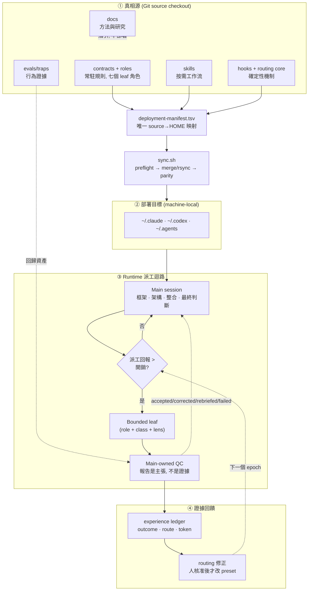

# Harness 架構總覽

這份文件由上而下走一遍 agent-harness 的設計: 先看完整架構圖, 再依序展開核心想法,
派工與 QC, 生命週期與驗證, hook 系統, 最後指向各附檔. 主文只講骨幹與為什麼; 每一層的
細節都在專門文檔裡, 這裡用白話說明它們各自回答什麼問題.

想直接動手部署的人看 [setup](setup.md); 想改 runtime 行為的人記得真相源是
`main/` 下的契約與 skill, 不是本文.

## 一. 完整架構圖

四個區塊對應四個關注點, 各有專門文檔: **部署** (①→②, [setup](setup.md)),
**派工與 QC** (③, [qc-explainer](qc-explainer.md)), **生命週期驗證**
(③ 的狀態, [dispatch-lifecycle](dispatch-lifecycle.md)), **證據回饋**
(④, [experience-ledger](../main/.agents/skills/experience-ledger/SKILL.md)).

## 二. 核心想法與研究指引

一句話: **把配置當程式管理** — 原本散在 `~/.claude`, `~/.codex`, `~/.agents` 的手寫契約
納入 Git, 可以 review, 測試, 部署, 回滾, 而不覆蓋憑證與機器狀態. 四個支柱:

1. **品質優先的派工**: main 保留架構與最終判斷, leaf 只做有界, 可驗收的工作. 直接執行是
   預設, 只有平行性, context 保護, fresh-context 獨立性或較低成本角色明顯值得開銷時才派工.
2. **可調整但不漂移的 routing**: benchmark 只是外部先驗, 本機 reviewed dispatch-outcome
   證據才負責修正選擇 — 而且改 preset 一定經人核准, 不在執行中偷換.
3. **跨平台一致契約**: Claude, Codex 與 Claude→Codex bridge 用對應角色與相同品質語意.
4. **可恢復的部署**: source 是真相源, 同步前 preflight, 套用後 parity, 回滾靠 git 重新部署.

方法論本身 (為什麼常駐檔要瘦, 規則什麼時候該進契約 vs skill vs hook) 在
[playbook](harness-engineering.md); 支撐它的 benchmark 快照, 成本口徑與研究缺口在
[研究摘要](research/README.md). 一個貫穿全域的判準: **常駐內容是注意力稅,
每條新規則稀釋所有其他規則**, 所以規則只寫模型推不出來的東西, 其餘走漸進揭露與確定性機制.

## 三. QC 派發架構

coding agent 最有據可查的失敗不是「做不出來」, 而是「宣稱做完了, 但沒有」. 所以 QC 的
定位不是不信任 leaf 的能力, 而是把**「報告是一組待證主張」**這件事制度化: 每次派工結束,
main 依序做收件分級 → 機械稽核 owed lines → 抓詐欺清單 (含強制 grep 覆核) → 四級裁決入帳.

派工的三個維度刻意分開, 不要為每個題材新增 agent:

| 維度 | 決定什麼 | 例 |
|---|---|---|
| **Role** | 權限, 工具, 判斷與停止邊界 | 七個固定角色 (explore 唯讀, executor 可寫…) |
| **Task class** | ledger 的可比較 cohort | recon · review · impl · verify · security |
| **Scenario/lens** | 這次要攻擊的接縫 | semantic-seams · state-concurrency · test-validity |

有約束力的 QC 規則字面在 [baton-dispatch](../main/claude/skills/baton-dispatch/SKILL.md)
與 [leaf-dispatch](../main/codex/skills/leaf-dispatch/SKILL.md); 白話的「為什麼可以信」在
[qc-explainer](qc-explainer.md). 關鍵設計取捨: leaf 契約只放少量決策點強制行
(INTENT/TWINS/AUTH, 有 A/B 實驗背書), 謊言與遺漏的攔截責任放在 QC 機制 — 因為機制勝過
提醒, 工具不會忘記設旗標, grep 不會被漂亮的報告說服.

## 四. 生命週期與驗證收斂

一次派工從解析路由到寫進 ledger 有五個狀態, 每個狀態都要有**實體承載物**, 不能只是散文
約定 — 沒有承載欄位的規則無法驗證. 這是本 harness 反覆用來抓自己漏洞的準則:

| 狀態 | 承載物 |
|---|---|
| resolved → launched → running → collected → logged | resolver JSON · dispatch_id · provider job 狀態 · LEAF_RESULT · ledger 記錄 |

兩個「不成立的推論」就是靠這準則抓出來的: **launcher 死了 ≠ 派工死了** (bridge job 比
launcher 長命, 重啟前要對帳, 否則同一 prompt 雙寫), **派工者說的 route ≠ 實際跑的 route**
(bridge 路由改由 provider 自己的 rollout 背書). 完整的狀態, 承載物與驗證清單在
[dispatch-lifecycle](dispatch-lifecycle.md).

驗證收斂的總原則: **最短驗證迴路優先**. 秒級檢查前移到 hook; 中等成本由 agent 明確執行;
慢速或主觀驗收由人執行, agent 供證據. Fresh verifier 放在完整主張可反駁的最小整合邊界,
每個 top-level task 至多一個; [verifier-quota](../main/claude/hooks/verifier-quota.py)
機械攔得住的是同一個 prompt 內的第二個 Claude `verifier`; 跨 prompt 的重複, 以及走
`codex:codex-rescue` bridge 的 Codex verifier (bridge 名稱不分角色, 額度看不到), 仍由主 session 判斷.

## 五. Hook 系統實作

Hook 是把「規則」變成「機制」的地方: 需要判斷的交給模型, 能機械判定的交給 hook. 預設
**fail-open** (診斷型故障時放行, 不阻塞工作); 刻意 **fail-closed** 的是五個有界 gate
(commit-test 的 Bash 與 git 兩側, leaf-redispatch, runtime-guard, verifier-quota),
每個只在很窄的條件下攔截.

一個代表性設計: 唯讀角色的邊界是**能力面而非解析 shell** — no-write roles 根本不配 Bash,
因為 shell 的寫入途徑關不完; 需要跑指令的驗證改派 Codex `verifier` 並鎖 `sandbox_mode = "read-only"`.
逐事件清單, 失敗模式, 以及「為什麼值得信任 (三關驗證)」在 [hook 系統](hook-system.md).

## 六. 附檔導引

主文只給骨幹, 以下專門文檔各自回答一類問題:

| 附檔 | 回答什麼問題 |
|---|---|
| [數據研究](research/README.md) | 各 model/effort 的 benchmark 與成本口徑, 選擇理由, 以及還沒本機驗證的缺口 |
| [Fable 5 安全 fallback](fable-5-fallback.md) | 用 Fable 5 時怎麼避免被切到 Opus (把觸發內容派給 Opus leaf, 保持 main context 乾淨), 以及可行性邊界; 與本 repo 的跨 provider fallback 區分 |
| 資料來源與驗證 | benchmark 快照怎麼抓, 如何交叉驗證, 與前一版差異 — 見[研究摘要](research/model-evidence.md) 的快照章節, 逐格驗證口徑在兩份 [routing toml](../main/claude/model-routing.toml) 的 `data_verification` 欄位 |
| [context 收束規範](contract-slimming.md) | 常駐契約放什麼/不放什麼, 預算怎麼算, 怎麼驗收; 大型唯讀輸入的壓縮見 [headroom-runtime](../main/.agents/docs/headroom-runtime.md) |
| [hook 案例規範](hook-system.md) | hook 怎麼建, 怎麼 pipe-test, 失敗訊息怎麼回到模型 |
| [測試案例規範](harness-engineering.md#5-驗證迴路) | 行為 trap 怎麼設計, grader 為何不信報告, covenant「無失敗 trap 即修剪」 |

導覽總表與各文檔的職責邊界在 [docs/README](README.md).
