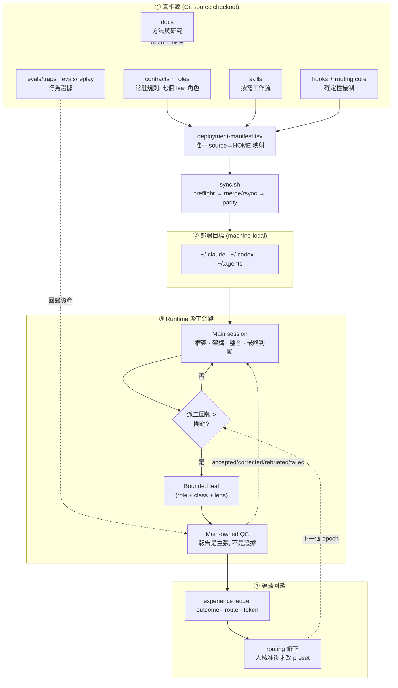

# Harness 架構總覽

這份文件由上而下走一遍 agent-harness 的設計: 完整架構圖, 核心想法, 然後是六層地圖與
每一層的入口. 主文只講骨幹與為什麼 —— 逐層的職責與實作在[分層剖析](agent-engineering.md),
更細的部分在各自的專門文檔, 這裡用白話說明它們各自回答什麼問題.

想直接動手部署的人看 [setup](setup.md); 想改 runtime 行為的人記得真相源是
`main/` 下的契約與 skill, 不是本文.

## 一. 完整架構圖

四個區塊對應四個關注點, 各有專門文檔: **部署** (①→②, [setup](setup.md)),
**派工與 QC** (③, [qc-explainer](qc-explainer.md)), **生命週期驗證**
(③ 的狀態, [dispatch-lifecycle](dispatch-lifecycle.md)), **證據回饋**
(④, [experience-ledger](../main/.agents/skills/experience-ledger/SKILL.md)).

## 二. 核心想法與研究指引

一句話: **把配置當程式管理** — 原本散在 `~/.claude`, `~/.codex`, `~/.agents` 的手寫契約
納入 Git, 可以 review, 測試, 部署, 回滾, 而不覆蓋憑證與機器狀態. 四個支柱:

1. **品質優先的派工**: main 保留架構與最終判斷, leaf 只做有界, 可驗收的工作. 直接執行是
   預設, 只有平行性, context 保護, fresh-context 獨立性或較低成本角色明顯值得開銷時才派工.
2. **可調整但不漂移的 routing**: benchmark 只是外部先驗, 本機 reviewed dispatch-outcome
   證據才負責修正選擇 — 而且改 preset 一定經人核准, 不在執行中偷換.
3. **跨平台一致契約**: Claude, Codex 與 Claude→Codex bridge 用對應角色與相同品質語意.
4. **可恢復的部署**: source 是真相源, 同步前 preflight, 套用後 parity, 回滾靠 git 重新部署.

方法論本身 (為什麼常駐檔要瘦, 規則什麼時候該進契約 vs skill vs hook) 在
[playbook](harness-engineering.md); 支撐它的 benchmark 快照, 成本口徑與研究缺口在
[研究摘要](research/README.md). 一個貫穿全域的判準: **常駐內容是注意力稅,
每條新規則稀釋所有其他規則**, 所以規則只寫模型推不出來的東西, 其餘走漸進揭露與確定性機制.

## 三. 六層分工與各層入口

這六層的完整剖析 —— 每一層的職責, 這個 repo 的實作, 量它的儀器, 已知的失效形態, 以及要
動它得先拿出什麼證據 —— 在[分層剖析](agent-engineering.md). 本節只給地圖與入口.

| 層 | 一句話 | 入口 |
|---|---|---|
| **① 子句** | 一條規則的措辭與位置. 判準是「刪掉這一行會不會犯錯」 | [子句層](agent-engineering.md#第一層-子句-一條規則怎麼寫-放哪一層), [契約瘦身](contract-slimming.md) |
| **② Context** | 一個 window 裡放什麼. 常駐每回合付費, 派工載入時付, 拉取打開時付一次 | [Context 層](agent-engineering.md#第二層-context-一個-window-裡放什麼) |
| **③ Loop** | 一次任務怎麼收斂. 最短驗證迴路優先, 修訂與重驗都有明寫上限 | [Loop 層](agent-engineering.md#第三層-loop-一次任務怎麼收斂) |
| **④ Harness** | 一個 agent 被允許做什麼. 唯讀角色的邊界是能力面, 不是解析 shell | [Harness 層](agent-engineering.md#第四層-harness-一個-agent-被允許做什麼), [hook 系統](hook-system.md) |
| **⑤ Graph** | 多 agent 怎麼協作. 報告是一組待證主張, 不是證據 | [Graph 層](agent-engineering.md#第五層-graph-多個-agent-怎麼協作), [QC 白話說明](qc-explainer.md), [派工生命週期](dispatch-lifecycle.md) |
| **⑥ Evidence** | 以上任一層憑什麼算數. 橫跨其他五層 | [Evidence 層](agent-engineering.md#第六層-evidence-以上任一層憑什麼算數), [升級評估](agent-engineering.md#四-升級評估-五個問題) |

要評估一個改動, 直接看[升級評估的五個問題](agent-engineering.md#四-升級評估-五個問題):
座標, 證據階, 推翻條件, 降級方案, 回歸閘.

## 四. 附檔導引

主文只給骨幹, 以下專門文檔各自回答一類問題:

| 附檔 | 回答什麼問題 |
|---|---|
| [數據研究](research/README.md) | 各 model/effort 的 benchmark 與成本口徑, 選擇理由, 以及還沒本機驗證的缺口 |
| [Fable 5 安全 fallback](fable-5-fallback.md) | 用 Fable 5 時怎麼避免被切到 Opus (把觸發內容派給 Opus leaf, 保持 main context 乾淨), 以及可行性邊界; 與本 repo 的跨 provider fallback 區分 |
| 資料來源與驗證 | benchmark 快照怎麼抓, 如何交叉驗證, 與前一版差異 — 見[研究摘要](research/model-evidence.md) 的快照章節, 逐格驗證口徑在兩份 [routing toml](../main/claude/model-routing.toml) 的 `data_verification` 欄位 |
| [context 收束規範](contract-slimming.md) | 常駐契約放什麼/不放什麼, 預算怎麼算, 怎麼驗收; 大型唯讀輸入的壓縮見 [headroom-runtime](../main/.agents/docs/headroom-runtime.md) |
| [hook 案例規範](hook-system.md) | hook 怎麼建, 怎麼 pipe-test, 失敗訊息怎麼回到模型 |
| [測試案例規範](harness-engineering.md#5-驗證迴路) | 行為 trap 怎麼設計, grader 為何不信報告, covenant「無失敗 trap 即修剪」 |

導覽總表與各文檔的職責邊界在 [docs/README](README.md).
