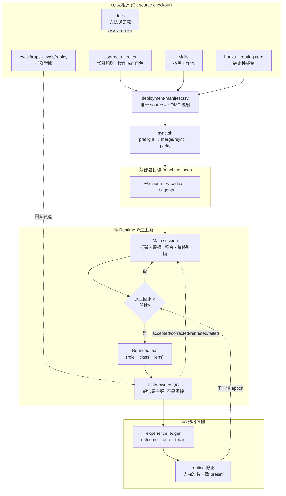
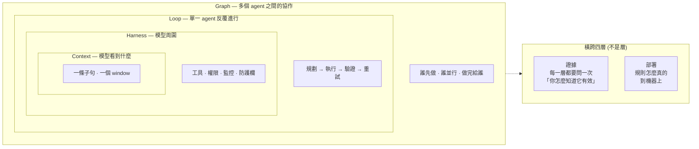

# Harness 架構總覽

這份文件是**這個專案架構設計的主體**: 完整資料流, 核心想法, 四層地圖, 兩件橫跨所有層的
事, 以及評估一個改動時要回答什麼. 每一層自己的職責與實作寫在旁邊四份:

| 層 | 管什麼 | 細節 |
|---|---|---|
| **Graph** | 多個 agent 之間的協作: 誰先做, 誰並行, 做完給誰 | [graph-engineering](graph-engineering.md) |
| **Loop** | 單一 agent 反覆進行: 規劃 → 執行 → 驗證 → 重試 | [loop-engineering](loop-engineering.md) |
| **Harness** | 模型周圍: 工具, 權限, 監控, 防護欄 | [harness-engineering](harness-engineering.md) |
| **Context** | 模型看到什麼 | [context-engineering](context-engineering.md) |

想直接動手部署的人看 [setup](../setup.md); 想改 runtime 行為的人記得真相源是
`main/` 下的契約與 skill, 不是本文. 跨專案可複用的方法論在
[engineering playbook](../engineering-playbook.md), 那份不談這個 repo 的實作.

**這是目標體系, 不是現況報告.** 專案目前的實作還沒有完全貼合這四層 —— 每一份層文件最後
都有一節「還沒貼合的部分」, 寫的是已知的落差, 不是待辦清單. 收斂是慢慢靠攏, 不是一次
重排.

## 一. 完整資料流

四個區塊對應四個關注點, 各有專門文檔: **部署** (①→②, [setup](../setup.md)),
**派工與 QC** (③, [qc-explainer](../qc-explainer.md)), **生命週期驗證**
(③ 的狀態, [dispatch-lifecycle](../dispatch-lifecycle.md)), **證據回饋**
(④, [experience-ledger](../../main/.agents/skills/experience-ledger/SKILL.md)).

## 二. 核心想法

一句話: **把配置當程式管理** — 原本散在 `~/.claude`, `~/.codex`, `~/.agents` 的手寫契約
納入 Git, 可以 review, 測試, 部署, 回滾, 而不覆蓋憑證與機器狀態. 四個支柱:

1. **品質優先的派工**: main 保留架構與最終判斷, leaf 只做有界, 可驗收的工作. 直接執行是
   預設, 只有平行性, context 保護, fresh-context 獨立性或較低成本角色明顯值得開銷時才派工.
2. **可調整但不漂移的 routing**: benchmark 只是外部先驗, 本機 reviewed dispatch-outcome
   證據才負責修正選擇 — 而且改 preset 一定經人核准, 不在執行中偷換.
3. **跨平台一致契約**: Claude, Codex 與 Claude→Codex bridge 用對應角色與相同品質語意.
4. **可恢復的部署**: source 是真相源, 同步前 preflight, 套用後 parity, 回滾靠 git 重新部署.

方法論本身 (為什麼常駐檔要瘦, 規則什麼時候該進契約 vs skill vs hook) 在
[playbook](../engineering-playbook.md); 支撐它的 benchmark 快照, 成本口徑與研究缺口在
[研究摘要](../research/README.md). 一個貫穿全域的判準: **常駐內容是注意力稅,
每條新規則稀釋所有其他規則**, 所以規則只寫模型推不出來的東西, 其餘走漸進揭露與確定性機制.

## 三. 四層地圖

四層是**包住的關係, 不是並排的階段**: 內層決定的事情, 外層都建立在上面. 模型看不到的
東西, 再嚴的迴路也管不到; 一個 agent 做不到的事, 再漂亮的拓撲也拼不出來.

旁邊那兩件畫在巢狀之外, 因為它們**不是層**: 證據與部署對每一層都要問一次, 不屬於其中
任何一層.

| 層 | 設計單位 | 主要工具 | 量它的儀器 |
|---|---|---|---|
| **Graph** | 一次派工樹 | 派工三維度, QC, 五個狀態 | dispatch ledger |
| **Loop** | 一個任務 | 最短驗證迴路, 停止條件, 修訂上限 | replay 的四項存活判準 |
| **Harness** | 一個角色 | 權限與工具面, fail-closed gate, 拒絕紀錄 | trap, hook 的 pipe-test |
| **Context** | 一個子句 / 一個回合 | 字數上限, 密度指標, 三個付費點 | `prompt-surface-census.py`, `resident-pool-report.py` |

**子句不是第五層.** 一條子句就是模型看到的東西, 它和一個 window 的關係是「一句 vs 整批」,
不是兩個相鄰的邊界. 這個 repo 的證據密度最高的地方就在這個尺度上 (措辭 A/B, 事前登記),
所以它在 [context-engineering](context-engineering.md) 裡自成一節, 而不是自成一層.

## 四. 跨層的兩條軸

四層是垂直的分工. 橫過去還有兩條軸, 而任何一條規則進來時都得在這兩條軸上有座標: 它放在
哪裡, 以及它憑什麼算數.

六層是垂直的分工. 橫過去還有兩條軸, 而任何一條規則進來時都得在這兩條軸上有座標: 它放在
哪裡, 以及它憑什麼算數.

### 軸一: 在哪裡付費

同一句話寫在不同層, 付費次數完全不同: 常駐是每一回合一次, 拉取是有人打開時一次, 機械是零.
這條軸決定的就是**誰付, 付幾次**:

| 付費點 | 什麼時候付 | 放什麼 | 由什麼量 |
|---|---|---|---|
| **常駐** | 每一回合都在 context 裡 | 兩份契約; 每支 skill 與 role 的 `name` + `description` | [prompt-surface-census.py](../../scripts/prompt-surface-census.py) 的 `resident` 桶; 字數上限由 contract tests 擋 |
| **派工** | 該 skill 或 role 真的被載入時 | skill 本文, role 本文, `references/` | 同一支腳本的 `dispatch` 與 `roles` 兩桶 |
| **拉取** | 有人打開它時付一次, 而且可以不看完 | `docs/` | [docs-size-report.py](../../scripts/docs-size-report.py), 只報不擋 |
| **機械** | 毫秒級, 完全不佔注意力 | hooks, tests, 報告腳本 | 測試套件自己 |

數字不抄在這裡, 因為抄了就會過期 —— 跑那兩支腳本, 它們讀的是當下的 checkout. 三件跟直覺
不一樣的事值得先知道:

- **skill 的 `description` 是常駐的, 本文不是.** 把一句話從本文搬進 description 是漲常駐,
  不是搬家. 而 Codex 上 `allow_implicit_invocation: false` 的 skill 連 description 都不
  注入, 兩半都算派工成本 —— 所以兩端不是同一張表.
- **role 的 `description` 同樣常駐.** 兩家 CLI 都在每個 session 列出所有已註冊角色, 那份
  清單就是選角面.
- **`docs/` 沒有字數預算**, 因為它是拉取成本. 但它分兩層: 只有現行指引那一層必須是真的,
  紀錄那一層刻意保留被後來證據推翻的段落.

### 軸二: 憑什麼算數

這條軸決定的是**這條規則有多大機率真的發生**. 每一級在本機都有數據, 而數據的方向不好看:

| 強度 | 形式 | 實際買到什麼 | 本機證據 |
|---|---|---|---|
| **散文** | 契約或 skill 裡的一句話 | 權重, 不是強制力 | 系統提示與契約正面衝突時, 四條規則裡三條輸得乾乾淨淨 (注入勝 5/5), 贏的那條也只有 3/5 |
| **措辭** | 同一條規則的不同寫法 | 觸發頻率, 幅度可以到三倍 | 2026-08-16 只改一句話, 遵守率變三倍; 但它改變的是觸發頻率, 不是規則的範圍 |
| **承載物** | 必填欄位, 固定格式行 | 可被機械檢查的事實 | 派工五狀態每一狀態都有實體承載物; 沒有承載欄位的規則驗不了 |
| **閘** | hook, test | 條件成立必攔, 但條件很窄 | 六個有界 gate, 每個都有逃生口 |
| **儀器** | 只報不擋的腳本 | 可觀測性, 零強制力 | 清單與各自回答什麼問題在[根 README](../../README.md) |

**這條軸上最貴的錯誤是把散文當成閘.** 「在契約裡提到一支 skill, 會不會讓它比較容易被
載入」這個問題量過兩次 —— `s11` 這一格跑了 90 個 run, replay 的 `d1`/`d2` 兩格又在派工
路徑上加了 21 個 —— 答案都是零位移. 但尺並沒有瞎: 2026-08-15 的反向對照拿掉語言子句,
中文輸出從 5/5 掉到 0/5. 子句確實有效, 只是它的作用面不是直覺猜的那一面.

## 五. 兩件橫跨所有層

四層之外還有兩件事, 它們不是某一層, 而是**對每一層都要問一次**.

### 證據: 憑什麼算數

**管什麼.** 一個主張要站在哪一階證據上, 以及什麼觀察會推翻它. 這一層橫跨前五層.

**怎麼做.** 兩道階梯疊著用. 通用的那道是
[evidence-ladder](../../main/.agents/skills/evidence-ladder/SKILL.md): L0 讀文件推理什麼都
證明不了, 往上到 L5 真實消費端. 本 repo 專用的那道是三級 ——
**外部 benchmark 只能當先驗** (決定探索順序), **本機 trap 能推翻外部先驗**,
**本機 ledger 是最終仲裁** (需 n ≥ 10). 上層可以推翻下層, 反過來不行.

每條方向都要自帶**推翻條件**與**降級方案**, 兩者都事前寫死. 指涉本 repo 的變更用內容
指紋而不是 commit SHA, 因為 rebase 會改寫每一個 SHA —— 2026-08-08 掃描顯示本樹十個本地
SHA 引用死了六個.

**用什麼量.** [evidence-check.py](../../scripts/evidence-check.py) 看引用還解不解得開, trap
結果列的量測面指紋還是不是出貨版本; 事前登記把 n, 分析計畫與兩種結果各自能 licence 什麼
寫在開跑之前.

**已知怎麼壞.**

- **儀器沒響不等於沒問題.** 中國用語掃描第一次跑出 60 筆, 其中 57 筆是同一個誤判 ——
  一支報 57 筆誤判的儀器就是永久告警, 而永久告警等於沒有儀器. **校準改的是工具, 不是
  被量的東西.**
- **沒紅過的測試不是證據.** 一道從來沒失敗過的閘, 和一道無法失敗的閘, 從輸出上分不出來.
- **四類證據不可互證.** repo 政策, 可部署狀態, 機器狀態, 執行中狀態是四件事; 拿任一類
  去證明另一類都是錯的.

**要動它得先拿出什麼.** 見下一節的五個問題.

### 部署: 規則怎麼真的到機器上

四層講的都是規則長什麼樣, 而它們要先到機器上才會發生任何事. 這條路只有一條:
`scripts/deployment-manifest.tsv` 是唯一的 source→HOME 映射, `scripts/sync.sh` 做 preflight,
merge 或 rsync, 再做 parity. 三件事跟著它:

- **repo 說了不等於部署了.** repo 政策, 可部署狀態, 機器狀態, 執行中狀態是四類證據,
  任一類都不能拿來證明另一類.
- **託管的目標不在本機改.** `managed-target-guard` 攔住對整份託管檔案的寫入, 逃生口是改
  checkout 再 `--apply`.
- **合併模式保留機器狀態.** `settings.json`, `config.toml` 與 `.agents/skills` 是合併不是
  覆蓋, 所以憑證, MCP 設定與非託管的 skill 不會被這個 repo 洗掉.

操作步驟在 [setup](../setup.md).

## 六. 升級評估: 五個問題

一個提案要能被評估, 得先變成**可以錯**的形狀. 這五個問題就是那個形狀; 少一個, 它還是
偏好而不是結論.

1. **座標**: 落在哪一層, 哪一個付費點, 哪一種約束力?
2. **證據**: 手上的證據在哪一階? 這一類改動最低要求哪一階? (見下表)
3. **推翻條件**: 什麼觀察會讓它變成錯的? 寫不出來的提案不進場.
4. **降級方案**: 推翻條件成立時退到哪裡? 事前寫死, 不是事後決定.
5. **回歸閘**: 哪一個檢查在修好之前應該是紅的? 沒紅過的測試不是證據.

第 3 與第 4 不是形式主義. 兩批方向的推翻條件查核結果: 第一批七條裡**五條的原始理由不
成立**, 第二批查了四條, **四條全部不成立** (見[落地紀錄](../research/README.md#方向與落地紀錄)).
那不是規劃品質差, 是推翻條件在做它該做的事 —— 真正該擔心的是某一批全部命中.

### 每一類改動的最低證據

| 改動 | 落在哪層 | 最低證據 |
|---|---|---|
| 改常駐子句的**措辭** | ① | 事前登記的本機 A/B |
| **新增**常駐子句 | ① ② | 先證明「刪掉它模型會犯錯」, 再做預算換算 |
| 改 context 的載入或壓縮策略 | ② | 量測前後的三桶字數, 加一次真實任務的觀察 |
| 改**迴路長度**或修訂上限 | ③ | replay 證據, 判準先寫再開跑 |
| 新增或改動 **gate** | ④ | pipe-test + 蓄意錯誤驗證 + 逃生口 |
| 新增 **role** | ④ ⑤ | 同 cohort 證明現有角色契約不足 |
| 換 **model/effort pin** | ⑤ | 同 role, 同 task class, 同 route cell 的本機 ledger |
| 改**部署映射** | ⑤ | manifest 列 + preflight + parity + 目標端證據 |
| 改**文件敘述** | ⑥ | 分層判定: 現行指引必須是真的, 紀錄保留原措辭與原日期 |

### 四種「看起來過了」

這個模型是從這四種失效長出來的, 每一種在本 repo 都真的發生過:

| 看起來 | 實際上 | 本機案例 |
|---|---|---|
| 規則寫進去了 | 不代表它會生效 | 字串測試只證明規則存在; 行為得靠 trap 量 |
| 測試綠 | 不代表那道閘紅得起來 | 文件涵蓋閘的比對函式會跨路徑分隔符, 於是每條 pattern 都是遞迴的, 三週內 77k 字的實驗紀錄悄悄進了現行指引 |
| 儀器沒響 | 不代表沒問題 | 中國用語掃描第一次跑出 60 筆, 其中 57 筆是同一個誤判 |
| 文件寫了 | 不代表部署了 | repo 政策, 可部署狀態, 機器狀態, 執行中狀態是四類證據, 任一類都不能拿來證明另一類 |

## 七. 層與層之間

三條規律決定什麼時候該往下搬, 什麼時候不該:

**往下一層通常更便宜也更可靠.** 同一個約束, 寫成契約裡的一句話是每回合付費且服從是機率
性的; 寫成一道 hook 是毫秒級且條件成立必攔. 所以**機制勝過提醒**是預設方向.

**但往下搬會失去判斷力.** 閘只能處理機械判定得了的條件. 語意守門就是這樣被判定不做成
fail-closed gate 的: 合法變動遠多於違法變動, 高誤報會導致繞過或白名單, 而那兩件事都
比原問題糟.

**每一層的儀器只看得到自己那層.** 常駐預算看不到動態流入; ledger 看不到子句的措辭;
trap 量得到行為卻量不到成本. 所以一個跨層的主張需要跨層的證據, 而**把某一層的綠燈當成
整體健康**是這份文件裡出現最多次的那個錯.

## 八. 附檔導引

主文只給骨幹, 以下專門文檔各自回答一類問題:

| 附檔 | 回答什麼問題 |
|---|---|
| [數據研究](../research/README.md) | 各 model/effort 的 benchmark 與成本口徑, 選擇理由, 以及還沒本機驗證的缺口 |
| [Fable 5 安全 fallback](../research/fable-5-fallback.md) | 用 Fable 5 時怎麼避免被切到 Opus (把觸發內容派給 Opus leaf, 保持 main context 乾淨), 以及可行性邊界; 與本 repo 的跨 provider fallback 區分 |
| 資料來源與驗證 | benchmark 快照怎麼抓, 如何交叉驗證, 與前一版差異 — 見[研究摘要](../research/model-evidence.md) 的快照章節, 逐格驗證口徑在兩份 [routing toml](../../main/claude/model-routing.toml) 的 `data_verification` 欄位 |
| [context 收束規範](../contract-slimming.md) | 常駐契約放什麼/不放什麼, 預算怎麼算, 怎麼驗收; 大型唯讀輸入的壓縮見 [headroom-runtime](../../main/.agents/docs/headroom-runtime.md) |
| [hook 案例規範](../hook-system.md) | hook 怎麼建, 怎麼 pipe-test, 失敗訊息怎麼回到模型 |
| [測試案例規範](../engineering-playbook.md#5-驗證迴路) | 行為 trap 怎麼設計, grader 為何不信報告, covenant「無失敗 trap 即修剪」 |

導覽總表與各文檔的職責邊界在 [docs/README](../README.md).
