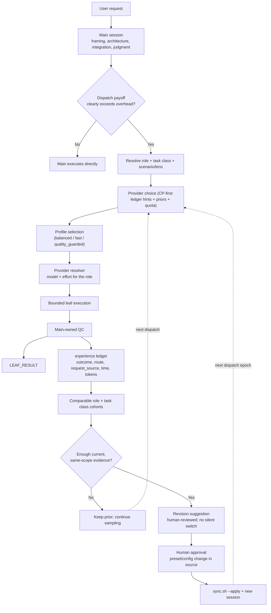

# Graph engineering: 多個 agent 的協作

**誰先做, 誰並行, 做完給誰.** 最外層, 包住 [loop](loop-engineering.md): 迴路管一個
agent 怎麼收斂, 拓撲管很多個迴路之間的順序, 擁有權與匯流.

這一層最貴的一句話是: **報告是一組待證主張, 不是證據.**

**管什麼.** 拓撲, 擁有權與狀態流: 誰派給誰, 誰擁有哪個 artifact, 結果怎麼回來.

**怎麼做.** main session 保留框架, 架構, 歧義, 整合與最終判斷; **直接執行是預設**, 只有
平行性, context 保護, fresh-context 獨立性, 或明顯較便宜的角色檔位值得那筆開銷時才派工.
派工的三個維度刻意分開, 不為每個題材新增 agent:

| 維度 | 決定什麼 | 本 repo 的實際值 |
|---|---|---|
| **Role** | 權限, 工具, 判斷與停止邊界 | 七個固定角色, 在 [`main/claude/agents/`](../../main/claude/agents/) |
| **Task class** | ledger 裡可比較的 cohort | 清單與各自的定義在 [metrics](../../main/.agents/skills/experience-ledger/references/metrics.md); 有幾個刻意不參與決策 |
| **Lens** | 這次要攻擊的接縫 | 語意接縫, 狀態與並行, 契約邊界, 測試有效性 |

三個維度為什麼要分開, 論證在 [playbook](../engineering-playbook.md#leaf-分派的三層契約).
`recon` (定位, 盤點, 摘要) 與 `review` (有界, 對抗式的唯讀審查, 必須指定 lens) 即使都由
`explore` 執行, 也不能併成同一筆 route 證據 —— 那會把兩種很不一樣的工作平均掉.

QC 把一件事制度化: **報告是一組待證主張, 不是證據.** 每次派工結束, main 依序做收件分級,
機械稽核, 抓詐欺清單 (含強制的 grep 覆核), 再四級裁決入帳. 派工的五個狀態每一個都要有
**實體承載物**, 不能只是散文約定 —— 沒有承載欄位的規則無法驗證.

**用什麼量.** dispatch ledger 記每一筆的 outcome, route 與 token; `weekly-integrity` 掃
有沒有 staged 了卻沒記錄的派工.

**已知怎麼壞.**

- **漂亮的報告會過關.** `s7` 這一格 (在交付物裡埋六種造假, 看無人稽核時抓不抓得到) 顯示
  說謊的報告可以全身而退. 另一格取證顯示, opus 檔位的 leaf 有約四成整行漏發修改依據, 十次
  裡有四次宣稱「沒有同型 bug」而其實有 —— 後者連格式稽核都看不出來, 因為那行格式完全
  正確, 只是內容是假的.
- **launcher 死了不等於派工死了.** bridge 的 job 比 launcher 長命, 重啟前不對帳就會對同一
  個 prompt 雙寫.
- **派工者說的 route 不等於實際跑的 route.** 所以 bridge 的路由改由 provider 自己的
  rollout 背書, 而不是由派的人自己宣稱.

**要動它得先拿出什麼.** 換 model 或 effort pin 要同 role, 同 task class, 同 route cell 的
本機 ledger 結果, 樣本不足就先探索; 外部排行榜只做先驗. 改部署映射要 manifest 列,
preflight, parity 與目標端證據四件齊全.

## 誰先做, 誰並行, 做完給誰

| 問題 | 這個 repo 的答案 |
|---|---|
| 誰先做 | 預設沒有人 —— 直接執行是預設, 派工要先通過三項成本測試 |
| 誰並行 | 以任務形狀 batching, 不以檔案數或 request bullet; 一個可寫 artifact 一個 owner |
| 做完給誰 | 回 main. leaf 不再派工, Claude 側由 `leaf-redispatch` 擋, Codex 側由 `max_depth = 1` |

## 一次派工的完整迴路

從請求出發, 經過派工與 QC, 回到「要不要改 routing」, 再回到下一次派工. 這一圈上**每一個決策
點都有人或機制守著** —— 沒有一步是模型自己說了算:



## Routing: 同一個角色, 不同的檔位

三個 profile 都**先滿足角色的品質門檻**, 再最佳化第二目標:

| Profile | 用途 |
|---|---|
| `balanced` | 能力, 時間, 成本與 token 的日常平衡 |
| `fast` | 通過品質門檻後, 優先較低時間/輸出成本 |
| `quality_guarded` | 高風險, 高影響或高度不確定工作, 提高能力餘裕 |

**套用方式因 surface 而異**, 而這是最容易誤解的一格 —— 沒有一個 surface 會在執行中換模型:

| Surface | Routing 套用方式 |
|---|---|
| Main session | 使用者在 task/session 開始前選擇; 專案不會在執行中偷換模型 |
| Claude named roles | deployment preset; 一次原子更新全部 frontmatter pins, 重新部署並開新 session |
| Native Codex leaf | 每次派工由 resolver 回傳 model/effort/invocation |
| Claude→Codex bridge | 每次派工以 `claude-bridge` surface 解析; 不套用 Claude pins |

實際的 pin, effort 與 availability 證據在兩份 `model-routing.toml`; 選擇理由與數據口徑在
[研究摘要](../research/README.md).

## 派工紀錄長什麼樣

main 把派工與 QC 結果**獨立成固定紀錄**, 不混在一般說明裡, 這樣人類回顧與 machine-local
遙測才對得上:

```text
[LEAF_DISPATCH] dispatch_id=review-01|task=semantic seam review|role=explore|class=review|request_source=claude-code|route=balanced/claude/claude-sonnet-5/low|reason=context-protection
[LEAF_RESULT] dispatch_id=review-01|task=semantic seam review|outcome=accepted|qc=full|ledger=logged
```

`request_source` 分得出 `claude-code`, `codex`, `claude-code-plugin-codex` 與
`codex-claude-cli`. 逐字模板只在兩份派工 skill 裡, 本文不複製.

## 還沒貼合的部分

- **成本有擁有者了, 但沒有算式.** 2026-08-21 起成本是[不屬於任何一層的四件事之一](architecture.md#成本-這樣做值不值得),
  每一層都寫明付什麼與用什麼量. 缺的是把它們放在一起的算式 —— 「這次改動整體上省了還是
  花了」仍然沒有東西回答得出來, 而在 ledger 長出樣本之前硬編一個, 只會做出一個沒有校準的
  數字.
- **並行幾乎沒有真實樣本.** ledger 裡絕大多數是單筆派工; 合批的判準寫得比用過的次數多.
- **跨 provider 的額度擋不住, 只數得到.** verifier 額度只認 Claude 的拼法, 走 bridge 的那一側
  靠主 session 判斷 —— 而那不是漏做: bridge 的名字涵蓋所有 Codex 角色, 把它列進閘會誤擋
  同一輪的第二個**實作**派工. 2026-08-21 起 `weekly-integrity` 事後數它 (ledger 有 payload
  缺的角色欄位, 因為那是 QC 之後寫進去的), 所以現在是**預防不了但看得見**. 實測到那天為止,
  hook 看得到的 112 筆派工裡, 沒有任何一輪花掉兩個 outcome verifier.
