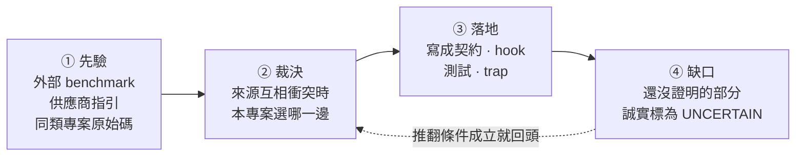

# Harness engineering 研究總結

> 對齊日期: 2026-07-28, 上游與場域研究於 2026-08-08 重查 (Pilotfish v1.3.10, Deep Agents 0.7.5). 這是目前專案採用決策的入口; 各來源的取證細節留在分題文件.

## 這份文件回答什麼

一個 harness 是包在模型外面的規則層: 它決定模型能做什麼, 什麼時候該找第二個模型, 以及結果怎麼被檢查. 規則越多, 每一條被遵守的機率越低, 所以「該放幾條」是本專案唯一真正要回答的問題.

這份文件走完那個回答的四個階段:



**先驗永遠可以被本機證據推翻**, 反過來不行. 這是全篇最重要的一條規則.

## 一分鐘版: 八個現行結論

harness 應該縮到「模型無法可靠自行維持, 且能被驗證」的邊界. 落在邊界內的是: 權限, 派工深度, 可寫 artifact 所有權, Plan 收斂, provider route, 獨立驗證條件, 可追溯結果, 部署邊界. 落在邊界外的是風格偏好, 一般工程常識, 重複提醒 - 這些寫進 resident prompt 只會稀釋其他規則.

| # | 本專案採用 | 拒絕掉的替代做法 |
|---|---|---|
| 1 | main task 保有整合與最終判斷, direct execution 為預設 | 預設就派工, 讓 main 只當協調者 |
| 2 | 只因平行價值, context 保護或 fresh-context independence 才派工 | 因為「任務看起來很大」就派工 |
| 3 | 以任務形狀 batching | 以檔案數或 request bullets batching |
| 4 | Plan 最多兩次自動實質修訂, 之後交還使用者 | 讓 verifier 無限要求修正 |
| 5 | outcome verifier 最多一個, 放在最小完整驗收邊界 | 每個失敗面各放一個 verifier |
| 6 | Claude no-write roles 不給 Bash; 要跑命令的獨立 verdict 交給 Codex read-only sandbox | 用 shell allowlist 擋掉危險命令 |
| 7 | provider/model 決策只用同 role, 同 task class, 同 route cell 的本機結果, 樣本不足就探索 | 直接照外部排行榜選 provider |
| 8 | Git 是可攜真相源; installer lock, 憑證, session, 服務狀態留 machine-local | 把整個 HOME 都納管 |

## 來源衝突與裁決

八個結論不是憑空選的, 是三類來源互相矛盾時逐條裁決出來的.

| 議題 | 衝突 | 裁決 | 理由 |
|---|---|---|---|
| 主動派工 | Pilotfish 鼓勵在合適形狀下主動 dispatch; 精簡 resident prompt 傾向少規則 | 保留三項成本測試, 未通過就 direct | 取得平行效益, 同時避免 delegation tax |
| Batching | 上游示例偏向同形任務批次; 一般 checklist 容易按 request bullet 拆分 | 依 shared context, artifact, dependency, verification surface 分組 | 降低重建 context 與整合成本 |
| Plan 迭代 | verifier 可持續要求修正; 不中止會形成 churn | 同 readiness-unit 最多兩次自動實質修訂 | 把真正的選項交回使用者, 不假裝無限收斂 |
| Bash 唯讀 | shell allowlist 想保留可執行重現; security review 證明 parser 可被 callbacks, 環境與 expansion 繞過 | Claude no-write roles 完全移除 Bash; 命令驗證轉 Codex read-only sandbox | 能力邊界比「解析任意 shell」可證明 |
| Prompt 壓縮 | Pilotfish benchmark 支持壓縮; vendor guidance 仍要求清楚結構與關鍵約束 | 移除重複與過時敘述, 不刪除 authority, stop, QC 與安全邊界 | 壓縮是降低 resident tax, 不是追求最短 |
| 壓縮的驗證方式 | 上游 v1.3.7 的 255 條短語斷言全數通過, 仍放進十二個語意缺陷; 本專案測試同樣以短語為主 | 壓縮常駐契約時另做逐句對照, 重點檢查連接詞, 範圍限定詞, 否定詞 | 這三類改動不會動到任何被斷言的短語, 測試綠燈不構成證據 |
| Provider 選擇 | 外部排行榜給先驗; 本機成本與失敗形態可能相反 | 外部資料只做先驗, 本機 ledger 達樣本門檻後覆蓋 | 對實際工作流的可接受結果成本最重要 |
| Headroom 版本 | PyPI package 與 GitHub release tag 可能不同步 | 分別報告 package, release tag, PR 與 live service state | 避免把不同層級合成「目前版本」 |

## Pilotfish v1.3.0-v1.3.10 蒸餾結果

對齊上游 [v1.3.10 release](https://github.com/Nanako0129/pilotfish/releases/tag/v1.3.10) (tag commit `7a7f71b...`, 2026-08-08).

v1.3.0 到 v1.3.4 存續下來且適合本專案的精華, 已經全部落為本專案的機制:

- shape-based batching 與 direct-execution brake
- 最小完整驗收邊界與 outcome verifier quota
- Plan anti-churn
- fixed dispatch/result record 與 provenance-aware QC
- security review/execution 分權
- resident prompt 去重與 current-state 文件收斂

v1.3.5-v1.3.10 的增量分成三種處置:

| 上游增量 | 處置 | 本專案怎麼做 |
|---|---|---|
| verdict 三分 CONFIRMED/REFUTED/INCONCLUSIVE | 已有等價 | 雙 provider 一致 |
| dispatch brake 壓過 explicit opt-in | 已有等價 | - |
| 常設 prompt 尺寸預算寫進測試 | 已有等價 | per-document 字數上限 + resident 總量 + role body budget; 另加規則條數, 每條位元組, 虛詞比例三項密度指標. 量測口徑與上游不同 |
| 只有可重現的 P0-P2 blocker 能 refute, P3/P4 僅建議 | **改造後採用** | 收斂成一條判準: 反例要可重現**且會改變驗收結論**. 其餘列 `Advisory:` 照報但不動 verdict. 不引進嚴重度分級 |
| 阻斷性修復共用五次 pass 預算 + candidate-state fingerprint | **改造後採用** | 五次上限照採; 指紋改成每個 pass 自述「上次之後改了什麼」, 沒改就不重驗 |
| readiness epoch 與一次最終 fresh readiness check | **不採用** | 維持現行硬性兩次上限, 不放寬 |
| 互動模式先於工作者選擇 (v1.3.9) | **不採用** | client 的 plan mode 已承擔「廣泛請求先唯讀」; 理由見[明確不做的事](#明確不做的事) |
| cue-free 限制: 更高優先級的 client 指令壓得過 user 層契約 (v1.3.9) | **採用** | 待辦方向 1. 本機另有當下可觀察的實例, 不只是借用上游結論 |
| 壓縮後對出貨位元組重做行為認證, 候選綁回被測快照 (v1.3.9 -> v1.3.10) | **改造後採用** | 待辦方向 2. 接線既有 census 指紋, 不新建 Gate |

**這些控制目前只有靜態契約與測試, 沒有行為證據.** 仍未證明的是長流程中的效果: 中斷後恢復, 連續 correction, 互相衝突的 leaf 結果, 以及真實 token 與 wall-clock 改善. 這些要靠 lifecycle replay 與 ledger 驗證. 不能把「測試存在」寫成「效果已證明」.

上游 v1.3.6 之後已公開自己的 Gate replay 方法與成本. **方法可借用, 數字不可借用** - 那是它的契約在它的 client 版本上的觀察.

## 時效性基準

外部版本會變動, 引用前一律 live recheck.

| 來源 | 查核時的狀態 | 查核日 | 注意 |
|---|---|---|---|
| Pilotfish | latest release tag `v1.3.10`, tag commit `7a7f71b...` | 2026-08-08 | 上游發版頻率高於本文件重查頻率 - 四天內出了 v1.3.9 與 v1.3.10 兩版, 引用前先確認 tag |
| Deep Agents | PyPI stable `0.7.5` (2026-08-06); CLI `deepagents-code 0.1.54` | 2026-08-08 | SDK 與 CLI 交錯發版, 版本序不同步; 版本與託管產品狀態需在引用時重查 |
| Headroom | PyPI `headroom-ai 0.34.0`; GitHub latest release tag `v0.34.0` (2026-08-05); PR #1044 仍 open | 2026-08-08 | 三者不可互換 |
| OpenAI prompting guidance | [Latest model guide](https://developers.openai.com/api/docs/guides/latest-model?model=gpt-5.6#prompting-best-practices) | - | 目前 canonical 文件 |
| Anthropic context guidance | [Effective context engineering](https://www.anthropic.com/engineering/effective-context-engineering-for-ai-agents) | - | - |

## 方向與落地紀錄

這節回答「下一步做什麼, 為什麼是這一步」.

排序原則是**證據強度 × 成本**, 不是影響力大小. 理由: 影響力是估出來的, 前兩者查得到. 用估出來的量當主排序鍵, 等於讓最會講故事的那條排第一.

每條方向只寫三行: 做什麼, 為什麼排這裡, 什麼會推翻它. **沒有推翻條件的建議不是結論, 是偏好.** 落地時先跑推翻條件, 成立就照該條自己寫好的降級方案走.

### 已落地 (2026-08-04)

七條方向一次做完. 推翻條件的查核結果是這批最值得看的部分 - 七條裡有五條的原始理由**不成立**:

```
推翻條件查核結果
  不成立      █████        5 條  ← 原始理由被本機證據推翻, 走降級方案
  成立但理由不同 █          1 條  ← 目標本來就達成, 交付改成修文件
  部分成立     █           1 條
```

順序只調動過一次: 第 4 條排到第 5 條之前. 第 5 條會鼓勵壓縮, 先開閘再補防護等於刻意製造暴露窗口.

| # | 方向 | 推翻條件查核 | 落地形式 |
|---|---|---|---|
| 1 | `mech-executor` 強制行只留 `AUTH:` | **成立, 但理由不同**: 逐 commit 查核顯示兩端契約從未出現 INTENT/TWINS, 原本「規則自己製造它要防的失敗」這個前提是錯的 | 目標狀態本來就成立且已被測試鎖住; 交付改成修正兩份寫錯因果的文件 |
| 2 | 解開 support pin 取樣死結 | 不成立: 兩端三個 profile 逐一查過, 沒有任何一個覆寫 support role 的 frontmatter pin | 走「承認由使用者偏好決定」那條. `model-routing.toml` 撤回 `n >= 10` 引用, 改記 `support_pin_evidence`; 論述見 [model-evidence.md](model-evidence.md) |
| 3 | 有界重驗: pass 預算與指紋 | 不成立: ledger 有一條 2026-07-28 的四次 verifier 派工鏈 (同一目標, 4.5 小時內), 三次上限會誤殺合法工作 | 兩端 dispatch skill 加五次上限, 並要求每個 pass 先講出上一次之後改了什麼; 沒改的候選不重驗 |
| 4 | 壓縮的語意守門機械化 | 不成立: `c143b72` 自己的 commit message 就是一筆本機壓縮語意缺陷 | 新增 `scripts/contract-operator-delta.py`, 永遠 exit 0 的附證腳本, 不是 gate |
| 5 | 常駐預算改為正規化密度 | 不成立: 換算後兩份契約在新指標下都有餘裕, 不是隱性收緊 | 密度指標**加在**字數上限之外, 字數上限一格未動 (見下) |
| 6 | REFUTED 門檻收斂 | 不成立: ledger 九筆 verifier 記錄裡沒有 advisory 級發現退回好結果的實例 | 兩端 `verifier` 契約各加一句判準, 不引進嚴重度分級 |
| 7 | lifecycle replay 存活判準 | **部分成立**: 判準第 3 項確實不需要 live session 就量得到 | 寫成 [lifecycle-replay.md](lifecycle-replay.md), 並註明第 3 項已有 `weekly-integrity` 在看; replay 仍未開跑 |

第 5 條的落地與原本寫的不同, 值得說清楚:

- 密度指標是**加上去**, 不是取代字數上限.
- 要讓密度先綁定, codex 那份的字數上限得往上拉約四分之一. 沒有證據支持把常駐層放大到那個程度.
- 這條方向自己的推翻條件禁止把收緊偷渡進換算. 同一條理由也禁止偷渡放寬.
- 真正換掉的是**調高字數上限的判準**: 三項密度都還在上限內的擴充, 買到的是更好的句子而不是更多字.

同批完成的還有 trap 在 Opus 5 上的重跑 (2026-08-04): s7/s8 各 3 seeds, s9 補到 11 seeds. 結果見 [model-evidence.md](model-evidence.md) 與 `evals/traps/*/README.md`.

### 待辦方向

2026-08-08 重查上游與場域研究後重排. 新來源沒有各自散開, 它們全部落在同一條軸上 - **一條常駐規則的一生** - 而本 repo 目前只有兩個階段有機制:

| 階段 | 現有機制 | 新證據指出的缺口 |
|---|---|---|
| ① 進場: 憑什麼常駐 | 字數上限, 三項密度指標, 「刪掉會不會讓模型犯錯」 | 預算不分程序型與知識型, 而外部消融只推翻得了後者 |
| ② 生效: 有機會被讀到嗎 | 無 | 常駐契約以 user context 進場, 服從是機率性的, 更高優先級指令壓得過它 |
| ③ 證明: 在哪一版位元組上證過 | census 的 `sha256`/`payload_sha256`, 275 條靜態斷言 | trap 結果表沒有指紋欄, 行為證據不帶有效期 |
| ④ 反證: 會不會過度觸發 | s10 的 `c-no-exclusions` 變體, 只蓋 skill description | gate 層沒有「本來就不該觸發」的對照組 |
| ⑤ 退場: 擋下來之後呢 | 五個 fail-closed gate | 沒寫下擋下來要回什麼, 也沒在量連續拒絕 |

排序照舊是**證據強度 × 成本**. **跑 lifecycle replay** 仍然待辦, 但排在這五條之後 - 它成本最高而前置條件一格未動, 條件見 [lifecycle-replay.md](lifecycle-replay.md).

| # | 階段 | 做什麼 | 為什麼排這裡 | 推翻條件 |
|---|---|---|---|---|
| 1 | ② | 在研究層與導覽寫下優先權現實: 常駐契約拿不到強制力, 只拿得到權重, 可靠路徑是使用者顯式叫用. 不新增常駐規則 | 三個獨立來源同指一事而成本只有文件. 兩個外部來源見 [context-and-vendors.md](context-and-vendors.md); 第三個是本機實例 - 本次工作階段的 client 指令 `Do not call the AgentTool unless the user requested it` 讓契約的 orchestration 整段不可執行, 而契約沒有任何條款蓋得過它 | 找得到一個 session, client 指令與契約直接衝突而契約仍勝出. 成立就只保留 user-context 這個事實, 不寫優先權結論 |
| 2 | ③ | trap 結果表加指紋欄 (census `payload_sha256` 或受測角色檔的 `file_sha256`), 另加一支永遠 exit 0 的附證腳本, 列出指紋已不符出貨版本的行為結果 | 上游剛示範完這個失效 (見 [peer-harnesses.md](peer-harnesses.md) 第三個修正), 而指紋本身已經算好了 | 每一列 trap 結果的契約指紋都能從該列已有的日期加 git 還原. 成立就改交付一份查表程序, 不加欄位 |
| 3 | ① | 常駐預算分程序/權限型與 repo 知識型兩類記帳; 後者預設可砍, 要留就得自帶本機反例 | 外部第一次給了知識型的有界證據, 而本機證據指向相反方向且兩者不衝突 - 量的不是同一種子句. 數字與限定見 [context-and-vendors.md](context-and-vendors.md) | census 顯示兩份契約裡沒有知識型子句. 成立就只寫成判定規則, 不動預算結構 |
| 4 | ④ | 為 fail-closed gate 與 owed gate line 各補一個 negative control: 正確行為是不停下, 不升級, 不派工 | 證據是規範性的而不是實測的, 且要動 fixture. Anthropic 的 evals 指引: 只測「該做時有沒有做」會養出「什麼時候都做」的 agent, 而 trap 公約目前只覆蓋這一半. 同一份指引也提醒飽和 - s7 post-clause 已連三輪 3/3 | 現有 fixture 已有一格的通過條件是不動作 (s8 的 spec-conflict 停止是有效結果). 成立就把該格標為 negative control 補進結果表, 不新建 fixture |
| 5 | ⑤ | ~~檢查五個 fail-closed gate 各自回給模型什麼, 以及有沒有連續拒絕的升級門檻~~ **已查核, 見下**. 接續項: 讓拒絕可觀測 | 最可能被自己的推翻條件打掉, 而查核便宜. 兩個獨立實作收斂到 deny-and-continue 加連續拒絕升級 (見 [context-and-vendors.md](context-and-vendors.md)), 但本機沒有一筆證據顯示我們有這個失效, 甚至沒在量連續拒絕 | (預期成立) hook log 或 ledger 裡找不到同一 gate 在單一 session 內連續擋三次以上. 成立就只確認拒絕訊息說得出下一步, 不加升級機制 |

#### 2026-08-08 查核結果 (方向 1, 2)

**方向 1: 未決, 且上表的實例要讀準.** 推翻條件要一個「client 指令與契約正面衝突而契約仍勝出」的 session, 那只能靠 session 證據, repo artifact 判不出來. 同時修正措辭: 觀察到的是**壓制**而不是落敗 - 那條 client 指令比契約更嚴, 是收窄不是牴觸, 結果是契約的 orchestration 整段不可執行. 這仍然是上游 cue-free 講的同一件事, 但不能拿來當「契約在正面衝突中會輸」的證據.

**方向 2: 存活, 範圍擴大, 已落地.** 推翻條件是「指紋能從該列日期加 git 還原」, 實測反過來 - 還原路徑本身已經斷了, 而且比 trap 那幾列廣得多. 全樹掃描結果:

| 引用形狀 | 數量 | 狀態 |
|---|---|---|
| 外部 repo, 完整 40 碼 + 連結 | 2 | 正確, 本來就不該在本 repo 解開 |
| 本地引用, 解得開 | 4 | - |
| 本地引用, **裸 short SHA, 死** | 6 | 含一個在**已出貨的 skill** 裡, 還有一個被測試字串釘住 |

**成因是工作流, 不是粗心**: 分支在 merge 前 rebase, rebase 改寫每一個 SHA, 所以引用在它命名的分支被整合的當下就死了. 這也解釋了為什麼兩個正確的都是外部引用 - 它們指向別人的歷史, 我們的 rebase 動不到.

日期也代替不了 SHA: s7 的 pre-clause 與 post-clause 兩批同樣掛在 2026-07-23.

落地的機制是**內容指紋取代 commit SHA**:

- 每個 trap 以 `surface.tsv` 宣告量測面 - 哪些檔案的位元組改變會使結果失效. 刻意寧可多列: 少列會讓一列宣稱自己還有效, 多列只會多一個要看的警告.
- [`evals/scripts/trap-surface.py`](../../evals/scripts/trap-surface.py) 算出 sha256 綁定; 結果列記 `[surface <short>]`. 指紋由位元組算出, rebase, 搬檔, 改名都不影響.
- [`scripts/evidence-check.py`](../../scripts/evidence-check.py) 兩項都報, **永遠 exit 0**. 不做成閘: 指紋過期最常見的原因是規則變好了, 做成 fail-closed 只會讓人不再標記.

現有 45 列結果**標為 unverified 而不是回填** - 它們跑在哪一版位元組上, 正是已經無法還原的那件事. 已出貨 skill 裡那個死引用已移除 (版本號是耐久錨點, 裸 SHA 不是), 其餘五個留在 append-only 決策史與本節, 因為那份檔案的規則是只追加不重寫, 而把錨點改寫成另一個沒人能查的 commit 等於把同一個錯誤再犯一次. 通用規則寫成[文件導覽規則 9](../README.md#維護規則).

#### 2026-08-08 查核結果 (方向 5)

**推翻條件不成立, 但成立與否不是重點 - 訊號本身不堪用.** 掃 86 份 transcript 找五個 gate 的真實拒絕:

| gate | 真實拒絕數 | 說明 |
|---|---:|---|
| commit-test-gate | 22 | 單一 session 最長連續 5 次, 兩個 session 都到 5 |
| runtime-guard | 2 | |
| verifier-quota | 1 | |
| leaf-redispatch | 0 | 從未擋過 |

門檻是「連續三次以上」, 實測有兩個 5. 但**跨過門檻的幾乎全是 commit-test-gate, 而它連續擋正是機制在運作**: 套件紅 -> 修 -> 重試, 五次是正常工作不是卡住. 在這個訊號上設 3 次升級門檻, 會對著合法工作發警報. 所以結論不是「照升級那條做」, 而是**這個閾值選錯了對象**.

**便宜的那一半查完, 目標狀態本來就成立.** 五個 gate 的拒絕訊息全部說得出下一步:

| gate | 給模型的下一步 |
|---|---|
| leaf-redispatch | 把提議的派工交回 main session |
| runtime-guard | 升級並重啟, 或改在 main session 做這次 review |
| verifier-quota | 改在最小完整驗收邊界驗證; 真的是新 task 就用 `AGENT_ALLOW_SECOND_VERIFIER=1` |
| commit-test-gate (三種) | 每種都先說明「這不是紅套件」或紅在哪, 再給重試路徑 |
| githooks/pre-commit | 還原檔案, 取消 `core.hooksPath`, 或明確跳過 |

換句話說 deny-and-continue 早就是現況, 只是沒被寫下來過.

**真正的缺口是另一件事: 沒有任何一個 gate 記錄自己的拒絕.** 上面這張表是從 transcript 考古出來的, 而且前三次都測錯 - 最初一輪 146 筆「命中」全是**讀 hook 原始碼**的檔案內容, hook 自己的 docstring 裡就有 `commit blocked` 這個字串. 這代表「我們的閘多常擋人, 擋在誰身上」目前不是一個查得到的問題. `delegation.jsonl` 記派工的 start/stop, 沒有對應的拒絕紀錄.

所以方向 5 的交付改成一條新的待查項: **先讓拒絕可觀測, 再談要不要升級門檻**. 順序理由與 lifecycle replay 同源 - 沒有判準就先開跑, 產出的是撤不回的數字.

### 明確不做的事

| 不做 | 理由 |
|---|---|
| 移植上游的 P0-P4 嚴重度分類法 | 換到的是同一個失效的更細表述, 代價是六個角色檔的規則條數 |
| 把上游 Gate 的數字當本專案證據 | 那是它的契約在它的 client 版本上的觀察; 方法可借, 數字不可借 |
| 把語意守門做成 fail-closed gate | 合法變動遠多於違法變動, 高誤報會導致繞過或白名單 |
| 在存活判準之前開跑 lifecycle replay | 會產出被後續文件引用, 且引用者看不出是空的數據 |
| 移植上游的三模式互動路由 (`co_discover`/`explore_then_plan`/`execute`) | 它買到的是「廣泛請求第一回合唯讀」, 而 client 的 plan mode 已承擔同一件事. 代價是常駐層多一組模式詞彙, 而本機沒有一筆「廣泛請求在第一回合造成不可逆寫入」的證據 |
| 防竄改 (雜湊鏈) 帳本 | 外部普查 70 個系統只有 5% 做到, 20% 有結構化稽核而本專案已在後者. 但本專案的閘刻意是可被 `--no-verify` 停用的本機閘; 在一個承認可繞過的模型上加防竄改帳本, 買到的是形式不是保證 |
| 用 ACE 的自動 Curator 改寫常駐契約 | 常駐層要人審與 Git 部署; 自動重寫直接撞上已證實的語意反轉失效 |

## 文件索引

| 文件 | 回答什麼問題 |
|---|---|
| [context-and-vendors.md](context-and-vendors.md) | 常駐 context 有多貴, 兩家供應商官方怎麼說 |
| [resident-context-options.md](resident-context-options.md) | 常駐成本現況, 可用槓桿與延後的 runtime-selection eval |
| [peer-harnesses.md](peer-harnesses.md) | Deep Agents 與 Pilotfish 的原始碼與版本拆解 |
| [model-evidence.md](model-evidence.md) | route 與 effort 怎麼選, 成本口徑怎麼算, 外部先驗有多可信 |
| [trap-experiments.md](trap-experiments.md) | 可重播的失敗情境與反證 |
| [local-experiments.md](local-experiments.md) | 本機任務結果 |
| [lifecycle-replay.md](lifecycle-replay.md) | replay 開跑前的存活判準; 尚無 replay 結果 |
| [prompt-surface-census.json](prompt-surface-census.json) | deterministic resident/role surface 快照 |

## 驗證缺口

- [UNCERTAIN: Pilotfish-derived controls 尚未完成真實 lifecycle replay; 上游 v1.3.6-v1.3.10 的 Gate 數據是它自己契約的 reachability 觀察, 不轉移到本專案. 開跑前的存活判準已寫在 [lifecycle-replay.md](lifecycle-replay.md).]
- [UNCERTAIN: 待辦方向 1-5 的推翻條件一條都還沒查. 第 5 條自己標了預期成立, 其餘四條在查核前只是排序假設 - 上一批七條裡有五條的原始理由被本機證據推翻, 這批沒有理由假設命中率更高.]
- [UNCERTAIN: 第 3 與第 6 條的推翻條件已於 2026-08-04 查過 ledger (131 筆, 其中 verifier 9 筆), 但這是單機單人的樣本; 「沒觀察到」在這個量級上是弱證據.]
- [UNCERTAIN: 方向排序是設計判斷, 不是實驗結果; 每條的「推翻條件」才是可檢驗的部分, 落地紀錄裡的查核結果同樣只在當時的 artifact 上成立.]
- [UNCERTAIN: provider route cells 多數尚未達決策樣本門檻.]
- [UNCERTAIN: 外部 package, release, beta 與 PR 狀態會變動, 引用前必須 live recheck.]
