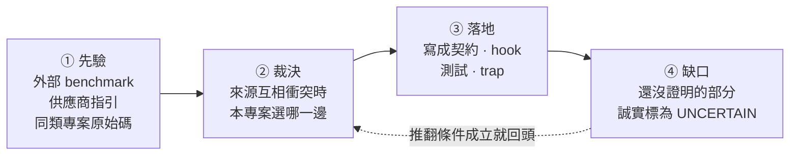

# Harness engineering 研究總結

> 對齊日期: 2026-09-08 (第一次勘查聚合型同業 ECC, 同日重跑[全語料盤點](landing-readiness.md#2026-09-08-重跑-21-份-而落地順序沒有改變)並補做[機制側盤點](mechanism-evidence-map.md)). 這是專案採用決策的入口: 本文只留結論, 指標與缺口; 每個來源的取證在分題文件, 每一次查核的原始紀錄在 [landing-log](landing-log.md).

## 這份文件回答什麼

一個 harness 是包在模型外面的規則層: 它決定模型能做什麼, 什麼時候該找第二個模型, 以及結果怎麼被檢查. 規則越多, 每一條被遵守的機率越低, 所以「該放幾條」是本專案唯一真正要回答的問題. 回答分四個階段:

**先驗永遠可以被本機證據推翻**, 反過來不行. 這是全篇最重要的一條規則.

## 九個現行結論

harness 應該縮到「模型無法可靠自行維持, 且能被驗證」的邊界. 邊界內: 權限, 派工深度, 可寫 artifact 所有權, Plan 收斂, provider route, 獨立驗證條件, 可追溯結果, 部署邊界. 邊界外: 風格偏好, 一般工程常識, 重複提醒 —— 寫進常駐 prompt 只會稀釋其他規則.

| # | 本專案採用 | 拒絕掉的替代做法 |
|---|---|---|
| 1 | main task 保有整合與最終判斷, direct execution 為預設 | 預設就派工, 讓 main 只當協調者 |
| 2 | 只因平行價值, context 保護或 fresh-context independence 才派工 | 因為「任務看起來很大」就派工 |
| 3 | 以任務形狀 batching | 以檔案數或 request bullets batching |
| 4 | Plan 最多兩次自動實質修訂, 之後交還使用者 | 讓 verifier 無限要求修正 |
| 5 | outcome verifier 最多一個, 放在最小完整驗收邊界 | 每個失敗面各放一個 verifier |
| 6 | Claude no-write roles 不給 Bash; 要跑命令的獨立 verdict 交給 Codex read-only sandbox | 用 shell allowlist 擋掉危險命令 |
| 7 | provider/model 決策只用同 role, 同 task class, 同 route cell 的本機結果, 樣本不足就探索 | 直接照外部排行榜選 provider |
| 8 | Git 是可攜真相源; installer lock, 憑證, session, 服務狀態留 machine-local | 把整個 HOME 都納管 |
| 9 | 下一批證據花在**沒有被量過的那一層** —— 現在是 gate 層 (7 個 fail-closed 閘, 52 個 eval 情境無一瞄準) | 繼續加固實質防線 (37/37 零中招, 下界 0.922), 或用「加一道新閘」代替「量現有的閘」 |

第 9 條 (2026-09-08) 與前八條不同: 前八條說**規則該長什麼樣**, 它說**下一塊錢花在哪**. 推翻條件: `evals/` 開始把 gate 當量測對象之後, 這一條要重新排序.

## 來源衝突與裁決

前八條不是憑空選的, 是三類來源互相矛盾時逐條裁決出來的.

| 議題 | 衝突 | 裁決 | 理由 |
|---|---|---|---|
| 主動派工 | Pilotfish 鼓勵在合適形狀下主動 dispatch; 精簡 resident prompt 傾向少規則 | 保留三項成本測試, 未通過就 direct | 取得平行效益, 同時避免 delegation tax |
| Batching | 上游範例偏向同形任務批次; 一般 checklist 容易按 request bullet 拆分 | 依 shared context, artifact, dependency, verification surface 分組 | 降低重建 context 與整合成本 |
| Plan 迭代 | verifier 可持續要求修正; 不中止會形成 churn | 同 readiness-unit 最多兩次自動實質修訂 | 把真正的選項交回使用者, 不假裝無限收斂 |
| Bash 唯讀 | shell allowlist 想保留可執行重現; security review 證明 parser 可被 callbacks, 環境與 expansion 繞過 | Claude no-write roles 完全移除 Bash; 命令驗證轉 Codex read-only sandbox | 能力邊界比「解析任意 shell」可證明 |
| Prompt 壓縮 | Pilotfish benchmark 支持壓縮; vendor guidance 仍要求清楚結構與關鍵約束 | 移除重複與過時敘述, 不刪除 authority, stop, QC 與安全邊界 | 壓縮是降低 resident tax, 不是追求最短 |
| 壓縮的驗證方式 | 上游 v1.3.7 的 255 條短語斷言全數通過, 仍放進十二個語意缺陷; 本專案測試同樣以短語為主 | 壓縮常駐契約時另做逐句對照, 重點檢查連接詞, 範圍限定詞, 否定詞 | 這三類改動不會動到任何被斷言的短語, 測試綠燈不構成證據 |
| Provider 選擇 | 外部排行榜給先驗; 本機成本與失敗形態可能相反 | 外部資料只做先驗, 本機 ledger 達樣本門檻後覆蓋 | 對實際工作流的可接受結果成本最重要 |
| Headroom 版本 | PyPI package 與 GitHub release tag 可能不同步 | 分別報告 package, release tag, PR 與 live service state | 避免把不同層級合成「目前版本」 |

## Pilotfish 蒸餾結果

對齊上游 [v1.3.10 release](https://github.com/Nanako0129/pilotfish/releases/tag/v1.3.10) (tag commit `7a7f71b...`, 2026-08-08). v1.4 起上游變成原生 plugin, 政策改由 SessionStart 注入; 拆解在 [peer-harnesses](peer-harnesses.md). 2026-09-10 的逐句比對把它從同業升為上游: 三支 skill 的 `ATTRIBUTION.md` 各記了哪幾句是它的.

v1.3.0 到 v1.3.4 存續下來且適合本專案的精華, 已經全部落為本專案的機制: shape-based batching 與 direct-execution brake, 最小完整驗收邊界與 outcome verifier quota, Plan anti-churn, fixed dispatch/result record 與 provenance-aware QC, security review/execution 分權, resident prompt 去重與 current-state 文件收斂.

v1.3.5 到 v1.3.10 的增量:

| 上游增量 | 處置 | 本專案怎麼做 |
|---|---|---|
| verdict 三分 CONFIRMED/REFUTED/INCONCLUSIVE | **我方先有** | 我方 2026-07-22 加入 `INCONCLUSIVE`, 上游到 `v1.3.4` (07-25) 仍只有兩值, 第三值在 `v1.3.5` (07-29) 才出現; 雙 provider 一致 |
| dispatch brake 壓過 explicit opt-in | 已有等價 | - |
| 常設 prompt 尺寸預算寫進測試 | 已有等價 | per-document 字數上限 + resident 總量 + role body budget; 另加規則條數, 每條位元組, 虛詞比例三項密度指標 |
| 只有可重現的 P0-P2 blocker 能 refute, P3/P4 僅建議 | **改造後採用** | 一條判準: 反例要可重現**且會改變驗收結論**. 其餘列 `Advisory:` 照報但不動 verdict. 不引進嚴重度分級 |
| 阻斷性修復共用五次 pass 預算 + candidate-state fingerprint | **改造後採用** | 五次上限照採; 指紋改成每個 pass 自述「上次之後改了什麼」, 沒改就不重驗 |
| readiness epoch 與一次最終 fresh readiness check | **不採用** | 維持現行硬性兩次上限 |
| 互動模式先於工作者選擇 (v1.3.9) | **不採用** | client 的 plan mode 已承擔「廣泛請求先唯讀」, 見[明確不做的事](#明確不做的事) |
| cue-free 限制: 優先序更高的 client 指令壓得過 user 層契約 (v1.3.9) | **採用** | 本機另有可觀察的實例, 見[待辦方向](#待辦方向)階段 ② |
| 壓縮後對出貨位元組重做行為認證, 候選綁回被測快照 (v1.3.10) | **改造後採用** | 接線既有 census 指紋, 不新建 gate |

上游 v1.3.6 之後公開了自己的 Gate replay 方法與成本. **方法可借用, 數字不可借用** —— 那是它的契約在它的 client 版本上的觀察. 本機的行為證據來自 [lifecycle replay](lifecycle-replay.md), 量級與限制見[驗證缺口](#驗證缺口).

## 時效性基準

外部版本會變動, 引用前一律 live recheck. 蒸餾來源的 pin 有沒有被上游甩開, 跑 `scripts/upstream-pin-report.py` —— 它從 ATTRIBUTION 與下表推導, 不是另一張要維護的清單.

**類別欄決定一列能不能當證據用** (蒸餾自 `sepia` 的證據等級欄, 改造成本 repo 的詞彙):

| 類別 | 意思 | 可以拿它做什麼 |
|---|---|---|
| 上游 | 我方從它蒸餾, 有 ATTRIBUTION 與 pin | 逐條處置的來源; **方法可借, 數字不可借** |
| 同業 | 可比較的 harness, 只勘查未蒸餾 | 同上; 它的量測是它的契約在它的 client 上的觀察 |
| 相依 | 我方實際在跑的工具 | 操作狀態, **不是證據來源** |
| 研究 | 第三方量測或 benchmark | 可引用, 受其自述範圍限制 |
| 供應商指引 | 供應商的規範性文件 | **是規範不是證據**; 它說該怎麼做, 不說做了會怎樣 |
| 供應商製品 | 觀察到的供應商行為 | 本機且會過期, 引用要附觀察日與版本 |

| 來源 | 類別 | 查核時的狀態 | 查核日 | 逐條與下次看什麼 |
|---|---|---|---|---|
| Pilotfish | 上游 + 同業 | 蒸餾 pin `7a7f71b327f079fecbf29fa91e444b9a6180c31c` (`v1.3.10`, 2026-08-08; MIT); latest release tag `v1.4.1` (2026-08-27); head `ea0d20bb` (2026-08-28, 距蒸餾 pin +19 commit, 全是 benchmark attempts 綁定與測試); 09-11 再查**未動** | 2026-09-11 | 09-10 從同業升為上游: 逐句比對後 `provider-routing` 三句, `baton-dispatch` / `leaf-dispatch` 四條是它的措辭, ATTRIBUTION 補齊. v1.4.0 起變成原生 plugin, 政策從 `CLAUDE.md` 搬到 SessionStart 注入, 重查要先找新載體. 拆解在 [peer-harnesses](peer-harnesses.md#pilotfish-v140-v141-政策從-claudemd-搬到-sessionstart-注入-2026-08-31-拆解). **09-11 讀了 `#63` (`v1.4.1`)**: 它把符號連結的 `CLAUDE.md` 從一律拒絕放寬成「解析後是可讀一般檔就接受」, 與我方 `project-init` 同日的處置相反而兩邊都對 —— 它寫一個區塊, 我方寫兩個, 兩個名字塌成一個 inode 時第二次渲染會蓋掉第一次; 記為佐證, 抬高的是那個現實的普遍性. 下次仍是先讀 spontaneous-dispatch 的 cue-free 資料, 那 14 個 benchmark commit **尚未讀** |
| cablate/baton | 上游 | release `v0.1.1`; pin `0ab4d2ec5c69820001eeac2a12fab2c87fd3e943` 就是最後一個 commit (2026-07-16), 之後未動 | 2026-09-05 | `baton-dispatch` 與 `leaf-dispatch` 的上游; 核對表在 [peer-harnesses](peer-harnesses.md#cablatebaton-baton-dispatch-的上游) |
| pilotfish-codex | 同業 | release `1.7.1` (2026-08-11); tag `v1.7.2` 存在但沒有 release; 自走版號 | 2026-09-05 | Codex CLI 分支; 帶了本專案沒有的 review-service circuit breaker, 見 [peer-harnesses](peer-harnesses.md#pilotfish-codex-15-17-codex-cli-分支) |
| Deep Agents | 同業 | PyPI `0.7.13` (2026-09-02); CLI `0.1.66`; `deepagents-acp 0.0.11` | 2026-09-05 | 三個 package 各自發版, 分開報. 主線是 session 身分穿過壓縮, 與 `dispatch_id` 同一件事, 見 [peer-harnesses](peer-harnesses.md#deep-agents-0710--0713-cli-0166-2026-09-05-重查) |
| Headroom | 相依 | PyPI `headroom-ai` `0.37.0` (2026-08-27) | 2026-09-05 | **只記上游, 不記本機**: 共用 repo 各部署版本不同. 自己那台跑什麼, 照 `main/.agents/docs/headroom-runtime.md` 開頭那四個來源當場問; 讀數在 [ledger 08-31 重查](upstream-distillation-ledger.md#2026-08-31-重查-六個遠端全掃-一個上游第一次真的動了來源檔) |
| mattpocock/skills | 上游 | marketplace pin `6654f6b60cd9d5be8b54c6fafe44346dabeb3b76` (2026-09-05 從公開 catalog 解析); release tag `v1.2.3`; 37 支 skill; head `3cca18b3` (2026-09-04), 09-11 再查**未動** | 2026-09-11 | **版本號不會告訴你內容變了**: pin 前進 20 個 commit 期間 tag 與 version 全程沒動. 09-11 的判準用比登記更強的儀器結掉: pin 到 head 的 compare 只列出兩個檔 (`CLAUDE.md` 一行與 `scripts/link-skills.sh`), 整棵樹就差這兩個, 不必逐一比 blob id. 下次照舊; 見 [ledger 09-05](upstream-distillation-ledger.md#2026-09-05-重查-五個-pin-三個動-marketplace-pin-第一次真的前進) 與 [09-11](upstream-distillation-ledger.md#2026-09-11-重查-九個-pin-七個報動-但其中三個是報告在重報已分類過的事) |
| Raymondhou0917/speak-human-tw | 上游 | pin `6ccc24a76c6bb7ff516bb27d3044c8a330ca62d6` (2026-09-11 推進, touched 仍只有 `assets/`) | 2026-09-11 | `readable-zh-tw` 的上游. 連續**六輪**都是機器人重畫星數圖, 判準 (`assets/` 以外有沒有路徑) 六次都不成立; 下次照舊看 `touched`, 見 [readable-zh-tw-upstream](readable-zh-tw-upstream.md#2026-09-05-重查-九個-commit-全是星數圖-第五輪) 與 [ledger 09-11 節](upstream-distillation-ledger.md#2026-09-11-重查-九個-pin-七個報動-但其中三個是報告在重報已分類過的事) |
| rebelytics/one-skill-to-rule-them-all | 上游 | pin `f4a95a180404bd4de35365da66849a243e3d07be` (`v3.1.0`, 2026-09-04); head `2967fa5f` +1 只動 `CONTRIBUTING.md`, 09-11 再查**未動** | 2026-09-11 | `task-observer` 的上游. 3.1 補的是儀器守則, 四條沒有的已全部落地或量過不加; 血緣 09-06 探針查無公開引用. 逐條在 [task-observer-upstream](task-observer-upstream.md#rebelytics-31-改版逐條-2026-09-05-上游在補儀器的守則-我方多半已有) |
| `anthropics/claude-plugins-community` 的 `eli5` | 同業 | path 最後 commit 仍是 `863e70dc7cff21a2facc749e40a7ecd1a5d19833` (2026-08-21); **path 是根目錄的 `eli5`, 不是 `plugins/eli5`** | 2026-09-05 | 七條裡六條沒採; R1 的推翻條件由使用者觸發, 兩份 app prompt 的專家宣告改成「expert at my own work」. 逐條在 [community-skills-survey](community-skills-survey.md) |
| `affaan-m/ecc` (Everything Claude Code) | 同業 | pin `5064474d4d762dc9640234a41617cccb79185cec` (head, 2026-09-07; `VERSION` 2.2.1); 68 agent / 286 skill / 94 command / 24 hook entry | 2026-09-08 | 走相反方向的同業 (要覆蓋面, 不要最小規則集). 42 條逐條在 [ecc-survey](ecc-survey.md), 11 條沒有等價的排進 [ECC 計畫](../plans/upgrade-plan-ecc-2026-09.md), 十三項於 09-10 全部結案. 它是**聚合者不是獨立觀察者**, 計票前先算血緣; 效果數字一個都不能借 (n=2 的主觀分). 更新頻率高到 pin 比對很快失去意義, 對它有價值的是逐節重查. **09-11 狀態**: head `c9148d0b` (2026-09-10), 距 pin +20 commit, 動了 `skills/` 131 檔; 逐節重查**這輪沒做**, 所以查核日停在 09-08 而不是改成今天 |
| `mindfold-ai/Trellis` | 同業 | pin `88f4834449da9b4f607ec05e322408a0aa66f2ce` (head, 2026-08-27; `0.6.16`, 另有 `v0.7.0-beta.3` 線); **AGPL-3.0**; head `762fbeb4` (2026-09-11, +3 commit: 跨會話任務誤綁定改明示 opt-in, headless subagent 提問轉發, SQLite 延遲讀頁 —— 都是實作修正, 不碰下列三項候選) | 2026-09-11 | 走專案層路線的同業: 把 spec/task/memory 持久化進使用者 repo 再靠 hook 注入, 22 個平台各一份鏡像. 逐條在 [trellis-survey](trellis-survey.md); 三項候選 (docs-only 對照臂, ablate 形狀, 防止機制六級表) 都要先量再決定. **兩條引用限制**: 它的效果量測明文不公開 (內部 benchmark 留在 gitignore 的 `tmp/`), 所以沒有數字可引; 授權是 AGPL, 逐字搬 prose 會把義務帶進來 |
| Claude Code client 的注入區塊 | 供應商製品 | 2.1.261 (2026-09-05): `opus_5_prompt_bundle` 的兩行不在, 「section not active on this build」; 前一狀態 (2.1.247, 在且生效) 自 08-28 持續到 09-05 | 2026-09-05 | **版本是機器本機的, 旗標是伺服器推的**, 兩邊都不該從這張表讀; 當場查用 `~/.claude/scripts/prompt-bundle-report` (`weekly-integrity` 只在移動時出聲). 取證在 [context-and-vendors](context-and-vendors.md) |
| Artificial Analysis Intelligence Index | 研究 | v4.1.1 (August 2026) | 2026-08-14 | 點版本會回溯重算全部分數; 引用絕對值前先確認版本, 見 [model-evidence](model-evidence.md) |
| `Sahir619/fable-method` | 上游 | plugin `v1.4.0`; 最後 commit `88b5cf3` (2026-07-15); MIT | 2026-09-05 | INTENT/TWINS/AUTH 強制行, QC fraud 清單與 trap-fixture 做法的來源; ATTRIBUTION 補於 2026-08-28. 案例在 [trap-experiments](trap-experiments.md#fable-method-案例-2026-07-22) |
| `Nanako0129/sepia` 與上游論文 StoryScope | 上游 + 研究 | pin `0162048ac8123e675fb40028298d72245eff2acb` (2026-09-05; `v0.7.0`); head `aa5a80d5` (2026-09-10, +36 commit 動 14 檔) | 2026-09-11 | 第一個寫作方法類上游. 中文 AI 痕跡四個形狀已進 `readable-zh-tw` (只借形狀不借數字); 小說側與模型歸因不採用; 論文只獨立驗過摘要. **09-11 重查**: 我方借形狀的 `references/languages/zh.md` 不在那 14 個檔裡, pin 不動; 新的「編輯指紋」材料 (改稿主訊號是實詞比例下降 → 刪除測試與還原測試) 是真候選但**今日不採用**, 它會動常駐面. 逐條在 [ledger sepia 節](upstream-distillation-ledger.md#sepia-v070-重查-2026-09-05-中文校準檔直接對上-readable-zh-tw) |
| OpenAI prompting guidance | 供應商指引 | [Latest model guide](https://developers.openai.com/api/docs/guides/latest-model?model=gpt-5.6#prompting-best-practices) | - | 目前 canonical 文件 |
| Anthropic context guidance | 供應商指引 | [Effective context engineering](https://www.anthropic.com/engineering/effective-context-engineering-for-ai-agents) | - | - |

## 方向與落地紀錄

排序原則是**證據強度 × 成本**, 不是影響力大小: 影響力是估出來的, 前兩者查得到. 每條方向只寫三行 —— 做什麼, 為什麼排這裡, 什麼會推翻它. **沒有推翻條件的建議不是結論, 是偏好.** 落地時先跑推翻條件, 成立就照該條自己寫好的降級方案走.

兩批方向的推翻條件查核結果, 是這套紀律最值得看的部分: 第一批七條裡**五條的原始理由不成立**, 第二批查了四條**四條全部不成立**. 那不是規劃品質差, 是推翻條件在做它該做的事; 真正該擔心的是某批全部命中. 兩批的逐條在 [landing-log-earlier](landing-log-earlier.md) 末兩節.

### 待辦方向

2026-08-08 重查上游與場域研究後, 新來源全部落在同一條軸上 —— **一條常駐規則的一生** —— 而本 repo 當時只有兩個階段有機制:

| 階段 | 現有機制 | 新證據指出的缺口 | 現況 |
|---|---|---|---|
| ① 進場: 憑什麼常駐 | 字數上限, 三項密度指標, 「刪掉會不會讓模型犯錯」 | 預算不分程序型與知識型, 而外部消融只推翻得了後者 | 判定軸寫進[契約瘦身](../contract-slimming.md): 32 個子句裡 repo 知識型是 0 條 |
| ② 生效: 有機會被讀到嗎 | 無 | 常駐契約以 user context 進場, 服從是機率性的, 優先序更高的指令壓得過它 | 2026-08-14 建出實例 (契約在 3/5 個 session 勝出); [注入位置兩輪實驗](injection-position.md) (09-01, 09-06) 量到對比二元, 位置量不出. 只保留「以 user context 進場」這個事實, 不寫優先權結論 |
| ③ 證明: 在哪一版位元組上證過 | census 的 `sha256`, 靜態斷言 | trap 結果表沒有指紋欄, 行為證據不帶有效期 | 內容指紋取代 commit SHA, `evidence-check.py` 只報不擋; client 半邊從未入戳 (見 [wording-effect-scale](wording-effect-scale.md)) |
| ④ 反證: 會不會過度觸發 | s10 (量 skill 觸發詞的召回) | gate 層沒有「本來就不該觸發」的對照組 | s8 arm B 負對照每臂 30 次; s7 grader 改必填 `--expect`; 派工煞車的正控制 09-06 量了 (replay `d3`–`d6`, 沒判錯過) |
| ⑤ 退場: 擋下來之後呢 | 七個有界 gate | 沒寫下擋下來要回什麼, 也沒在量連續拒絕 | denial log (只記錄, 不設門檻); 每個閘的推翻條件與「什麼條件下等於沒有」寫進 [hook-system](../hook-system.md) |

五個階段講的是一條常駐規則的一生. 2026-08-21 另落地一條講**派工迴路**的規則 —— 驗證者沒有回來時該怎麼辦 —— 兩個獨立上游 (pilotfish-codex 的 circuit breaker, cablate/baton 的「持續失敗就退回直接執行」) 指向同一處, 直接寫進兩支 dispatch skill; **效果沒有證據**, ledger 裡沒有任何一次「派工後拿不到結果」的真實樣本.

跨上游整合已跑四輪 (08-21, 08-28 ×2, 09-06), 逐條裁決, 處置與沒讀清單在 [cross-upstream-synthesis](cross-upstream-synthesis.md). 撐得住的一句: **一條常駐規則生不生效由它怎麼寫決定 (15%→48%, p=0.0000014), 不由旁邊有幾條決定 (拿掉 83% 仍 p=0.68)**; 而二元遵循量測可以證實大效應, 無法為殘餘設下界 —— 任何一家用二元遵循報出的滿分都不得讀成「規則現在生效」.

還開著的項目登記在 [pending-evidence](../plans/pending-evidence.md), 每項寫等什麼與到了怎麼判; 同業勘查後的排程在 [ECC 計畫](../plans/upgrade-plan-ecc-2026-09.md).

### 明確不做的事

| 不做 | 理由 |
|---|---|
| 移植上游的 P0-P4 嚴重度分類法 | 換到的是同一個失效的更細表述, 代價是六個角色檔的規則條數 |
| 把上游 Gate 的數字當本專案證據 | 那是它的契約在它的 client 版本上的觀察; 方法可借, 數字不可借 |
| 把語意守門做成 fail-closed gate | 合法變動遠多於違法變動, 高誤報會導致繞過或白名單 |
| 在存活判準之前開跑 lifecycle replay | 會產出被後續文件引用, 且引用者看不出是空的數據 |
| 移植上游的三模式互動路由 (`co_discover`/`explore_then_plan`/`execute`) | 它買到的是「廣泛請求第一回合唯讀」, 而 client 的 plan mode 已承擔同一件事; 本機沒有一筆「廣泛請求在第一回合造成不可逆寫入」的證據 |
| 防竄改 (雜湊鏈) 帳本 | 本專案的閘刻意是可被 `--no-verify` 停用的本機閘; 在一個承認可繞過的模型上加防竄改帳本, 買到的是形式不是保證 |
| 用 ACE 的自動 Curator 改寫常駐契約 | 常駐層要人審與 Git 部署; 自動重寫直接撞上已證實的語意反轉失效 |

## 文件索引

**本文是這個目錄唯一的現行結論來源, 其餘每一份都是紀錄.** 紀錄會刻意保留被後來證據推翻的段落, 拿它當現行設計讀就會讀錯. 這條分界寫在 [`docs/document-inventory.json`](../document-inventory.json), 由 `test_document_inventory.py` 盯住, 並由 `scripts/docs-size-report.py` 分層回報.

**檔案維持平放, 不開子目錄.** 子目錄會逼出 `docs/research/**/*.md` 這條遞迴 glob, 而那正是 2026-08-19 從稽核信封裡拔掉的東西 (一條遞迴規則讓整個目錄悄悄變成現行指引, 三週沒人發現).

### 成本與常駐 — Context 層

| 文件 | 回答什麼問題 |
|---|---|
| [context-and-vendors.md](context-and-vendors.md) | 常駐 context 有多貴, 兩家供應商官方怎麼說, client 注入區塊的觀察 |
| [resident-context-options.md](resident-context-options.md) | 常駐成本現況, 可用槓桿與延後的 runtime-selection eval |

### 模型, routing 與同業 — Graph 層

| 文件 | 回答什麼問題 |
|---|---|
| [model-evidence.md](model-evidence.md) | route 與 effort 怎麼選, 成本口徑怎麼算, 外部先驗有多可信; 末節登記「查過但不能用」的來源 |
| [fable-5-fallback.md](fable-5-fallback.md) | 用 Fable 5 時怎麼避免被切到 Opus, 以及可行性邊界 |
| [peer-harnesses.md](peer-harnesses.md) | 同業**各自**是什麼: Deep Agents, Pilotfish, pilotfish-codex, cablate/baton 的原始碼與版本拆解 |
| [cross-upstream-synthesis.md](cross-upstream-synthesis.md) | 同業**合起來**說明什麼: 四輪跨上游整合的發現, 處置與推翻條件 |

### 本機實驗 — 橫跨四層的證據面

| 文件 | 回答什麼問題 |
|---|---|
| [trap-experiments.md](trap-experiments.md) | 可重播的失敗情境與反證 |
| [lifecycle-replay.md](lifecycle-replay.md) | replay 的四項存活判準, 生命週期問題與結論, 以及各格的事前登記 |
| [injection-position.md](injection-position.md) | 矛盾指令從哪個位置送進去會贏, 對比強度能不能調; 兩輪都已結案, 2026-09-11 依 `DOC_SPRAWL_CEILING` 的處置從 lifecycle-replay 拆出 |
| [clause-pricing.md](clause-pricing.md) | 能不能用產出品質給常駐子句定價 |
| [carrier-evidence.md](carrier-evidence.md) | 載體換掉行為會不會變: 專案事實區塊 (`p2`) 與 skill 對檔案 (`y2`); 兩格都停在先導, 都沒量到差. 2026-09-14 依 `DOC_SPRAWL_CEILING` 的處置從 lifecycle-replay 拆出 |
| [landing-readiness.md](landing-readiness.md) | 全語料盤點: 21 份研究文合起來說現在該落地什麼 |
| [mechanism-evidence-map.md](mechanism-evidence-map.md) | 機制側盤點: 115 個機制各自站在什麼證據上, 誰在盯它不過期; 最大缺口是 52 個 eval 情境無一瞄準 gate 層 |
| [wording-effect-scale.md](wording-effect-scale.md) | 措辭效應能不能外推, 與量它的 INTENT 連續尺 |
| [local-experiments.md](local-experiments.md) | 本機任務結果 |
| [community-skills-survey.md](community-skills-survey.md) | 第三方社群 skill 的逐條裁決 |
| [landing-log.md](landing-log.md) | 每一次查核的原始紀錄與原始措辭, 含被後來證據推翻的段落; 2026-09 起 |
| [landing-log-2026-08.md](landing-log-2026-08.md) | 同上, 2026-08-20 至 08-31; 2026-09-11 依期間拆出 |
| [landing-log-earlier.md](landing-log-earlier.md) | 同上, 2026-08-04 至 08-14; 依期間拆出, 因為 `DOC_SPRAWL_CEILING` 指名的處置是拆檔不是調高常數 |
| [prompt-surface-census.json](prompt-surface-census.json) | deterministic resident/role surface 快照 |

### 上游與蒸餾 — 這些能力從哪來

| 文件 | 回答什麼問題 |
|---|---|
| [mattpocock-skills-integration.md](mattpocock-skills-integration.md) | 工程工作流 skill 的上游快照, 工作流比較, 採用與拒絕理由 |
| [upstream-distillation-ledger.md](upstream-distillation-ledger.md) | 上游每一節蒸餾到哪裡, 捨棄了什麼 (`scripts/upstream-recheck.sh` 可覆核); 涵蓋 mattpocock/skills 與 sepia, 加每輪全掃的讀數表 |
| [task-observer-upstream.md](task-observer-upstream.md) | `task-observer` 的上游 rebelytics 逐版逐條 (v2.0.0, v3.0.0, v3.1.0) |
| [ecc-survey.md](ecc-survey.md) | 同業 `affaan-m/ecc` 的 42 條逐條處置, 三個反面觀察與兩個分歧 |
| [trellis-survey.md](trellis-survey.md) | 同業 `mindfold-ai/Trellis` 的逐層處置, 三個分歧與三項待量候選; 含 AGPL 與「效果數字不可引用」兩條限制 |
| [readable-zh-tw-upstream.md](readable-zh-tw-upstream.md) | `readable-zh-tw` 的上游 pin, 目標分岔與逐次同步紀錄 |

## 驗證缺口

每一項標 `[UNCERTAIN]`; 引用相關結論前先看這張表. 逐項的來歷與更新在各自指向的文件.

| 缺口 | 目前讀數 | 在哪 |
|---|---|---|
| 長流程的行為效果 (中斷後恢復, 連續 correction, 衝突的 leaf 結果) | replay 累計 463 run; 中斷恢復與衝突結果各 5/5 未觀察到失效, 但 exact 95% CI 下界只有 0.478 —— 這**不是**「控制成立」的證據. 連續 correction 的衰減檢定 p = 1.000, 記為未觀察到衰減. replay 量契約加 hook 層, trap 量契約單獨, 兩邊數字不互通 | [lifecycle-replay](lifecycle-replay.md) |
| 契約與 client 指令衝突時誰贏 | 只保留「契約以 user context 進場, 服從是機率性的且逐規則不同」; `--append-system-prompt` 是 client 位置的近似, 契約在這個近似下贏是強證據, 輸則比看起來弱 | [lifecycle-replay](lifecycle-replay.md), [context-and-vendors](context-and-vendors.md) |
| 契約提及一支 skill 會不會提高載入率 | s11 90 run 加 replay 21 run 全是零結果; 反向對照 (拿掉語言子句, 中文 5/5 → 0/5) 證明尺不是瞎的, 但**最小可偵測效應仍然未知** | [lifecycle-replay](lifecycle-replay.md) |
| 規則觸發了有沒有比較好 | 減法子句: 產出正確性原理上無法為派工類子句定價 (隔離只會減少資訊). 加法子句 (驗證類) 可判, 但 40 run 是天花板, 因為陷阱在閱讀距離之內; 要定價, 事實必須在閱讀距離之外 | [clause-pricing](clause-pricing.md) |
| 措辭效應能不能外推 | 靈敏度是 (規則, 結果變數) 這一對的性質; 四條受測規則只有語言子句有連續尺. 二元遵循量測可證實大效應, 無法為殘餘設下界 | [wording-effect-scale](wording-effect-scale.md) |
| provider route cells 的樣本 | 18 格中 6 格達門檻 (`min_samples = 10`, 逐 role × task-class × provider); 三分之二在探索階段 | [experience-ledger metrics](../../main/.agents/skills/experience-ledger/references/metrics.md) |
| 成本讀數的可信範圍 | 2026-08-31 11:04 之前的 cache 欄位經過有 bug 的 proxy (Headroom 0.36.5, `#2085`), 而帳本分不出哪筆受影響; `context_proxy` 欄位起才可信. `review_secs`/`rework_secs` 幾乎全空, 逐批成本歸因卡在 proxy log 沒有同時帶 session id 與數字的行 | [pending-evidence](../plans/pending-evidence.md#三之六-成本儀器剩下的接線-卡在歸因-不是計算-2026-08-31) |
| 前後 lifecycle benchmark | **不可重建**: 「之前」那一側是 2026-07-28 的整個環境, client, 指數, proxy, 模型四軸全動. 留下的是規則: 效率宣稱的量測要在改動落地**之前**設計 | [playbook 第 5 節](../engineering-playbook.md#5-驗證迴路) |
| 單機單人樣本 | 第 3, 6 條的推翻條件查過 ledger (131 筆, verifier 9 筆); 「沒觀察到」在這個量級上是弱證據 | 本文第 3, 6 條 |
| 外部版本 | package, release, beta 與 PR 狀態會變動, 引用前必須 live recheck | 上表 |
