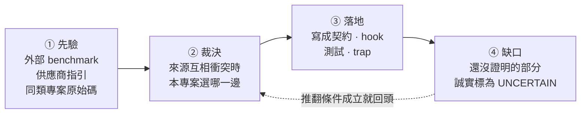

# Harness engineering 研究總結

工程工作流 skill 的分題研究見 [Matt Pocock skills 導入研究](mattpocock-skills-integration.md),
已核准的後續範圍, 驗收與停止條件見
[蒸餾實作計畫](../plans/engineering-workflow-distillation.md).

> 對齊日期: 2026-07-28, 上游與場域研究於 2026-08-08 重查 (Pilotfish v1.3.10, Deep Agents 0.7.5). 這是目前專案採用決策的入口; 各來源的取證細節留在分題文件.

## 這份文件回答什麼

一個 harness 是包在模型外面的規則層: 它決定模型能做什麼, 什麼時候該找第二個模型, 以及結果怎麼被檢查. 規則越多, 每一條被遵守的機率越低, 所以「該放幾條」是本專案唯一真正要回答的問題.

這份文件走完那個回答的四個階段:



**先驗永遠可以被本機證據推翻**, 反過來不行. 這是全篇最重要的一條規則.

## 一分鐘版: 八個現行結論

harness 應該縮到「模型無法可靠自行維持, 且能被驗證」的邊界. 落在邊界內的是: 權限, 派工深度, 可寫 artifact 所有權, Plan 收斂, provider route, 獨立驗證條件, 可追溯結果, 部署邊界. 落在邊界外的是風格偏好, 一般工程常識, 重複提醒 - 這些寫進 resident prompt 只會稀釋其他規則.

| # | 本專案採用 | 拒絕掉的替代做法 |
|---|---|---|
| 1 | main task 保有整合與最終判斷, direct execution 為預設 | 預設就派工, 讓 main 只當協調者 |
| 2 | 只因平行價值, context 保護或 fresh-context independence 才派工 | 因為「任務看起來很大」就派工 |
| 3 | 以任務形狀 batching | 以檔案數或 request bullets batching |
| 4 | Plan 最多兩次自動實質修訂, 之後交還使用者 | 讓 verifier 無限要求修正 |
| 5 | outcome verifier 最多一個, 放在最小完整驗收邊界 | 每個失敗面各放一個 verifier |
| 6 | Claude no-write roles 不給 Bash; 要跑命令的獨立 verdict 交給 Codex read-only sandbox | 用 shell allowlist 擋掉危險命令 |
| 7 | provider/model 決策只用同 role, 同 task class, 同 route cell 的本機結果, 樣本不足就探索 | 直接照外部排行榜選 provider |
| 8 | Git 是可攜真相源; installer lock, 憑證, session, 服務狀態留 machine-local | 把整個 HOME 都納管 |

## 來源衝突與裁決

八個結論不是憑空選的, 是三類來源互相矛盾時逐條裁決出來的.

| 議題 | 衝突 | 裁決 | 理由 |
|---|---|---|---|
| 主動派工 | Pilotfish 鼓勵在合適形狀下主動 dispatch; 精簡 resident prompt 傾向少規則 | 保留三項成本測試, 未通過就 direct | 取得平行效益, 同時避免 delegation tax |
| Batching | 上游示例偏向同形任務批次; 一般 checklist 容易按 request bullet 拆分 | 依 shared context, artifact, dependency, verification surface 分組 | 降低重建 context 與整合成本 |
| Plan 迭代 | verifier 可持續要求修正; 不中止會形成 churn | 同 readiness-unit 最多兩次自動實質修訂 | 把真正的選項交回使用者, 不假裝無限收斂 |
| Bash 唯讀 | shell allowlist 想保留可執行重現; security review 證明 parser 可被 callbacks, 環境與 expansion 繞過 | Claude no-write roles 完全移除 Bash; 命令驗證轉 Codex read-only sandbox | 能力邊界比「解析任意 shell」可證明 |
| Prompt 壓縮 | Pilotfish benchmark 支持壓縮; vendor guidance 仍要求清楚結構與關鍵約束 | 移除重複與過時敘述, 不刪除 authority, stop, QC 與安全邊界 | 壓縮是降低 resident tax, 不是追求最短 |
| 壓縮的驗證方式 | 上游 v1.3.7 的 255 條短語斷言全數通過, 仍放進十二個語意缺陷; 本專案測試同樣以短語為主 | 壓縮常駐契約時另做逐句對照, 重點檢查連接詞, 範圍限定詞, 否定詞 | 這三類改動不會動到任何被斷言的短語, 測試綠燈不構成證據 |
| Provider 選擇 | 外部排行榜給先驗; 本機成本與失敗形態可能相反 | 外部資料只做先驗, 本機 ledger 達樣本門檻後覆蓋 | 對實際工作流的可接受結果成本最重要 |
| Headroom 版本 | PyPI package 與 GitHub release tag 可能不同步 | 分別報告 package, release tag, PR 與 live service state | 避免把不同層級合成「目前版本」 |

## Pilotfish v1.3.0-v1.3.10 蒸餾結果

對齊上游 [v1.3.10 release](https://github.com/Nanako0129/pilotfish/releases/tag/v1.3.10) (tag commit `7a7f71b...`, 2026-08-08).

v1.3.0 到 v1.3.4 存續下來且適合本專案的精華, 已經全部落為本專案的機制:

- shape-based batching 與 direct-execution brake
- 最小完整驗收邊界與 outcome verifier quota
- Plan anti-churn
- fixed dispatch/result record 與 provenance-aware QC
- security review/execution 分權
- resident prompt 去重與 current-state 文件收斂

v1.3.5-v1.3.10 的增量分成三種處置:

| 上游增量 | 處置 | 本專案怎麼做 |
|---|---|---|
| verdict 三分 CONFIRMED/REFUTED/INCONCLUSIVE | 已有等價 | 雙 provider 一致 |
| dispatch brake 壓過 explicit opt-in | 已有等價 | - |
| 常設 prompt 尺寸預算寫進測試 | 已有等價 | per-document 字數上限 + resident 總量 + role body budget; 另加規則條數, 每條位元組, 虛詞比例三項密度指標. 量測口徑與上游不同 |
| 只有可重現的 P0-P2 blocker 能 refute, P3/P4 僅建議 | **改造後採用** | 收斂成一條判準: 反例要可重現**且會改變驗收結論**. 其餘列 `Advisory:` 照報但不動 verdict. 不引進嚴重度分級 |
| 阻斷性修復共用五次 pass 預算 + candidate-state fingerprint | **改造後採用** | 五次上限照採; 指紋改成每個 pass 自述「上次之後改了什麼」, 沒改就不重驗 |
| readiness epoch 與一次最終 fresh readiness check | **不採用** | 維持現行硬性兩次上限, 不放寬 |
| 互動模式先於工作者選擇 (v1.3.9) | **不採用** | client 的 plan mode 已承擔「廣泛請求先唯讀」; 理由見[明確不做的事](#明確不做的事) |
| cue-free 限制: 更高優先級的 client 指令壓得過 user 層契約 (v1.3.9) | **採用** | 待辦方向 1. 本機另有當下可觀察的實例, 不只是借用上游結論 |
| 壓縮後對出貨位元組重做行為認證, 候選綁回被測快照 (v1.3.9 -> v1.3.10) | **改造後採用** | 待辦方向 2. 接線既有 census 指紋, 不新建 Gate |

**這些控制目前只有靜態契約與測試, 沒有行為證據.** 仍未證明的是長流程中的效果: 中斷後恢復, 連續 correction, 互相衝突的 leaf 結果, 以及真實 token 與 wall-clock 改善. 這些要靠 lifecycle replay 與 ledger 驗證. 不能把「測試存在」寫成「效果已證明」.

上游 v1.3.6 之後已公開自己的 Gate replay 方法與成本. **方法可借用, 數字不可借用** - 那是它的契約在它的 client 版本上的觀察.

## 時效性基準

外部版本會變動, 引用前一律 live recheck.

| 來源 | 查核時的狀態 | 查核日 | 注意 |
|---|---|---|---|
| Pilotfish | latest release tag `v1.3.10`, tag commit `7a7f71b...` | 2026-08-08 | 上游發版頻率高於本文件重查頻率 - 四天內出了 v1.3.9 與 v1.3.10 兩版, 引用前先確認 tag |
| Deep Agents | PyPI stable `0.7.5` (2026-08-06); CLI `deepagents-code 0.1.54` | 2026-08-08 | SDK 與 CLI 交錯發版, 版本序不同步; 版本與託管產品狀態需在引用時重查 |
| Headroom | PyPI `headroom-ai 0.35.0`; GitHub latest release tag `v0.35.0` (皆 2026-08-13); 本機 CLI `0.35.0`; 跑著的 proxy 自報 `0.35.0`; PR #1044 仍 open | 2026-08-17 | 四層這次全部對齊, 而**第四層是問出來的不是推的** — 08-14 查時 `persistent-service` 停著, 根本問不出 proxy 版本; 08-17 重啟後 `/health` 才自己說. 見 [landing-log](landing-log.md) 的 2026-08-10 與 2026-08-14 兩次查核 |
| mattpocock/skills | Claude marketplace pin `068b6e0`; release tag `v1.2.3` (2026-08-06); `plugin.json` version `1.2.3`; 25 skills | 2026-08-17 | **版本號不會告訴你內容變了** - 08-14 到 08-17 之間 pin 前進 12 個 commit, 而 tag, version 與 skill 數全部沒動. 逐字引用上游 SKILL.md 前先重解析 pin, 見 [mattpocock-skills-integration.md](mattpocock-skills-integration.md) |
| Artificial Analysis Intelligence Index | **v4.1.1** (August 2026-current) | 2026-08-14 | 點版本會回溯重算全部分數 - v4.1.1 只換了 𝜏³-Banking 的 dataset 與三項評測的 grader, 前緣分數就整體上移約 2 分. 引用絕對值前先確認版本, 見 [model-evidence.md](model-evidence.md) |
| OpenAI prompting guidance | [Latest model guide](https://developers.openai.com/api/docs/guides/latest-model?model=gpt-5.6#prompting-best-practices) | - | 目前 canonical 文件 |
| Anthropic context guidance | [Effective context engineering](https://www.anthropic.com/engineering/effective-context-engineering-for-ai-agents) | - | - |

## 方向與落地紀錄

這節回答「下一步做什麼, 為什麼是這一步」.

排序原則是**證據強度 × 成本**, 不是影響力大小. 理由: 影響力是估出來的, 前兩者查得到. 用估出來的量當主排序鍵, 等於讓最會講故事的那條排第一.

每條方向只寫三行: 做什麼, 為什麼排這裡, 什麼會推翻它. **沒有推翻條件的建議不是結論, 是偏好.** 落地時先跑推翻條件, 成立就照該條自己寫好的降級方案走.

### 已落地 (2026-08-04)

七條方向一次做完. 推翻條件的查核結果是這批最值得看的部分 - 七條裡有五條的原始理由**不成立**:

```
推翻條件查核結果
  不成立      █████        5 條  ← 原始理由被本機證據推翻, 走降級方案
  成立但理由不同 █          1 條  ← 目標本來就達成, 交付改成修文件
  部分成立     █           1 條
```

順序只調動過一次: 第 4 條排到第 5 條之前. 第 5 條會鼓勵壓縮, 先開閘再補防護等於刻意製造暴露窗口.

| # | 方向 | 推翻條件查核 | 落地形式 |
|---|---|---|---|
| 1 | `mech-executor` 強制行只留 `AUTH:` | **成立, 但理由不同**: 逐 commit 查核顯示兩端契約從未出現 INTENT/TWINS, 原本「規則自己製造它要防的失敗」這個前提是錯的 | 目標狀態本來就成立且已被測試鎖住; 交付改成修正兩份寫錯因果的文件 |
| 2 | 解開 support pin 取樣死結 | 不成立: 兩端三個 profile 逐一查過, 沒有任何一個覆寫 support role 的 frontmatter pin | 走「承認由使用者偏好決定」那條. `model-routing.toml` 撤回 `n >= 10` 引用, 改記 `support_pin_evidence`; 論述見 [model-evidence.md](model-evidence.md) |
| 3 | 有界重驗: pass 預算與指紋 | 不成立: ledger 有一條 2026-07-28 的四次 verifier 派工鏈 (同一目標, 4.5 小時內), 三次上限會誤殺合法工作 | 兩端 dispatch skill 加五次上限, 並要求每個 pass 先講出上一次之後改了什麼; 沒改的候選不重驗 |
| 4 | 壓縮的語意守門機械化 | 不成立: `c143b72` 自己的 commit message 就是一筆本機壓縮語意缺陷 | 新增 `scripts/contract-operator-delta.py`, 永遠 exit 0 的附證腳本, 不是 gate |
| 5 | 常駐預算改為正規化密度 | 不成立: 換算後兩份契約在新指標下都有餘裕, 不是隱性收緊 | 密度指標**加在**字數上限之外, 字數上限一格未動 (見下) |
| 6 | REFUTED 門檻收斂 | 不成立: ledger 九筆 verifier 記錄裡沒有 advisory 級發現退回好結果的實例 | 兩端 `verifier` 契約各加一句判準, 不引進嚴重度分級 |
| 7 | lifecycle replay 存活判準 | **部分成立**: 判準第 3 項確實不需要 live session 就量得到 | 寫成 [lifecycle-replay.md](lifecycle-replay.md), 並註明第 3 項已有 `weekly-integrity` 在看; replay 仍未開跑 |

第 5 條的落地與原本寫的不同, 值得說清楚:

- 密度指標是**加上去**, 不是取代字數上限.
- 要讓密度先綁定, codex 那份的字數上限得往上拉約四分之一. 沒有證據支持把常駐層放大到那個程度.
- 這條方向自己的推翻條件禁止把收緊偷渡進換算. 同一條理由也禁止偷渡放寬.
- 真正換掉的是**調高字數上限的判準**: 三項密度都還在上限內的擴充, 買到的是更好的句子而不是更多字.

同批完成的還有 trap 在 Opus 5 上的重跑 (2026-08-04): s7/s8 各 3 seeds, s9 補到 11 seeds. 結果見 [model-evidence.md](model-evidence.md) 與 `evals/traps/*/README.md`.

### 待辦方向

2026-08-08 重查上游與場域研究後重排. 新來源沒有各自散開, 它們全部落在同一條軸上 - **一條常駐規則的一生** - 而本 repo 目前只有兩個階段有機制:

| 階段 | 現有機制 | 新證據指出的缺口 |
|---|---|---|
| ① 進場: 憑什麼常駐 | 字數上限, 三項密度指標, 「刪掉會不會讓模型犯錯」 | 預算不分程序型與知識型, 而外部消融只推翻得了後者 |
| ② 生效: 有機會被讀到嗎 | 無 | 常駐契約以 user context 進場, 服從是機率性的, 更高優先級指令壓得過它 |
| ③ 證明: 在哪一版位元組上證過 | census 的 `sha256`/`payload_sha256`, 275 條靜態斷言 | trap 結果表沒有指紋欄, 行為證據不帶有效期 |
| ④ 反證: 會不會過度觸發 | s10 的 `c-no-exclusions` 變體, 只蓋 skill description | gate 層沒有「本來就不該觸發」的對照組 |
| ⑤ 退場: 擋下來之後呢 | 五個 fail-closed gate | 沒寫下擋下來要回什麼, 也沒在量連續拒絕 |

排序照舊是**證據強度 × 成本**. **lifecycle replay 2026-08-12 跑完第一批** (15 個 run), 所以它從待辦移出; 見下方 [2026-08-12 判準 2 與第一批](#2026-08-12-判準-2-備妥-replay-有了自己的-harness) 與 [lifecycle-replay.md](lifecycle-replay.md). 一批 n=5 的下界撐不起任何「控制成立」的結論, 下一批要問的是**第 3 回合那個排擠假說**, 而不是把同一批再跑一次.

**現況一覽 (2026-08-10 收束).** 五條的推翻條件查了四條, 而**四條的原始理由全部不成立** - 這批的命中率是 0/4, 比上一批七條裡活兩條還低. 這不是規劃品質差, 是「每條自帶推翻條件」在做它該做的事; 真正該擔心的是某批全部命中.

| # | 階段 | 推翻條件 | 實際發生什麼 | 落地 |
|---|---|---|---|---|
| 1 | ② 生效 | **2026-08-14 推翻條件成立** | 推翻條件是「找得到一個 session, client 指令與契約直接衝突而契約仍勝出」. 建出來了: 系統提示明令不准用中文, 契約要求繁中, 英文提示排除鏡射 — 契約在 3/5 個 session 勝出 (`p1b`), 中文提示時 5/5 (`p1`). 依該條自己寫的降級方案, **只保留「以 user context 進場」這個事實, 不寫優先權結論** | 文件 + [replay p1/p1b](../../evals/replay/README.md) |
| 2 | ③ 證明 | **反被推翻** | 不是還原困難, 是還原路徑已斷 - 十個本地 SHA 引用死了六個, 成因是 rebase | 內容指紋取代 commit SHA, 附證腳本 |
| 3 | ① 進場 | **成立但理由不同** | 32 個子句裡 repo 知識型是 **0** 條; 兩分法錯在關節, 要三分 | 判定軸寫進瘦身規範; 衍生 A/B 見 s11 |
| 4 | ④ 反證 | **字面成立, 意圖不成立** | s8 的通過條件確實是不動作, 但那是正向測試; 真洞是**通過條件可以事後選** | s7 grader 改必填 `--expect` |
| 5 | ⑤ 退場 | **不成立, 但門檻選錯對象** | 有連續 5 次, 但幾乎全是 commit-gate 的紅套件重試 - 那是機制在運作 | denial log (只記錄, 不設門檻) |

那時還欠著三件, 到 2026-08-12 收束成一件: negative control fixture (方向 4) 已落地為 s8 arm B 並跑過每臂 30 次; description 接不接得住隱晦措辭 (方向 3 衍生) 已測且**判定無定論, 退場**; **lifecycle replay 也在同日補齊並跑完第一批** — 四項判準, 三份事前登記情境, 15 個 run. 三件都收束了, 開著的換成新的三件 (見下).

這些查核的完整紀錄搬到 [landing-log.md](landing-log.md) 了 —— 它是一份**日誌**, 而本文是**總結**, 兩者長在一起時 sprawl guard 就會燒. 依日期由新到舊:

- [2026-08-14: 方向 1 的推翻條件成立 — 契約有時候真的贏](landing-log.md#2026-08-14-方向-1-的推翻條件成立--契約有時候真的贏)
- [2026-08-14: 判準 3 的不穩定比任何操弄都大](landing-log.md#2026-08-14-判準-3-的不穩定比任何操弄都大)
- [2026-08-13 計劃區塊已落地 (2026-08-14 收)](landing-log.md#2026-08-13-計劃區塊已落地-2026-08-14-收)
- [2026-08-12: description 覆蓋度實測, 無定論 —— 但推翻了一條自己記過的結論](landing-log.md#2026-08-12-description-覆蓋度實測-無定論--但推翻了一條自己記過的結論)
- [2026-08-12: 判準 2 備妥, replay 有了自己的 harness](landing-log.md#2026-08-12-判準-2-備妥-replay-有了自己的-harness)
- [2026-08-13: 排擠假說被自己的操弄推翻](landing-log.md#2026-08-13-排擠假說被自己的操弄推翻)
- [曾經要等新 session 的兩件 (2026-08-11 開, 2026-08-12 兩件都收掉)](landing-log.md#曾經要等新-session-的兩件-2026-08-11-開-2026-08-12-兩件都收掉)
- [2026-08-08 查核結果 (方向 1, 2)](landing-log.md#2026-08-08-查核結果-方向-1-2)
- [2026-08-08 查核結果 (方向 4)](landing-log.md#2026-08-08-查核結果-方向-4)
- [2026-08-08 查核結果 (方向 3)](landing-log.md#2026-08-08-查核結果-方向-3)
- [A/B 結果 (2026-08-08 ~ 08-10, 90 runs)](landing-log.md#ab-結果-2026-08-08--08-10-90-runs)
- [2026-08-08 查核結果 (方向 5)](landing-log.md#2026-08-08-查核結果-方向-5)
- [2026-08-10 查核結果 (Headroom 0.34 升級): 同一個失效換了一層皮](landing-log.md#2026-08-10-查核結果-headroom-034-升級-同一個失效換了一層皮)
- [2026-08-14 查核結果 (Headroom 0.35 升級): 這次是儀器先開口](landing-log.md#2026-08-14-查核結果-headroom-035-升級-這次是儀器先開口)

### 明確不做的事

| 不做 | 理由 |
|---|---|
| 移植上游的 P0-P4 嚴重度分類法 | 換到的是同一個失效的更細表述, 代價是六個角色檔的規則條數 |
| 把上游 Gate 的數字當本專案證據 | 那是它的契約在它的 client 版本上的觀察; 方法可借, 數字不可借 |
| 把語意守門做成 fail-closed gate | 合法變動遠多於違法變動, 高誤報會導致繞過或白名單 |
| 在存活判準之前開跑 lifecycle replay | 會產出被後續文件引用, 且引用者看不出是空的數據 |
| 移植上游的三模式互動路由 (`co_discover`/`explore_then_plan`/`execute`) | 它買到的是「廣泛請求第一回合唯讀」, 而 client 的 plan mode 已承擔同一件事. 代價是常駐層多一組模式詞彙, 而本機沒有一筆「廣泛請求在第一回合造成不可逆寫入」的證據 |
| 防竄改 (雜湊鏈) 帳本 | 外部普查 70 個系統只有 5% 做到, 20% 有結構化稽核而本專案已在後者. 但本專案的閘刻意是可被 `--no-verify` 停用的本機閘; 在一個承認可繞過的模型上加防竄改帳本, 買到的是形式不是保證 |
| 用 ACE 的自動 Curator 改寫常駐契約 | 常駐層要人審與 Git 部署; 自動重寫直接撞上已證實的語意反轉失效 |

## 文件索引

| 文件 | 回答什麼問題 |
|---|---|
| [context-and-vendors.md](context-and-vendors.md) | 常駐 context 有多貴, 兩家供應商官方怎麼說 |
| [resident-context-options.md](resident-context-options.md) | 常駐成本現況, 可用槓桿與延後的 runtime-selection eval |
| [peer-harnesses.md](peer-harnesses.md) | Deep Agents 與 Pilotfish 的原始碼與版本拆解 |
| [model-evidence.md](model-evidence.md) | route 與 effort 怎麼選, 成本口徑怎麼算, 外部先驗有多可信 |
| [trap-experiments.md](trap-experiments.md) | 可重播的失敗情境與反證 |
| [local-experiments.md](local-experiments.md) | 本機任務結果 |
| [lifecycle-replay.md](lifecycle-replay.md) | replay 的四項存活判準, 三份事前登記情境, 與 2026-08-12 第一批的結論 |
| [prompt-surface-census.json](prompt-surface-census.json) | deterministic resident/role surface 快照 |

## 驗證缺口

- [UNCERTAIN: 上游 v1.3.6-v1.3.10 的 Gate 數據是它自己契約的 reachability 觀察, 不轉移到本專案. 本機 lifecycle replay 累計 **463 個 run** (2026-08-12 至 08-17, [lifecycle-replay.md](lifecycle-replay.md); `runs/` 下另有兩個目錄沒有 `meta.json`, 一個在操弄檢查就被退貨, 一個作廢, 都不算 run; 每個 run 的量測面 fingerprint 記在自己的 `meta.json`, 這裡不再抄一個會過期的值): 中斷後恢復與衝突的 leaf 結果各 5/5 未觀察到失效, 但 exact 95% CI 下界只有 0.478 — 真實成功率五成也和這批相容, 所以這**不是**「控制成立」的證據, 而後續的批次都沒有加大這幾格的 n. 連續 correction 每個 run 都至少缺一次標記, 而事前登記的衰減檢定 p = 1.000, 記為在此 n 下未觀察到衰減. 判準 3 已於 2026-08-15 重新定義為「每筆派工都有紀錄」, 舊定義下的對帳率 (33 個有帳要記的 run 只有 15 個對上) 不再是有效性判準, 而補紀錄的掃描**尚未在真實使用裡被觀察到寫出任何一筆**. 另外 replay 的構造是契約加 hook 層, 與 trap 的契約單獨不同, 兩邊數字不互通.]
- [UNCERTAIN: 待辦方向 2-5 的推翻條件已於 2026-08-08 ~ 08-10 查完, 四條的原始理由全部不成立 (見[現況一覽](#待辦方向)); 方向 1 (② 生效) 仍**未決** - 它要的是 session 證據, repo artifact 判不出來. 這一列在 2026-08-11 之前寫的是「一條都還沒查」, 查完後沒跟著更新: 一份宣告自身不確定性的清單過期, 比別處過期更傷, 因為它是別人用來判斷「哪些結論還不能引用」的那張表.]
- [UNCERTAIN: s11 的 90 runs 是**零結果**, 2026-08-13 的 replay `d1`/`d2` 又在派工路徑上加了 21 runs 的同向零結果 (三臂齊平 5/5 載入, 契約提及 2→1→0 不動搖它) - 契約提及沒有移動任何一次載入決策. 零結果比正結果更容易來自「測不到」而不是「沒有效果」: 這批只覆蓋兩個 clause, 一個模型與兩種觸發強度, 而且**每一格的通過條件都是「該載入時有沒有載入」**. **2026-08-15 反向對照建立了, 而且過了**: 語言子句在英文請求下 arm A 中文 5/5, arm B (拿掉那條) 中文 0/5, 完全分離 ([lifecycle-replay.md](lifecycle-replay.md) 的「反向對照」). 所以這些零結果**是關於那些子句的**, 不是關於一把瞎掉的尺 —— 這一條的原始疑慮解除.

  **但只解除到「不是瞎的」為止.** 那是地板測試不是校準: 語言子句的效應極大 (0 vs 85 個漢字), 而**最小可偵測效應仍然未知**. 零結果現在的正確讀法是「沒有這個量級的效應」, 而那個量級是多少沒有人量過. 加上 `q1`/`q2` 的結論 (產出正確性原理上無法為派工子句定價), 要再往前得換量測對象而不是換題目.]
- [UNCERTAIN: 第 3 與第 6 條的推翻條件已於 2026-08-04 查過 ledger (131 筆, 其中 verifier 9 筆), 但這是單機單人的樣本; 「沒觀察到」在這個量級上是弱證據.]
- [UNCERTAIN: **從來沒有量過「規則觸發了有沒有比較好」** (這句在 2026-08-17 之前為真, 之後不再是 —— 見本條最後一段的 `v1`/`v2`; 原句留著, 因為它底下那段推理仍然是這一格的來歷). s7 量 gate-line 合規率不量報告品質; s11 與 replay `d1` 量 skill 載不載入不量派工品質; r2 系列量標記有沒有出現不量那些選擇做得對不對. `d1` 三臂全部 5/5 載入而沒有人檢查三臂的派工品質是否相同 — 契約子句刪掉後若載入照舊但品質下降, 現行量測面完全看不見. 要建的是**結果品質的判準**而非行為的判準, 瓶頸在判準設計不在算力: 候選裡「leaf 有沒有回傳可用結果」太低標, 「brief 含不含 scope/done-criteria」又是在量形式 (本目錄已被形式檢查咬過三次), 人工評分違反判準 4.

  **2026-08-15 量了一次, 而且結果比缺口本身更值得記** (`q1-clause-verdicts`, 見 [clause-pricing.md](clause-pricing.md) 的「結果品質的判準」): 十一條各有事前寫死的裁決, 兩條只有並排兩份 leaf 報告才判得出來. 三臂各 5 個 run, **全部 11/11, 165 個裁決零錯誤**, leaf 覆蓋率與 invalid 率也都沒有分離. 依事前判準讀數是「可以刪」.

  但範圍窄, 而窄在請求那一句: turn 1 逐字沿用 `r3`, 而那句話**自己就把派工形狀講完了**, 所以這 15 個 run 分不出「子句沒有價值」和「請求已經做完子句的工作」. 撐得住的是**當請求已寫明形狀時常駐提及沒有可量到的貢獻**; 撐不住的是「所以可以刪」. 請求含糊時一個 run 都沒量過.

  **2026-08-15 續: 含糊那格也量了, 而這條路到底了.** `q2-unstated-shape` 種了平的互斥與近似陷阱, 請求完全不講形狀. arm A 五個 run **沒有一個派工** (0/5), 自己讀完兩份文件, 每一組互斥都找到, 零誤報零發明. 所以 B/C 不跑 —— 派工次數已經在地板, 拿掉講派工的子句不可能讓 0 更少, 這是推導不是猜.

  底下的理由是結構性的, 不是題目沒設計好: **隔離只會減少資訊, 永遠不會增加**. 握有聯集的單一讀者算得出任何切法算得出的答案, 於是「答案可檢查」與「隔離拿得到分」互斥 —— 前者蘊含單一讀者算得出來, 後者要求價值在兩份判斷的獨立性而那沒有唯一正確答案, 判準 4 過不了. **用產出正確性去證明派工類常駐子句的價值, 原理上走不通.** 還量得動的是成本, context 餘裕, 以及輸入真的裝不下的工作, 但最後一項量到的是容量不是子句.

  **2026-08-17: 上一段的論證只涵蓋做減法的子句, 這一格因此重開了一半** ([clause-pricing.md](clause-pricing.md) 的 `v1`/`v2`). 驗證子句做的是加法 —— 跑一次程式產生的事實讀不出來 —— 所以它的結果品質可判, 而且**判準真的跑起來了**: grader 自己跑交付的函式, 40 個 run 零 invalid. 結果是天花板 (20/20 對 20/20, arm B 下界 0.832), 而原因是陷阱在閱讀距離之內: 15 個沒跑額外檢查的 run 全部直接讀了資料表. 由此得到**驗證類子句要能被定價, 那個事實必須在閱讀距離之外**. 這個 null 不 licence 這條子句無用, 也不 licence 關掉這條線.]
- [UNCERTAIN: 方向排序是設計判斷, 不是實驗結果; 每條的「推翻條件」才是可檢驗的部分, 落地紀錄裡的查核結果同樣只在當時的 artifact 上成立.]
- [UNCERTAIN: provider route cells 多數尚未達決策樣本門檻.]
- [UNCERTAIN: 外部 package, release, beta 與 PR 狀態會變動, 引用前必須 live recheck.]
