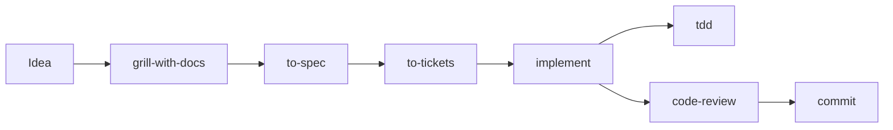

# Matt Pocock skills 導入研究

- 研究日期: 2026-08-14; 上游重查與第一批原始碼精讀 2026-08-17
- 上游: [mattpocock/skills](https://github.com/mattpocock/skills)
- 研究基準 (2026-08-14): Claude marketplace catalog `f8f7402b0ff3b88bf311d2efedeb6aad5841d0bb`; upstream pin `8b78b531ab965735c5dc74f6f7a219e1e37326df`; release `v1.2.3` (`6acc160e4e0cd062dbbbd7a1b26ae92855edf07e`)
- **目前 marketplace pin (2026-08-17): `068b6e0c62393147daf03530149cdce209c93da8`** — 見[上游 pin 三天內就動了](#上游-pin-三天內就動了)
- 本地基準: branch `new-artificialanalysis`; HEAD `8d5d2e18e0fca9c341429bd6ce8a51040d5e4f10`

> 本文件保存上游事實, 方案比較與採用決策. 實作順序, 檔案範圍, 驗收與停止條件在
> [蒸餾實作計畫](../plans/engineering-workflow-distillation.md).

## 結論

**採用「蒸餾自有核心 + commit-SHA 上游追蹤」; 不整包直接安裝, 不讓 `@latest` 或 plugin 自動更新成為 agent-harness 的受管來源.**

推翻條件: 若上游改成**內容變動必然帶版本變動** (marketplace pin 不再超前同名 release, 或 plugin version 隨每次 skill 內容改動而遞增), 蒸餾相對 vendoring 的主要理由就消失, 屆時應重新比較「釘 SHA 的 vendoring + read-only diff」是否成本更低. 2026-08-17 的重查是往反方向走的證據, 見下節.

上游最值得採用的是工程方法, 不是它完整的 orchestration ownership:

- 先建立能重現真實問題的回饋迴圈, 再診斷或修復.
- 測試放在公開行為 seam, expected value 來自獨立真相源.
- 以垂直切片縮小回饋距離, 避免一次展開整個水平層.
- 規格與 review 分開回答「做對東西」和「東西做得對不對」.
- 把難以回復, 容易令人意外的決策留成 ADR, 不把所有討論都文件化.

需要改寫的是權限, 派工, commit, 文件 ownership, 外部 issue 寫入與更新生命週期. 這些已有 agent-harness 的明確真相源, 不能由第三方 skill 重新定義.

## 研究問題

本研究回答五個問題:

1. 上游實際提供哪些工作流, 怎麼安裝與更新?
2. 哪些方法能補強 agent-harness, 哪些已經重複?
3. 直接套用會不會繞過現有 contract, dispatch, deployment 或文件邊界?
4. plugin, installer, vendoring, 蒸餾四種來源模式, 哪一種可重現且可 review?
5. 如何保留使用者自己的 tuning, 又不讓上游更新覆寫?

## 證據分層

### VERIFIED: 上游目前狀態

- `skills/engineering/` 有 18 個正式 skill, `skills/productivity/` 有 7 個, 共 25 個 promoted skills.
- `.claude-plugin/plugin.json` 在 `main` 與 `v1.2.3` 都列出完整 25 個 skills.
- 25 個 `SKILL.md` 合計 116,785 bytes; 連同 references, templates 與其他支援檔, 兩個 promoted buckets 共 209,463 bytes, 76 個檔案.
- 最新 GitHub release 是 `v1.2.3`, 發布於 2026-08-06.
- Claude 官方 marketplace 於研究日釘在 `8b78b53`, 即 2026-08-13 的 upstream `main`.
- `v1.2.3` tag 指向 `6acc160`, marketplace pin 已超前 tag, 但兩個位置的 plugin version 都仍是 `1.2.3`.
- 授權為 MIT, Copyright (c) 2026 Matt Pocock.

### 上游 pin 三天內就動了

2026-08-17 重查. 上面那組數字裡, **只有 pin 變了**:

| 項目 | 2026-08-14 | 2026-08-17 |
|---|---|---|
| Claude marketplace pin | `8b78b53` | **`068b6e0`** (= 上游 `main`, 2026-08-15 commit) |
| GitHub release tag | `v1.2.3` (2026-08-06) | `v1.2.3` (未動) |
| `plugin.json` 的 `version` | `1.2.3` | `1.2.3` (未動) |
| manifest 內 skill 數 | 25 | 25 (未動) |

兩個 pin 之間是 12 個 commit, 18 個檔案. 這件事有三層意義:

- **本研究「不以 semantic version 單獨代表內容」那條政策, 三天內就被上游自己證實**. 版本字串, release tag 與 skill 數全部沒變, 內容卻換了 — 只看版本號的人不會發現任何事發生過.
- **改到的正是第一批蒸餾的兩個來源**: `diagnosing-bugs/SKILL.md` (+1/-3) 與 `tdd/SKILL.md` (+1/-1) 都在這 18 個檔案裡.
- **改動集中在 invocation 語彙**: 三個 changeset 分別是 `skill-tool-invocation-terminology`, `user-invoked-skill-invocation` 與 `grilling-remove-em-dashes`, 另外 `.agents/invocation.md` 也改了. 觸發語與 invocation policy 正是蒸餾時最不該照抄, 必須依本專案 skill 載入方式重新推導的那一層.

因此本文件的 skill 清單, 分組與相容性判斷仍然成立 (數量與邊界未變), 但**任何逐字引用上游 SKILL.md 的動作都必須以 `068b6e0` 重新取證**, 不能沿用 `8b78b53` 的讀取結果.

### VERIFIED: 本專案目前邊界

- `main/` 是全域部署的唯一來源; repo 根目錄的 `.agents/skills` 是 dev-only, 不會自動部署.
- `main/.agents/skills/INSTALLED.txt` 只列 agent-harness 擁有的共用 skills, 部署採 managed merge, 保留清單外的 machine-local 第三方 skills.
- Claude 與 Codex 的共用 skill 透過各自 surface 下的相對 symlink 或薄 wrapper 指回 `main/.agents/skills`.
- `scripts/deployment-manifest.tsv` 是唯一 source-to-HOME 映射; HOME 不是編修來源.
- 派工需要經 `baton-dispatch` 或 `leaf-dispatch`, main 保有架構, 整合, QC 與最終判斷.
- commit, publish, 外部 issue 寫入及其他外部變更需要明確授權.
- skill 的 name 與 description 是 resident metadata; body 只在叫用時載入. 因此 skill 數量仍有固定 catalog 成本, 但不能把 116,785 bytes 全算成每回合常駐內容.

### VERIFIED: 目前 machine-local 重疊

研究日的 `~/.agents/skills` 已有 `debug-issue`, `review-changes`, `review-pr`, `review-delta`, `refactor-safely`, `build-graph`. 這些不是 repo policy, 也不保證其他機器存在; 但在目前機器直接安裝整套上游, 會增加 debug, review, refactor 的同名意圖與觸發重疊.

## 上游工作流模型

上游主流程是:



三個主要 on-ramp:

- 問題已發生: `diagnosing-bugs` 建立重現與回歸測試後進入修復.
- issue 堆積: `triage` 將請求轉成 agent-ready 狀態.
- 工作大到超過一個 session: `wayfinder` 先解決未知決策, 再回到 spec/tickets.

底層 vocabulary skills:

- `domain-modeling` 維護 `CONTEXT.md` 與 ADR.
- `codebase-design` 提供 deep module, interface, seam, adapter, leverage, locality 等設計語彙.

其他 standalone skills 負責 prototype, research, handoff, 問卷, 教學, wizard, merge conflicts 與 agent-facing writing.

## Skill 分組與處置

| 處置 | 上游 skills | 原因 |
|---|---|---|
| 第一批蒸餾 | `diagnosing-bugs`, `tdd` | 價值高, 邊界相對獨立; 可改寫成符合本專案授權與驗證規則的核心. 精讀後成本不對稱: `diagnosing-bugs` 本體自足, `tdd` 的實質在兩份 reference 與一個跨 skill 指標, 見[原始碼精讀](#第一批兩個-skill-的原始碼精讀) |
| 第二批候選 | `grilling`, `grill-with-docs`, `to-spec`, `to-tickets`, `domain-modeling`, `codebase-design`, `code-review` | 方法有價值, 但需要重新設計問題數量, 文件 ownership, issue publishing 與 dispatch |
| 不直接導入 | `implement`, `ask-matt`, `setup-matt-pocock-skills`, `research`, `grill-me` | 與現有 main contract, skill routing, source ownership 或 leaf dispatch 重複; `grill-me` 只是轉呼叫 `grilling` 的一行 alias |
| 有需求再評估 | `triage`, `wayfinder`, `prototype`, `wizard`, `handoff`, `teach`, `to-questionnaire`, `wait-what`, `resolving-merge-conflicts` | 不是目前核心缺口, 部分還需要外部 tracker, 秘密或高風險操作 |
| 只吸收原則 | `improve-codebase-architecture`, `writing-for-agents` | 本專案已有 `harness-review`, contract-slimming 與文件分層, 另裝會形成第二套規範 |

上表涵蓋 manifest 內全部 25 個 skills. `grill-me` 沒有獨立 workflow, 因此不另外建立本地 alias.

## 相容性分析

### Contract 與授權

`diagnosing-bugs` 原版會從 diagnosis 走進 failing test 與 fix; agent-harness 把「診斷」和「修復」視為不同授權. 蒸餾版必須先依使用者動詞分類:

- `diagnose`, `explain`, `review`: 只取證, 定位根因與提出修復方向.
- `fix`, `change`, `build`: 才能寫 failing regression, 修改, 驗證.

`implement` 原版最後要求 commit; 本專案不允許 skill 自動把完成工作擴張成 commit, push 或 PR.

### 派工與 verifier

`grilling` 會為可查事實直接派背景 agent; `code-review` 固定把 Standards 與 Spec review 並行派出. 這繞過:

- dispatch payoff 判定;
- `leaf-dispatch` / `baton-dispatch` 的 brief 與 stop;
- 固定 `[LEAF_DISPATCH]` / `[LEAF_RESULT]` 紀錄;
- experience ledger;
- 每個 top-level task 最多一個 outcome verifier.

蒸餾版 skill 不直接擁有 dispatch; 若工作真的值得派工, 只能要求 main 進入現有 dispatch workflow.

### 文件 ownership

`setup-matt-pocock-skills` 預設新增或修改根目錄 `AGENTS.md` / `CLAUDE.md`, `docs/agents/*`, `CONTEXT.md` 與 `docs/adr/*`. 本專案已有:

- `main/claude/CLAUDE.contract.md`;
- `main/codex/AGENTS.contract.md`;
- `docs/architecture.md`;
- `docs/harness-engineering.md`;
- `docs/research/*`;
- `main/claude/plans/*`.

直接跑 setup 會建立平行真相源. 蒸餾版只能更新既有 owner, 不能自行發明新的根文件布局.

### 外部 issue tracker

`to-spec`, `to-tickets`, `triage`, `wayfinder` 假設可寫 issue tracker. agent-harness 的 portable repo policy 不應依賴某一 tracker; 即使偵測到 GitHub remote, 建立或修改 issue 仍是外部寫入, 必須在精確 target 已知後取得明確授權.

### Context 與觸發面

全套安裝增加 25 組 resident name/description, 並讓主流程一次可能載入多個相依 skill body. 這不是不可接受的絕對大小, 但相對目前只管理四個共用 skills, 對尚未證明需要的流程屬於過早擴張.

## 第一批兩個 skill 的原始碼精讀

2026-08-17, 在 pin `068b6e0` 上逐字讀完 `diagnosing-bugs` 與 `tdd` 及其 reference.
**先前的分組與相容性判斷是從 manifest 與結構推的, 這節是從內文讀的**, 兩者結論一致, 但精讀
另外查出四項相依與一項先前沒注意到的價值.

### 體積與構成

| Skill | SKILL.md | 附帶 | 實際份量 |
|---|---:|---|---|
| `diagnosing-bugs` | 138 行 / 8614B | `scripts/`, `agents/` | 本體就是全部內容, 六個 phase 自足 |
| `tdd` | **38 行** / 3578B | `tests.md` (2214B), `mocking.md` (1481B), `agents/` | 本體是索引, 實質在兩份 reference |

`tdd` 比預期薄很多. 它把「什麼是好測試」外包給 `tests.md`, 把 mock 邊界外包給
`mocking.md`, 再把 seam/module/depth 的語彙外包給 `codebase-design` skill. **蒸餾它不是改寫
38 行, 是要決定那三份外包內容各自由誰承接.**

### 四項相依, 每項都要處置

| 相依 | 兩個 skill 怎麼用 | 本專案的處置 |
|---|---|---|
| `CONTEXT.md` 與 ADR | **兩個 skill 的開頭第一段都是**「read `CONTEXT.md` (if it exists)」與 respect ADRs | 計畫明文不新增 `CONTEXT.md` 與 `docs/adr/*`. 蒸餾版要改指既有 owner (`AGENTS.md`, [architecture.md](../architecture.md)), 不能只把那行刪掉留下空洞 |
| `codebase-design` skill | `tdd` 要 agent 呼叫 Skill tool 取 seam 語彙 | 不導入該 skill. 蒸餾版自帶最小語彙 (seam = 可觀察行為的公開邊界), 不留跨 skill 指標 |
| `tests.md` / `mocking.md` | TypeScript + Jest 範例 | 概念可移植, **範例不可移植** — 本 repo 是 Python + shell + markdown 契約. 要自己寫等價範例, 不是翻譯 |
| `scripts/hitl-loop.template.sh` | feedback loop 第 10 級 (需要人點擊時的結構化迴圈) | 本 repo 的驗證面沒有這種情境; 直接移除該級, 不留未實作的指標 |

### 先前沒注意到的一項價值

`diagnosing-bugs` 有一節 **Redact**: 這個 skill 會要求展示命令, 輸出與擷取的產物, 所以先把
秘密換成 `<REDACTED>`, 迴圈以環境變數建構讓憑證留在環境裡, 擷取的產物只引用帶訊號的那幾行;
**遮蔽後不足以診斷就明說並問使用者**. 這條在原本的分組表裡沒有出現過, 而它與本 repo 既有的
「外部寫入需明確授權」是互補而非重複 — 那條管的是寫出去, 這條管的是貼出來.

### 精讀確認的兩個衝突

先前從結構推出的兩個衝突, 在內文得到逐字證實:

- **`diagnosing-bugs` 沒有授權閘**. Phase 5 直接寫 regression test 並套用修復, Phase 6 的完成
  清單也預設改動已發生. 全文沒有任何一句把 diagnosis 與 fix 分開.
- **`tdd` 的 seam 確認是硬阻斷**: 「Test only at pre-agreed seams... confirm them with the
  user. **No test is written at an unconfirmed seam.**」與本專案「不要問 repo 已經講清楚的
  事」直接相斥. 本機證據支持修改而非照抄, 見下節.

### 最值得整批搬過來的一條

`diagnosing-bugs` 的 Phase 1 完成判準, 是整個上游 repo 裡最硬的一條規則:

> 說得出**一條命令** — script 路徑, 測試呼叫或一個 curl — 而且你**已經至少跑過一次**
> (附上呼叫與輸出), 並且它 red-capable (打到真正的 bug 路徑, 斷言使用者說的那個症狀),
> deterministic, fast, agent-runnable. 「還沒有這條命令就先讀程式碼建立理論」時**停下來**.

它把「我覺得問題在這」和「我有一個會為這件事變紅的東西」變成兩個可以分辨的狀態. 這正是本
repo 反覆在別的載體上重新發現的同一件事 (帶日期的查核宣稱, trap 結果列的指紋), 而上游把它
寫成了 debugging 的進場條件.

## 逐段對標 (2026-08-17, 重新抓取上游後)

前面那節的精讀是在 pin `068b6e0` 上做的, 但當時是**讀過就寫**, 沒有留下逐段對照.
這節是把上游四份檔案重新抓下來 (同一個 SHA) 之後做的比對, 也是 ATTRIBUTION 的 Rechecking
段要求的動作 —— 「必須重新抓上游, 重讀那份檔案不算 recheck」.

先驗工具本身: 抓到的四份大小是 8614 / 3578 / 2214 / 1481 bytes, **與前面那節記的完全一致**,
所以那次精讀的量測可信. 但路徑記錯了 —— reference 在 `tdd/tests.md` 與 `tdd/mocking.md`,
不在 `references/` 底下.

### `diagnosing-bugs` → `evidence-debugging`

| 上游元素 | 我們的處置 | ATTRIBUTION 有沒有記 |
|---|---|---|
| frontmatter 的觸發語 (broken/throwing/failing/slow) | 沿用同一組詞 | **沒有** — 描述本身是近似改寫, 未列名 |
| `CONTEXT.md` + ADR 開場 | 刪除, 改指既有 owner | 有 |
| **Redact** 一節 | 近乎逐字 | 有 (substantial portion 2) |
| Phase 1「這就是這個 skill」+ 十種建構迴圈的方法 | 濃縮成八種, 刪掉 HITL | 部分 — HITL 有記, 清單本身當成概念重寫 |
| **完成判準** (red-capable / deterministic / fast / agent-runnable + 停下來) | 近乎逐字 | 有 (substantial portion 1) |
| **Tighten the loop** (更快 / 訊號更利 / 更確定) | **整節刪掉** | **沒有** |
| 非確定性 bug 要提高重現率 | 改寫成「量到的重現率, 前後都要引用」 | 概念重寫 |
| Phase 2「錯的 bug = 錯的修復」「每個剩下的元素都要承重」 | 兩條都在, 措辭接近 | 概念重寫 |
| Phase 3 三到五個排序假設 + 可證偽 + 展示但不阻塞 | 四點全在 | 概念重寫 |
| Phase 4 一次一變因 / debugger 優於十條 log / 加前綴 / 效能先量基線 | 全在 | 概念重寫 |
| Phase 5「沒有正確的 seam, 那件事本身就是發現」 | 近乎逐字 | 有 (列在概念重寫裡, 措辭其實更接近逐字) |
| Phase 6 清理清單 | 濃縮成一句 | 概念重寫 |

### `tdd` → `test-first-change`

| 上游元素 | 我們的處置 | ATTRIBUTION 有沒有記 |
|---|---|---|
| **seam 定義**「你在那裡測的公開邊界: 觀察行為而不伸手進去的介面」 | 我們的是「檢查可以呼叫而不伸手進被測物的邊界」—— **近似改寫** | **記錯了** — 寫成「這一節不欠上游任何東西, 只欠它留下的缺口」 |
| 「只在事先議定的 seam 測 … 未確認的 seam 不寫測試」 | 刪除, 換成從程式碼推導 | 有 |
| `codebase-design` 指標 | 刪除 | 有 |
| 反模式 **Tautological**「用程式碼自己的算法重算期望值, 因此由建構保證通過」 | 我們拆成第 1 與第 2 類 | **記錯了** — 寫成「上游兩類都有」, 上游其實只有**一類** |
| 「期望值必須來自獨立的真相來源 —— 已知的字面值, 算過的例子, 規格」 | 我們: 「取自獨立於程式碼的來源 —— 已知字面值, 算過的例子, 規格」**近乎逐字** | **沒有** |
| 反模式 **Implementation-coupled** | 由 mocking 與 seam 規則覆蓋, 沒有獨立分類 | 沒有記 (既非採用也非刪除) |
| 反模式 **Horizontal slicing** + **vertical slices** + tracer bullet | 只留否定面 (不要一次寫完所有檢查) | 概念重寫 — 但**垂直切片這條正面規則被丟掉了** |
| 「Red before green … 只寫剛好夠通過的碼, 不預先做未來的功能」 | 步驟 3 | 概念重寫 |
| **「Refactoring 不屬於這個迴圈」** | tuning: 「Refactoring is not part of the red-green loop」**近乎逐字** | **沒有** |
| `mocking.md` 上半 (只在系統邊界 mock; 不要 mock 自己的東西) | 近似 | 有 (substantial portion 2) |
| `mocking.md` 下半 (dependency injection, SDK 式介面) | **刪除** | **沒有** |

### 五處要修

四處是**少算上游**, 一處是路徑錯. 少算是計畫明說唯一不能弄錯的方向.

1. seam 定義說成「不欠上游任何東西」—— 實際是近似改寫;
2. 「上游兩類都有」—— 上游只有一類, 第二類是我們拆出來的;
3. 期望值那句近乎逐字, 未列名;
4. 「Refactoring 不屬於迴圈」近乎逐字, 未列名;
5. reference 路徑寫成 `references/tests.md`, 實際是 `tdd/tests.md`.

另外兩處是**刪除未記錄**: `diagnosing-bugs` 的 Tighten the loop, `mocking.md` 的 DI/SDK 半節.

### 一個影響 M6 判斷的發現

我在 M6 判定裡寫「垂直切片是 `change-shaping` 唯一會帶來的新東西」. **那是錯的** ——
垂直切片就寫在 `tdd` 的反模式一節裡, 也就是我們已經蒸餾過的那個 skill, 而我們只留了它的
否定面 (不要一次寫完所有檢查), 把正面規則丟掉了.

所以那條規則的正確歸屬不是「未來某個 skill 的唯一價值」, 而是**這次蒸餾漏掉的一條**.

## 本機證據: CCR 事件同時檢驗了這兩個 skill

2026-08-17 處理 Headroom 0.35 CCR 失效的整個過程, 事後對照這兩個 skill **兩邊都不及格**.
這不是借來的論證, 是同一天在這個 repo 上發生的事, 完整經過在
[landing-log](landing-log.md) 與 `main/.agents/docs/headroom-runtime.md`.

| 上游規則 | 當時實際做的事 | 差在哪 |
|---|---|---|
| Phase 1: 沒有 red-capable 命令就不准進 Phase 2 | **一次都沒有重現過**那個 `HTTP 200 empty/malformed`. 從讀 proxy log 直接跳到假設 | 正是該 skill 自稱要防的那個失敗 |
| Phase 2: 迴圈要產生**使用者描述的**失敗, 不是附近那個 | 手上有的是 401, 429 與一條 CCR 轉換紀錄; 前兩者形狀就不對, 第三者只是相關 | 沒有「錯的 bug = 錯的修復」這道檢查 |
| 修復後要看它由紅轉綠 | 觀察到的是改設定後**症狀沒再出現** | 從來沒紅過的東西, 綠不構成證據 |
| `tdd`: 斷言不能由建構保證通過 | 那條測試斷言「launcher 有匯出 `HEADROOM_LOSSLESS`」 | 它重述了程式碼做的事, **永遠不可能與程式碼不一致**; 而它全綠時 CCR 完全沒關掉 |

### 這件事改動了兩條 tuning

**第一條, 補一條上游沒有的規則.** 上游的 seam 規則是「和使用者確認 seam」. 當時的 seam 毫無
疑義 (就是那個 shell function), 問誰都不會變; 真正的問題是**那個 seam 碰不到要觀察的結果** —
變數送出去了, 而它要影響的 proxy 早就在跑. 所以本專案的版本是:

> seam 必須抵達可觀察的結果, 不只是抵達你控制得了的那個動作. 當測試只能證明「請求已發出」,
> 就把「效果是否發生」明寫成未涵蓋, 不讓綠燈代言.

上游的 tautological 定義 (斷言重算了程式碼的算法) 涵蓋不到這個形狀 — 我們這一筆是**斷言了
正確的事實, 但那個事實與結果無關**. 這是對上游分類的補充, 不是複述.

### 兩件不能從這裡多讀的事

- **這不表示當時的處置是錯的.** 停用 CCR 這個決定本身有原始碼層級的證據 (lossless 會清掉
  `ccr_inject_marker` 與 `ccr_inject_tool`, 那條串流轉換因此沒有入口). 不及格的是**因果宣稱
  的強度**, 不是動作.
- **這不是「有了 skill 就不會發生」.** 沒有任何證據支持那個推論. 它支持的只有一件事: 這兩個
  skill 想防的失敗在本機真實發生過, 所以它們處理的不是假想問題. 這條把採用理由從「上游說它
  有用」換成「本機有一筆」, 僅此而已.

## 三種主要方案

| 方案 | Contract fit | 可重現性 | 更新安全 | Claude/Codex 對稱 | 維護成本 | 結論 |
|---|---:|---:|---:|---:|---:|---|
| Claude plugin + Codex installer 直接套用 | 低 | 低至中 | 低 | 低 | 低 | 拒絕作為正式來源 |
| 建立 installer/update 引導器 | 中 | 中, 需另釘 SHA | 中 | 中 | 中高 | 僅適合實驗或上游 diff 輔助 |
| 蒸餾成 agent-harness 自有 skills | 高 | 高 | 高 | 高 | 中 | 採用 |

### 為什麼不直接套用

Claude plugin 與 Codex installer 是兩套生命週期:

- Claude plugin 由官方 marketplace source pin 推進; README 宣稱自動更新.
- Codex 以 `npx skills@latest add mattpocock/skills` 複製可編輯檔案, 之後執行 `npx skills update`.

這會讓兩端在不同時間取得不同內容, 也會繞過 source checkout, manifest dry-run 與 parity. plugin 或 installer 可以做 disposable 評估, 不能做正式受管來源.

### 為什麼不以 updater 管核心

即使包一層 updater, 仍要處理:

- upstream skill 新增, 移除, 改名與相依變化;
- 本地 tuning merge conflict;
- license 與 attribution;
- Claude frontmatter 和 Codex `agents/openai.yaml`;
- contract, dispatch, commit 與文件語意的重新審查;
- 更新後的行為 traps.

既然每次更新都必須人工重新裁決, 讓 updater 覆寫 core skill 沒有實際好處. 較安全的功能是 read-only upstream diff report, 不是 automatic apply.

## 採用架構

蒸餾版把內容分成三層:

```text
SKILL.md
  stable portable workflow and stop conditions

references/tuning.md
  agent-harness-specific defaults and user tuning

ATTRIBUTION.md
  upstream URL, reviewed tag/SHA, borrowed concepts, MIT notice
```

這個切法讓 tuning 成為明示 owner, 而不是散落在 fork 後再也無法辨認的改字:

- `SKILL.md` 保存跨 repo 都成立的流程.
- `references/tuning.md` 保存本 harness 的授權, 問句, 報告, 測試與派工偏好.
- `ATTRIBUTION.md` 保存來源及法律義務.
- 上游更新只比對 stable workflow 與 attribution pin; 不能覆蓋 tuning.

## 使用者 tuning 的初始方向

下列 tuning 已由現有 contract 與本次決策支持, 實作時仍應寫成英文 runtime instructions:

- 先查 repo 和可觀察事實, 不把能查的問題丟回使用者.
- 只有不同答案會實質改變結果時才問; 一次只問一個精確問題.
- diagnosis-only 停在根因, 證據, 風險與建議, 不自動修復.
- build/fix 使用最窄, 真能反駁聲稱的驗證, 不用綠色 mocked test 代替真實路徑.
- 不自動 commit, push, publish, 建立 issue, 寫秘密或執行 cutover.
- 不直接 dispatch; 需要 leaf 時回到既有 dispatch skill.
- seam 要抵達可觀察的結果, 不只是抵達自己控制得了的動作; 測試只證明得了「請求已發出」時, 把「效果是否發生」明寫成未涵蓋. 這條來自本機 CCR 事件, 上游沒有.
- 展示命令, 輸出或擷取產物之前先遮蔽秘密; 遮蔽後不足以診斷就明說並詢問, 不自行降低遮蔽標準.
- 對使用者的輸出使用台灣繁中; code, identifier, command, runtime instruction 使用英文.
- 報告只保留 outcome, evidence, material decision, risk 與 next action.

這些是初始 baseline, 不是封閉清單. 後續自訂 tuning 先以一個應觸發案例和一個不應觸發案例說明預期行為, 再判定應落在 portable `SKILL.md`, 本專案 `references/tuning.md`, 或只屬於單次任務而不持久化. 只有 repo source, 行為 trap 和 metadata 一起更新後才算完成; HOME copy 不直接編修, deployment 仍是另一個需明確授權的階段. 完整變更流程見 [Tuning 變更協定](../plans/engineering-workflow-distillation.md#5-tuning-變更協定).

## 上游追蹤政策

1. 每次採用或重查都記錄 tag 與完整 commit SHA.
2. 不以 semantic version 單獨代表內容. 這不是假設性風險: 2026-08-14 到 08-17 之間 pin 前進 12 個 commit, 而 version, tag 與 skill 數三者都沒動.
3. 更新先產生 read-only source diff, 列出變更的 workflow, trigger, writable surface, dependency 與 license.
4. 每一項增量分成 `adopt`, `adapt`, `already-covered`, `reject`.
5. 只有 `adopt` / `adapt` 進入專案 diff; 不得整包覆寫.
6. 任何 substantial portion 都保留 MIT notice; 純概念重寫仍保留 attribution, 方便追溯.
7. 更新後重跑 skill validation, behavior traps, contract tests, prompt census 與 deployment dry-run.

## 已反證的候選問題

初次讀取 `.claude-plugin/plugin.json` 時, RTK/Headroom 壓縮後的 JSON 表面只顯示 16 個 entries, 似乎缺少 `setup` 與相依 skills. 重新以 raw GitHub API, `jq '.skills | length'` 和逐項列名查核後, `main` 與 `v1.2.3` 都是完整 25 個.

因此「上游 plugin manifest 缺 skill」不是 finding; 這個事件反而證明完整性結論不能建立在壓縮後陣列的視覺內容上.

## 仍未解決的證據

- 沒有安裝 Claude plugin, 也沒有做 live update probe; marketplace pin 在 version 不變時是否一定刷新既有安裝仍未確認.
- 沒有在 disposable repo 執行整套工作流. 第一批兩個 skill 已於 2026-08-17 在 pin `068b6e0` 上逐字精讀, 衝突判斷因此有內文依據 (見上); 但**仍然沒有一次 live behavior measurement** — 沒有觀察過上游版本在真實任務上的行為, 也沒有量過蒸餾版與原版的差異.
- CCR 那筆本機證據是**事後對照**, 不是事前登記的檢定. 它證明這兩個 skill 針對的失敗在本機發生過, 不證明採用它們會降低發生率. 後者要等蒸餾版落地後才可能量, 而且要先想清楚量什麼.
- `scripts/sync.sh` dry-run 在 sandbox 因 HOME temporary/lock paths 被拒絕而未完整通過; 錯誤是 `/Users/zack/.gate-test-*` 與 `~/.agents/telemetry/experience-pending.jsonl.lock` 的 `PermissionError`, 沒有觀察到本研究範圍的 product assertion failure.

## 來源

- [Claude official marketplace catalog](https://github.com/anthropics/claude-plugins-official/blob/f8f7402b0ff3b88bf311d2efedeb6aad5841d0bb/.claude-plugin/marketplace.json)
- [Upstream README](https://github.com/mattpocock/skills/blob/8b78b531ab965735c5dc74f6f7a219e1e37326df/README.md)
- [Claude plugin manifest](https://github.com/mattpocock/skills/blob/8b78b531ab965735c5dc74f6f7a219e1e37326df/.claude-plugin/plugin.json)
- [Codex plugin ADR](https://github.com/mattpocock/skills/blob/8b78b531ab965735c5dc74f6f7a219e1e37326df/.agents/adr/0002-ship-as-a-claude-code-plugin.md)
- [Engineering skills](https://github.com/mattpocock/skills/tree/8b78b531ab965735c5dc74f6f7a219e1e37326df/skills/engineering)
- [Productivity skills](https://github.com/mattpocock/skills/tree/8b78b531ab965735c5dc74f6f7a219e1e37326df/skills/productivity)
- [v1.2.3 release](https://github.com/mattpocock/skills/releases/tag/v1.2.3)
- [MIT license](https://github.com/mattpocock/skills/blob/8b78b531ab965735c5dc74f6f7a219e1e37326df/LICENSE)
