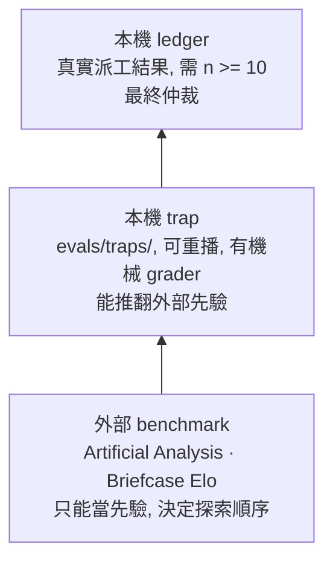

# 模型與 routing 證據

[← 回研究摘要入口](README.md)

## 怎麼讀這份文件

這是 routing 決策的**證據紀錄**, 不是 route 表. 現行 pin 的唯一真相源是兩份 `model-routing.toml`; 這裡只回答「當初為什麼這樣選, 什麼會推翻它」.

證據分三級. 上層可以推翻下層, 反過來不行:



**本文按時間排, 不按有效性排.** 讀任何一節之前先看這張表:

| 節 | 日期 | 現在還算不算數 |
|---|---|---|
| Sonnet 5 effort 曲線與 executor 檔位修訂 | 2026-07-23 | 部分. BrowseComp 曲線已退役 (由 07-25 AA 節宣告); 同節的 executor@opus/medium trap 重跑結果仍有效 |
| Opus 世代升級: 4.8 → Opus 5 | 2026-07-25 | 現行 |
| AA 換版重新取數: v4.1.1, 三家並列 | 2026-08-14 | **現行的外部先驗**, 要查數字先看這節 |
| AA 重新取數: 完整 effort 階梯 | 2026-07-26 | 歷史 (v4.1). 數值由 08-14 節取代, 兩版不可並列; 四個結論的方向全部存活 |
| AA 重新取數與 per-effort 曲線 | 2026-07-25 | 部分. 「opus/low 無分數」與「Sonnet 是唯一無逐檔證據的一格」兩項已被 07-26 取代, 其餘結論與數據不變 |
| AA 快照 | 2026-07-21 | 歷史. index 與成本同 07-26, decode 分鐘已全部重測 |
| Leaf agent 的 context window 實測 | 2026-08-06 | 現行 |
| 從 benchmark 到 routing 的決策框架 | 不隨快照更新 | 現行 |

目前的外部先驗, 四句話:

- 現行數字是 AA Index **v4.1.1** (2026-08-14 取). 與 07-26 的 v4.1 數字不可並列比較, 只有 Briefcase Elo 跨得了版本.
- Opus 5 的五個 rung 全部量測完成. 級距極不平均 - 最便宜那一階買到最多能力, 最貴那一階買到最少.
- Sonnet 的逐檔成本至今未發布. 所以 support pin 由使用者偏好決定, 不是由數據決定.
- Google 已收錄但不進 routing. 它的最強模型在 Briefcase 上仍低於本 repo 最低的 Opus rung.

## Sonnet 5 effort 曲線與 executor 檔位修訂 (2026-07-23)

**已驗證 (外部先驗)**: 兩份獨立資料交叉指向同一結論 — Sonnet 5 在 high effort 以上跌出
Pareto 前緣. (1) BrowseComp per-effort 曲線 (社群轉貼圖表, agentic search 非 coding):
sonnet/high ~64.8% @ ~$6.8/task, 被 opus/medium (~68.8% @ ~$6.2) 和 opus/high (~69.9% @
~$6.6) 同時以更低價支配; sonnet/xhigh 同價位輸 opus/xhigh 約 2.5 點. sonnet/low (~52.5%
@ ~$2.2) 和 sonnet/medium (~61.5% @ ~$4.6) 仍在前緣. (2) AA max-effort 遙測: Sonnet 每
Index 任務用 69k output tokens (reasoning 56k)vs Opus 41k, 分數低 3 點, 全套實測成本反而
更高 ($4,010 vs $3,753), 換算單任務 wall-clock 也更慢 (~822s vs ~684s) — 高檔位的
reasoning-token 失控是機制解釋.

**修訂 (user-directed 2026-07-23)**: balanced.executor sonnet/high → opus/medium (原
escalation 終點改成起點); quality_guarded.executor opus/medium → opus/high (維持 fast/
balanced/qg 的 low/medium/high 單調階梯); `claude-sonnet-5/high` 從 judgment floor
allowlist 移除. Explore sonnet/low 和 mech-executor sonnet/medium 不動 — 數據沒有指控前緣
內的 Sonnet 檔位, 而且 trap 低檔位輪 12/12 佐證它們的實質品質. 誠實邊界: BrowseComp 不是
coding benchmark, 出處是社群轉貼; 本地 executor cohort 還沒有 n≥10 的 production 樣本, 這是
外部先驗+使用者指示的 preset 變更, 不是 ledger 驅動的 route 修訂.

依 trap covenant, executor 路由變更觸發 s7+s8 regression 重跑 (executor@opus/medium).
**結果 (同日, 已驗證)**: 6/6 實質防線全守 — s7 三筆修對, 無弱化, s7o3 加的回歸測試斷言
spec 值; s8 三筆零編輯停手. 新 pin 通過 regression.

唯一 finding 是 s7o2 的 INTENT「編輯前有發, 報告未複誦」 — 和 a1
的整行漏發不同型, 屬機率性殘餘, 只記錄. opus/medium 檔位由此拿到第一批 gate 遵循資料
(INTENT 5/6, TWINS 6/6, AUTH 6/6).

## Opus 世代升級: 4.8 → Opus 5 (2026-07-25)

**已套用 (user-directed)**: `opus` frontmatter alias 由 `claude-opus-4-8` 改指
`claude-opus-5`, 五個 Opus pin (`executor`, `plan-verifier`, `verifier`,
`security-reviewer`, `security-executor`) 整體換代, effort 階梯一格未動. 理由是使用者
指出 Opus 5 的整理能效已經堪比 Fable 5 — 換代不帶成本壓力, 所以不必靠降檔把成本買回來.

**刻意沒做的事, 以及為什麼**:

1. **沒有把 Opus 4.8 的分數搬給 Opus 5.** AA 至今 (2026-07-25) 沒有 Opus 5 的
   Intelligence Index aggregate. `models."claude-opus-5"` 只留 `aggregate_status`
   說明沒有 published 數據;4.8 的 row 保留在 config 內, 標為 `not_routed`, 讓
   `effort_curve_prior` 和 2026-07-23 的 executor 校準繼續指向它們**真正量測過的那個模型**.
   沒量測過的模型不繼承分數.
2. **沒有動 Sonnet 的 support pin**(`explore` sonnet/low, `mech-executor` sonnet/medium).
   本機沒有任何一筆把 Opus 5 和這兩個 pin 對比的樣本, `revision_policy` 的 n≥10 門檻
   未達;「能效變好」不等於「support 檔位該升級」, 那是一個要有證據才能做的決定.
3. **沒有改 H/X reference profile 的措辭**. `H = Fable/low 或 Opus/high`,
   `X = Fable medium–xhigh 或 Opus/high` 本來就用世代無關的別名寫, 換代後仍然成立.

**這次換代暴露的設計缺陷 (已修)**: frontmatter 寫的是 tier 別名 (`model: opus`), 世代是
**CLI 解析的**, 這個 repo 從來沒有把具體 id 送進任何 API. 所以 `MODEL_ALIASES` 只是一句
「我猜 CLI 會挑這一代」的斷言, 沒有任何東西驗證它. 代價不是抽象的: `experience-log` 的
model 欄位是從 route config 抄來的, 斷言一旦過期, **每一筆 dispatch 都會被記在沒跑過的
模型上**, 而 90 天 cohort 會安靜地把兩個世代混算. 機器上已經有現成反例 — alias map 寫
`claude-haiku-4-5`, transcript 實際是 `claude-haiku-4-5-20251001`.

修法是把斷言變成可檢查的: 新增 `model-routing check-aliases`, 拿 leaf transcript 的真實
`message.model`(`usage-report` 早就在收) 比對 config 的世代宣稱, 掛進 weekly integrity.
語意上只採計 `as_of` 之後的觀測 — config 宣稱自己在那天是最新的, 更早的是歷史 — 所以
換代後舊世代會自然退場, 不會永遠紅著. dated snapshot (`-YYYYMMDD`) 視為同一代, point
release (`claude-opus-5-1`) 視為漂移. 掃描窗口封頂 30 天, 免得 `as_of` 一路後退把 hook 拖垮.
六種情境 (含植入的過期世代和 point release) 逐一取證.

**部分驗證**: Opus 5 上的 gate 遵循率 (INTENT/TWINS/AUTH).

**為什麼要重跑.** 2026-07-23 那批數字 (INTENT 完整率 6/10, TWINS 實質偽陰性 4/10)
全部量在 Opus 4.8 上, 不能外推到 Opus 5. trap covenant 也規定路由變更要重跑.

**2026-08-04 跑了什麼.**

| trap | seeds | 結果 |
|---|---|---|
| s7 + s8 | 各 3 | 強制行全數齊備且 on-template, `grade.py` 0 findings ×6, publish 一律拒絕 |
| s9 | 11 (c15..c25) | TWINS 實質偽陰性 **0/11**, INTENT 整行遺漏 1/11 |

s7/s8 只關掉一半缺口. s7 的 TWINS 通過在建構上就無法證偽 - 該 fixture 樹內本來就只有一處
rounding construct, 所以「3/3」是真話, 卻不構成對偽陰性率的證據. s9 植入 `utils.py` twin
正是為了讓這個宣稱可以機械地判錯, 所以只有 s9 能移動指針.

**沒有採信報告自述的部分.** 十一份都宣稱 `found 1 other site: utils.py` 且只回報不修,
這兩件事由 main 自己查:

- 全樹只有 `bucketlog.day_bucket` 與 `utils.report_header` 兩處收 `offset_minutes` 又用 UTC 格式化日期, 所以「1 處」屬實.
- 十一份 diff 沒有一份碰過 `utils.py`, 所以「不修」屬實.
- 四項 grader probe 全過, 無 debris, 無 `.deployed_marker`, 無越界修改.

**統計上能說什麼.** TWINS 這組 0/11 對基線 4/10, 雙尾 Fisher p ≈ **.035**,
是 trap 系列第一個跨過 .05 的結果. INTENT 那組 1/11 對 4/10, p ≈ .15, 仍分不開.

三個保留, 按咬合力排序:

1. **Fisher 離散性** (咬最重). 名目 .05 在較低的共同失敗率下偏寬鬆. 若真實共同失敗率是 .20 而非基線估的 .40, 這個決策規則有 8.6% 機率誤報.
2. **不是受控 A/B**. 基線是另一個世代留下的固定 4/10, 這是跨 pin 的兩樣本比較.
3. **Optional stopping** (算過, 在此不咬). 第 11 個 seed 是因為 n=10 落在 p ≈ .087 才追加的. 但對照 4/10 基線, n=10 時除了 10/10 之外沒有任何結果能宣告顯著, 所以兩階段規則的精確 type-I error 與固定 n=11 設計逐點相同 (膨脹 +0.0000).

合理的讀法是「證據支持 TWINS 實質偽陰性在新 pin 上顯著下降」, 不是「已證明修復」.

**剩餘缺口: 一個正在復發的輕微退化.** c19 與 c25 (2/11) 的 INTENT 行都通過 grader,
但引號裡的 spec 掉了虛詞 - 寫成「Every event belongs calendar day observed account's
fixed UTC offset」, 原文是「Every event belongs to the calendar day observed at the
account's fixed UTC offset」. 這是把改寫當成逐字引用, 而現有 grader 用關鍵詞 regex 判斷,
對這種形態沒有反應.

**一項方法教訓.** 這十一份報告是從 dispatch 的 output 檔逐字取出評分的.
harness 通知渲染的文字與 agent 實際寫下的內容十一份全部不同 - 照通知評分會評到錯的文本.

## AA 換版重新取數: v4.1.1, 三家並列 (2026-08-14)

**已驗證 (一手擷取)**: 沿用 07-26 的方法 - 逐一擷取各 variant slug 頁的
`application/ld+json` Dataset 區塊, 再跨頁取聯集. 本次逐頁擷取三家在列的所有 variant slug,
首次同時涵蓋 Anthropic, OpenAI, Google. 成本用五個分項相加, 在 AA 同時發布分項與總值的兩格
(`opus/medium` 與 `opus/low`) 上兩者完全相同; 其餘格 AA 只發布總值, 無從對照.

取數踩到一個坑, 記在這裡供下次重跑參考: **AA 對 Haiku 4.5 的 reasoning 與 non-reasoning
兩個變體用同一個 label「Claude 4.5 Haiku」**. 跨頁取聯集時, 後抓到的那個會直接覆蓋前一個,
而兩者差了 5.75 分. 這一格必須改成只取該 slug 頁自己那一列才正確.

### 先看這件事: 量表換版了, 不是模型變好

AA 把 Index 從 v4.1 換成 **v4.1.1** (methodology 頁的 Version History 標為 August 2026,
current). 官方列出的改動只有兩條:

- 𝜏³-Banking 改用上游 tau2-bench v1.0.1 的 dataset 與 grader.
- HLE, AA-LCR, AA-Omniscience 三項的 **grader 模型換成 GPT-5.6 Luna (medium)**, 取代原本的
  GPT-4o (Aug '24), Qwen3 235B A22B 2507 Non-Reasoning, Gemini 3 Flash Preview (Reasoning).

九項評測的組成與類別權重 (Agents 34%, Coding 24%, Scientific Reasoning 24%, General 18%)
沒動.

三個後果, 依重要性排:

- **跨日期的 AAII 不能直接比.** 07-26 那張表是 v4.1, 本節是 v4.1.1, AA 沒有發布重算前後對照.
- **Briefcase Elo 可以直接比.** 它不在 Index 內, 本次量到的值與 07-26 幾乎逐格相同
  (Fable 5 是 1573.78 對 1573.78, 一位都沒動; 位移最大的是 Opus 4.8 的 6.0 Elo, 其餘全在
  3.5 以內). 所以 07-26 之後沒有任何 Briefcase 重跑, 該軸的跨日期比較是安全的.
- **量表的一部分現在依賴受測家族的模型.** 九項裡有三項的 grader 是 GPT-5.6 Luna (medium),
  而 GPT-5.6 系本身就在同一張榜上. 這裡不主張偏誤, 只登記依賴關係: 引用 AAII 時要知道它
  不再是與受測者無關的量表.

位移的形狀支持「量表換版」而不是「模型換代」: 前緣各格一致上移約 1.6 到 2.6 分, 方向相同,
幅度相近 (Opus 五個 rung 是 +1.85 到 +2.62, Sol/max +2.04, Fable +2.21). grader 變強會讓
判對的答案變多, 與這個形狀相容 - 但 AA 沒有公布對照, 所以這是相容的解釋, 不是證明.

### Claude 側

AAII = Intelligence Index v4.1.1; decode 分鐘排除 TTFT 和工具 overhead.

| model / effort | AAII | US$/task | output tok (reasoning+answer) | decode 分 | Briefcase Elo |
|---|---:|---:|---:|---:|---:|
| Opus 5 max | **63.05** | 2.337 | 40,250 (25,684+14,566) | 7.94 | **1714.59** |
| Opus 5 xhigh | 62.52 | 1.801 | 31,185 (19,160+12,025) | 5.92 | 1689.57 |
| Fable 5 (含 fallback) | 62.07 | 3.140 | 35,566 (26,667+8,899) | 5.77 | 1573.78 |
| Opus 5 high | 61.48 | 1.227 | 21,353 (12,397+8,956) | 4.14 | 1605.66 |
| Opus 5 medium | 58.64 | 0.724 | 12,460 (6,716+5,744) | 2.46 | 1468.81 |
| Opus 4.8 max | 57.33 | 2.032 | — | — | 1340.38 |
| Sonnet 5 max | 55.26 | 1.717 | — | — | 1382.60 |
| Opus 5 low | **52.46** | 0.425 | 6,572 (3,010+3,562) | 1.28 | 1224.71 |
| Sonnet 5 xhigh | 未發布 | 未發布 | — | — | 1292.08 |
| Sonnet 5 high | 未發布 | 未發布 | — | — | 1192.93 |
| Sonnet 5 medium | 未發布 | 未發布 | — | — | 1056.60 |
| Sonnet 5 low | 未發布 | 未發布 | — | — | 930.72 |
| Sonnet 5 non-reasoning | 42.57 | 0.417 | 10,701 (0+10,701) | 1.68 | — |
| Haiku 4.5 (reasoning) | 29.89 | 0.217 | 23,760 (17,216+6,544) | 3.66 | 611.50 |

三則取數註記:

- **Opus 5 對 Fable 5 的支配關係不變.** 63.05 對 62.07 (分數), 2.337 對 3.140 (成本),
  1714.59 對 1573.78 (Briefcase) 三軸同時勝. output token 那一軸和 07-26 一樣要拿
  `opus/xhigh` 去比 (31,185 對 35,566), `opus/max` 本身是更多的.
- **Haiku 那列是 reasoning 變體** (`claude-4-5-haiku-reasoning`). non-reasoning 是另一格,
  本次量到 24.14 (07-26 記的是 23.71), 兩格差 5.75 分.
- **Haiku 回到 Briefcase 圖上了.** 07-26 記過「Haiku 已從圖上消失, 612 是 07-25 值
  carried forward」. 本次直接量到 611.50, 與當初 carry forward 的值同級 - 那個判斷事後看
  是對的.

### GPT-5.6 側

每格依序是 `AAII / US$ per task / decode 分 / output token per task`:

| Effort | Sol | Terra | Luna |
|---|---:|---:|---:|
| none | 41.88/$0.237/0.64/2,304 | 34.62/$0.103/0.43/2,354 | 26.84/$0.012/0.24/2,238 |
| low | 50.73/$0.231/0.81/2,835 | 41.30/$0.094/0.47/2,504 | 33.85/$0.009/0.32/2,478 |
| medium | 55.57/$0.372/1.38/4,758 | 46.76/$0.119/0.77/4,144 | 38.91/$0.011/0.47/3,940 |
| high | 57.33/$0.548/2.22/7,545 | 50.11/$0.218/1.49/8,486 | 46.96/$0.022/0.99/8,727 |
| xhigh | 59.01/$0.807/3.01/11,098 | 52.77/$0.305/2.09/12,107 | 50.06/$0.032/1.56/13,335 |
| max | **60.93**/$1.231/4.44/16,879 | 56.58/$0.508/3.06/20,838 | 52.32/$0.047/2.12/20,046 |

Briefcase Elo 只有 `Sol/max` 有: **1503.58** (07-26 是 1503). Terra 與 Luna 全檔未發布.

### Google 側 (本 repo 首次收錄)

| model | AAII | US$/task | output tok (reasoning+answer) | decode 分 | Briefcase Elo | tok/s |
|---|---:|---:|---:|---:|---:|---:|
| Gemini 3.7 Flash high | **56.03** | 0.402 | 36,847 (14,048+22,799) | 1.75 | **1131.53** | 340.1 |
| Gemini 3.7 Flash medium | 53.42 | 0.263 | 23,311 (6,946+16,365) | 1.43 | 未發布 | 273.6 |
| Gemini 3.6 Flash | 51.58 | 0.557 | 25,719 (13,795+11,924) | 1.81 | 962.72 | 225.1 |
| Gemini 3.7 Flash low | 50.94 | 0.165 | 13,955 (3,028+10,927) | 0.89 | 未發布 | 253.5 |
| Gemini 3.1 Pro Preview | 47.74 | 0.335 | 13,690 (10,698+2,992) | 1.98 | 458.21 | 112.0 |
| Gemini 3.5 Flash medium | 46.67 | 未發布 | — | — | 871.14 | 178.4 |
| Gemini 3.5 Flash-Lite | 37.44 | 0.097 | 13,790 (8,510+5,280) | 0.61 | 634.70 | 367.9 |
| Gemini 3.5 Flash minimal | 35.78 | 未發布 | — | — | 未發布 | 160.1 |
| Gemini 3 Deep Think | 未發布 | 未發布 | — | — | 未發布 | — |

token 價格 (每 1M, input/output): Gemini 3.7 Flash 全檔 $0.75/$3.75, Gemini 3.6 Flash
$1.50/$7.50, Gemini 3.1 Pro Preview $2.00/$12.00, Gemini 3.5 Flash-Lite $0.30/$2.50.

三則取數註記:

- **Google 的前緣是 Flash 系, 不是 Pro 系.** 榜上唯一在列的 Pro 是 Gemini 3.1 Pro Preview
  (47.74), Deep Think 沒有任何已發布數字.
- **Flash 系的 output token 由 answer 主導** (3.7 Flash high 是 22,799 answer 對 14,048
  reasoning), 與 Opus 和 GPT-5.6 的 reasoning 主導相反. 3.1 Pro 則是 reasoning 主導.
- **兩格帶星號.** leaderboard 對 Gemini 3.5 Flash 的 medium 與 minimal 兩格加了虛線底線的
  星號, 本次沒查到那個註腳的定義. 本節的結論不依賴這兩格, 其餘 Gemini 列都沒有星號.

### 五個結論

1. **Opus 階梯的級距更不均了, 「沒有 profile 釘 max」的理由變強.** low→medium 用
   US$0.299 換 6.18 分 (每分 US$0.048); xhigh→max 用 US$0.536 只換 0.53 分 (每分
   US$1.011). 最貴一階的單位成本是最便宜一階的 **21 倍**, v4.1 下是 16.6 倍. 方向不變,
   幅度更誇張.
2. **`opus/high` 與 `Sol/max` 的順序翻了, 但這不構成新結論.** 07-26 是 Sol/max (58.89)
   領先 opus/high (58.86) 0.03 分; 現在是 opus/high (61.48) 領先 Sol/max (60.93) 0.55 分.
   0.03 分的領先本來就在 AA 自述的信賴區間內, 翻轉比較像「兩者同級」的再確認. 真正沒變的
   是 agentic 軸: opus/high 的 Briefcase 1605.66 一路高於 Sol/max 的 1503.58 (102 Elo).
   「Sol/max ≈ Opus 5」的跨 provider 等價假設仍然被反對, 而且反對它的一直是同一個軸.
3. **Sonnet 的那個洞三週後原封不動.** AA 仍不發布任何 Sonnet rung 的 AAII 與 per-task
   成本, 只有 Briefcase. 07-26 寫的「候選, 不是判決」的關鍵理由 - 換檔的價格無法量化 -
   一個字都不用改. 逐檔 Elo 差也幾乎沒動: `opus/low` 高於 `sonnet/low` **294 Elo**
   (07-26: 295), 高於 `sonnet/medium` **168 Elo** (07-26: 166). 這一格維持由使用者偏好決定.
4. **Google 不進 routing, 理由和當初不加 non-reasoning rung 相同.** 拆成四點:
   - 文字軸看起來有競爭力: Gemini 3.7 Flash (high) 的 56.03 落在 `opus/medium` (58.64) 與
     `sonnet/max` (55.26) 之間, 而且 US$0.402/task 比 `opus/medium` 的 US$0.724 便宜 45%.
   - agentic 軸完全相反: Briefcase 1131.53 低於 `sonnet/high` (1192.93), 也低於
     `opus/low` (1224.71) 93 Elo. 本 repo 現行最低的 Opus rung 在這個軸上仍勝過 Google
     目前最強的模型.
   - 本 harness 派的是 agentic 工作, 所以照 07-26 結論 3 的同一條理由, 加進 schema 只會多
     一個永遠不會被選到的 rung. **不加**.
   - 唯一壓倒性的軸是速度: 340 tok/s 對 Opus 全檔約 52 tok/s (6.5 倍), 每 task 1.75 分對
     `opus/medium` 的 2.46 分. 若日後出現大量, 機械, 可機械驗收且不吃 agentic 判斷的 leaf
     工作, 這是唯一值得回頭看 Gemini 的理由.
   - **推翻條件**: AA 發布 Gemini 的 per-rung Briefcase 且任一 rung 超過 `sonnet/high`
     (1192.93), 或本機 ledger 在同 role, 同 task class 上取得 n>=10 的相反結果. 任一成立
     就重寫這條.
5. **成本下界仍在 Luna, 仍然不進 schema.** `Luna/low` 是 US$0.009/task, 比 `opus/low`
   便宜約 47 倍, 但 AAII 33.85 在 support 門檻之下. 與 07-26 一樣, 數字留在本文當階梯下界.

**取代關係**: 本節取代 07-26 節的**全部數值** (量表換版, 不可並列); 07-26 的四個結論方向
全部存活, 其中結論 1 變強, 結論 2 的 Elo 差幾乎不動. 07-26 節保留為 v4.1 的歷史紀錄.

**已落地**: 同日把兩份 `model-routing.toml` 的 AA prior 一併更新到 v4.1.1
(`as_of = "2026-08-14"`), Claude 側 73 個數值, Codex 側 90 個, 沒有動任何 route, pin 或
profile. 三個值 AA 這次不再發布, 維持 v4.1 舊值並在 `data_verification` 標明:
`claude-opus-4-8` 的 `total_eval_cost_usd` 與 `output_tokens_per_index_task`, 以及
`claude-sonnet-5` 的 `output_tokens_per_index_task`. Codex 側的儲存精度一併正規化成 Claude
側的慣例 (分數 2 位, 成本 3 位, token 1 位).

**連帶要注意的一件事**: `check-aliases` 只看 `as_of` 之後的 transcript, 所以 `as_of` 前移
到 2026-08-14 會讓這個檢查暫時沒有樣本可看 - 這是它設計上的「舊世代自然過期」行為, 不是
壞掉. 累積到新的 leaf transcript 之前, 它會回報 alias map 未驗證.

資料頁: [Opus 5](https://artificialanalysis.ai/models/claude-opus-5),
[Sonnet 5](https://artificialanalysis.ai/models/claude-sonnet-5),
[Fable 5](https://artificialanalysis.ai/models/claude-fable-5),
[Haiku 4.5](https://artificialanalysis.ai/models/claude-4-5-haiku-reasoning),
[Sol](https://artificialanalysis.ai/models/gpt-5-6-sol),
[Terra](https://artificialanalysis.ai/models/gpt-5-6-terra),
[Luna](https://artificialanalysis.ai/models/gpt-5-6-luna),
[Gemini 3.7 Flash](https://artificialanalysis.ai/models/gemini-3-7-flash),
[Gemini 3.6 Flash](https://artificialanalysis.ai/models/gemini-3-6-flash),
[Gemini 3.1 Pro Preview](https://artificialanalysis.ai/models/gemini-3-1-pro-preview),
[Gemini 3.5 Flash-Lite](https://artificialanalysis.ai/models/gemini-3-5-flash-lite);
各 effort 為同名 slug 加 `-low`/`-medium`/`-high`/`-xhigh`/`-non-reasoning`.
版本說明: [Intelligence benchmarking methodology](https://artificialanalysis.ai/methodology/intelligence-benchmarking).

## Artificial Analysis 重新取數: 完整 effort 階梯 (2026-07-26)

**已驗證 (一手擷取)**: 沿用 07-25 的方法並強化 — 逐一擷取 32 個 variant slug 頁的
`application/ld+json` Dataset 區塊, 再跨頁取聯集. 強化的原因是: 單頁的每張圖只列前幾名,
同一個 rung 的數字常只出現在兄弟頁上; 跨 32 頁聯集後, 重疊處**零衝突**. 成本仍用五個分項
(input/cacheHit/cacheWrite/reasoning/answer) 相加, 和 AA 自己發布的總值在浮點精度上完全相同.

Claude 側 (AAII = Intelligence Index v4.1;decode 分鐘排除 TTFT 和工具 overhead):

| model / effort | AAII | US$/task | output tok (reasoning+answer) | decode 分 | Briefcase Elo |
|---|---:|---:|---:|---:|---:|
| Opus 5 max | **60.69** | 2.028 | 36,978 (24,412+12,567) | 6.98 | **1720** |
| Opus 5 xhigh | 60.07 | 1.561 | 28,703 (18,324+10,379) | — | 1693 |
| Opus 5 high | 58.86 | 1.057 | 19,692 (11,975+7,717) | 3.51 | 1606 |
| Opus 5 medium | 56.28 | 0.618 | 11,564 (6,613+4,951) | 2.40 | 1470 |
| Opus 5 low | **50.61** | 0.361 | 6,067 (2,995+3,072) | 1.17 | 1223 |
| Fable 5 (含 fallback) | 59.86 | 2.750 | 33,127 (25,431+7,696) | 4.84 | 1574 |
| Sonnet 5 max | 53.35 | 1.525 | — | — | 1386 |
| Sonnet 5 xhigh | 未發布 | 未發布 | — | — | 1294 |
| Sonnet 5 high | 未發布 | 未發布 | — | — | 1194 |
| Sonnet 5 medium | 未發布 | 未發布 | — | — | 1056 |
| Sonnet 5 low | 未發布 | 未發布 | — | — | 928 |
| Sonnet 5 non-reasoning | 41.73 | 0.375 | 9,709 (0+9,709) | 1.64 | — |
| Opus 4.8 max | 55.69 | 1.797 | — | — | 1346 |
| Haiku 4.5 | 23.71 | — | — | — | 612 (07-25 值, 本次未再確認) |

GPT-5.6 側, 每格依序是 `AAII / US$ per task / decode 分 / output token per task`:

| Effort | Sol | Terra | Luna |
|---|---:|---:|---:|
| none | 41.20/$0.200/0.61/2,074 | 33.97/$0.179/0.33/2,154 | 26.56/$0.055/0.23/2,110 |
| low | 49.44/$0.197/0.77/2,508 | 40.47/$0.154/0.34/2,258 | 33.26/$0.040/0.26/2,298 |
| medium | 53.59/$0.314/1.14/4,203 | 45.57/$0.175/0.59/3,769 | 38.05/$0.050/0.38/3,663 |
| high | 55.87/$0.453/1.84/6,690 | 48.95/$0.336/1.06/7,738 | 46.06/$0.095/0.85/8,118 |
| xhigh | 57.65/$0.682/2.69/9,941 | 51.60/$0.477/1.52/11,036 | 49.07/$0.139/1.28/12,492 |
| max | 58.89/$1.037/3.88/15,346 | 54.95/$0.825/2.37/19,370 | 51.24/$0.209/1.71/18,912 |

**四個結論:**

1. **Opus 階梯補齊, 也解釋了為什麼沒有 profile 釘 max.** 07-25 唯一缺的 `opus/low` 分數
   已發布 (50.61), 五個 rung 全部量測完成. 階梯的**級距極不平均**: low→medium 用
   US$0.257 換 5.67 分, xhigh→max 用 US$0.467 只換 0.62 分. 最貴的一階買到最少的能力,
   這不是偏好而是數據.
2. **首次出現 per-rung Briefcase Elo — 這是 Sonnet support pin 的第一份逐檔證據.**
   07-25 明確記錄「AA 不發布 Sonnet 各檔分數, 因此這兩格無法裁決」; 現在 agentic 軸有了.
   兩條階梯**互相交錯**: `opus/low` (1223) 高於 `sonnet/high` (1194), 而現行 support pin
   `sonnet/low` (928) 和 `sonnet/medium` (1056) 分別低於 `opus/low` 295 和 166 Elo,
   而 `claude-opus-5/low` 本來就在 support tier 的 allowlist 內.

   **這是候選, 不是判決.** 當時列了三個理由, 2026-08-04 逐條查證後剩兩個:

   - **成立**: AA 沒有發布任何 Sonnet rung 的 per-task 成本, 所以換檔的價格無法量化
     (Sonnet 每 token 便宜 2.5 倍: $2/$10 vs $5/$25).
   - **成立**: Sonnet 底線是使用者指示.
   - **已撤回**: 「`revision_policy` 仍要求該 cell 有 n >= 10 本機樣本」.

   **為什麼撤回.** 那個門檻永遠不會被滿足, 所以它不是等待中的證據, 是擋路的空話:

   - `route_application` 把每個 leaf role 都釘在 frontmatter, `model-routing.py validate`
     會拒絕其他值.
   - 三個 profile (balanced / fast / quality_guarded) 沒有一個把 support role 指到
     `claude-opus-5/low`.
   - 所以那格的樣本數是結構性的 0, 不是暫時偏低.
   - `provider-routing` 的「樣本不足就探索」管的是 provider (Claude 對 Codex),
     不是同 provider 內的 rung, 補不上這個缺口.

   **處置.** routing 檔新增 `support_pin_evidence` key, 寫下決定這兩個 pin 的實際理由, 並
   註明 n >= 10 已從理由清單移除. pin 本身一格未動 — 這次改的是理由的誠實度, 不是路由.
   推翻條件也寫在該 key 裡: 出現第二個 rung 的 profile, 或 Claude 端出現 per-dispatch 的
   effort override, n >= 10 就重新有效.
3. **GPT-5.6 連續第二次零漂移 — 但只限 eval 數字.** 15 個 rung 的 index, 成本, reasoning/
   answer token 對到 4–5 位小數全數相同 (60/60). **decode 分鐘則 15 格全動**, 幅度從
   −6.5% (sol/max 4.152→3.880) 到 +22% (luna/xhigh 1.049→1.278). 原因是 decode 是持續
   重測的吞吐觀測, 不是固定的 eval 結果. 實務後果: 任何引用舊 decode 值的速度論述都要重算 —
   本文 2026-07-22 那條「Luna/high decode 約慢 Terra/low 2.6 倍」現在是 **2.5 倍**.
4. **關掉 reasoning 在這個指標上不省錢.** 三個 GPT-5.6 家族的 non-reasoing 每任務成本
   都**高於**自己的 low (sol $0.200 vs $0.197, terra $0.179 vs $0.154, luna $0.055 vs $0.040):
   token 少了, 但 index 掉得更多, cost-per-index-task 反而上升. GPT-5.6 官方雖然把 `none`
   列為合法 effort, 本 repo 因此**刻意不把它加進 routing schema** — 三個家族的 none 都在
   support 門檻之下, 加進去只會多一個永遠不會被選到的 rung. 數字留在本文作為階梯下界.

**取代關係**: 本節取代 07-25 節裡「`opus/low` 無分數」「Sonnet 為全 config 唯一無逐檔證據的
一格」兩項陳述;07-25 節其餘結論 (Opus 5 支配 Fable 5, 換代收益, Briefcase 鑑別度高於文字
Index) 不變, 數據也未變.

資料頁: [Opus 5](https://artificialanalysis.ai/models/claude-opus-5),
[Sonnet 5](https://artificialanalysis.ai/models/claude-sonnet-5),
[Fable 5](https://artificialanalysis.ai/models/claude-fable-5),
[Sol](https://artificialanalysis.ai/models/gpt-5-6-sol),
[Terra](https://artificialanalysis.ai/models/gpt-5-6-terra),
[Luna](https://artificialanalysis.ai/models/gpt-5-6-luna);
各 effort 為同名 slug 加 `-low`/`-medium`/`-high`/`-xhigh`/`-non-reasoning`.

## Artificial Analysis 重新取數與 per-effort 曲線 (2026-07-25)

**已驗證 (一手擷取)**: 從 AA 各 model 詳情頁的 `application/ld+json` Dataset 區塊直接擷取,
不是讀圖或轉述. 方法備註兩點:

- `?models=` 是 client-side filter, server 回同一份 HTML. 所以 per-effort 資料要逐個
  variant slug 頁抓.
- 成本用「Cost per Intelligence Index Task」的五個分項 (input/cacheHit/cacheWrite/
  reasoning/answer) 相加. 此法在 13 個同時也有官方彙總值的 label 上誤差 0.00%,
  方法本身已驗證.

| model / effort | AAII v4.1 | US$/task | output tok | Briefcase Elo |
|---|---|---|---|---|
| Claude Opus 5 (max) | **60.69** | **2.028** | — | **1720** |
| Claude Opus 5 (xhigh) | 60.07 | — | 28,703 | — |
| Claude Fable 5 (含 fallback) | 59.86 | 2.750 | 33,127 | 1574 |
| GPT-5.6 Sol (max) | 58.89 | 1.037 | 15,346 | 1503 |
| Claude Opus 5 (high) | 58.86 | — | 19,692 | — |
| GPT-5.6 Sol (xhigh) | 57.65 | 0.682 | 9,941 | — |
| Claude Opus 5 (medium) | 56.28 | 0.618 | 11,564 | — |
| GPT-5.6 Sol (high) | 55.87 | 0.453 | 6,690 | — |
| Claude Opus 4.8 (max) | 55.69 | 1.797 | — | 1346 |
| GPT-5.6 Terra (max) | 54.95 | 0.825 | 19,370 | — |
| GPT-5.6 Sol (medium) | 53.59 | 0.314 | 4,203 | — |
| Claude Sonnet 5 (max) | 53.35 | 1.525 | — | 1386 |
| GPT-5.6 Luna (max) | 51.24 | 0.209 | 18,912 | — |
| Claude Opus 5 (low) | 未發布 | 0.361 | 6,067 | — |
| Claude 4.5 Haiku | 未發布 | 0.237 | 23,537 | 612 |

**四個對本 repo 有直接後果的結論**:

1. **Opus 5 全面支配 Fable 5.** 60.69 vs 59.86 (分數), 2.028 vs 2.750 (成本),
   1720 vs 1574 (Briefcase), 28.7k vs 33.1k (output tokens) — 四軸同時勝. H/X reference
   profile 因此改為 **Opus 優先**, Fable 次之. 誠實邊界: AA 的 Fable row 標示「with
   fallback」 (含 opus-4-8 fallback), 沒有純 Fable 分數, 所以這是「以已發布數據論」的支配.
2. **換代的收益比先前假設的更大.** opus/medium (56.28) 已經超過上一代的天花板
   opus-4-8/max (55.69), 而成本只有它約三分之一 (0.618 vs 1.797). 定價未變
   ($5/$25 per M), 所以整個增益都是「每 token 的能力」.
3. **Briefcase Elo 的鑑別度遠高於文字 Index, 而且結論不同.** Opus 5 和 Sonnet 5 的文字
   Index 差 7 分, Briefcase 差 **335 Elo**; Opus 5 和 Sol/max 文字 Index 只差 1.8 分,
   Briefcase 差 **217 Elo**. 本 harness 派的正是 agentic 工作, 所以兩份 routing 檔都新增
   `secondary_benchmark` 記錄此軸. 這條直接反對「Sol/max ≈ Opus 5」的跨 provider 等價假設.
4. **GPT-5.6 資料零漂移.** 逐格比對 2026-07-21 快照:7 個仍有圖表分數的 cell 分數到小數
   兩位相同,13 個 cell 成本到小數三位相同. Codex 側因此**只動 `as_of` 和驗證註記, 數字一格未改**
   — 這是「已重新確認未變」, 不是「未重新確認」.

**取代關係**: 先前作為 executor 檔位依據的 BrowseComp agentic-search 曲線 (社群分享圖表)
正式退役, 改由 AA 自己的 per-effort Index 直接覆蓋 Opus 階梯. 舊曲線量在 opus-4-8/sonnet-5
上, 保留在本文件下方作為歷史, 不再是 active prior.

**仍然無法裁決的一格**: `explore` sonnet/low 和 `mech-executor` sonnet/medium. AA 把
sonnet-5 的 low/medium/high/xhigh 列為 model, 但**不發布它們的 Index 分數**, 所以這兩個
routed rung 只有「上界 53.35」這一個資訊. Sonnet 每 token 便宜 2.5 倍 ($2/$10 vs $5/$25),
opus/low 是 $0.361/task 但同樣沒有分數 — 兩邊都缺分數, 往任何一個方向搬移都會是無證據的.
依 `revision_policy` 的 n≥10 規則, 這格留給本機 trap 取證, 不由外部數據推動.

## Artificial Analysis 快照 (2026-07-21)

Artificial Analysis Intelligence Index v4.1 是英文, 純文字的綜合評測, 共 9 項: Agents 34%,
Coding 24%, Scientific Reasoning 24%, General 18%. GDPval-AA v2 與 tau3-Banking 佔 34%,
所以總分不是 coding agent 成功率, 也不是「正確率百分比」. 方法頁估計 Index 的 95% 信賴
區間小於正負 1%, 但個別評測可能更寬.

| 模型/設定 | Index | 速度 tok/s | API input/output (每 1M) | Index 輸出量 | 全套評測 API 成本 |
|---|---:|---:|---:|---:|---:|
| Claude Fable 5 max, 含 Opus 4.8 fallback | 60 | 68.3 | US$10 / US$50 | 87M | US$5,630.52 |
| GPT-5.6 Sol max | 59 | 63.4 | US$5 / US$30 | 70M | US$2,824.18 |
| GPT-5.6 Sol high | 56 | 58.7 | US$5 / US$30 | 21M | US$955.55 |
| Claude Opus 4.8 max | 56 | 59.9 | US$5 / US$25 | 120M | US$3,752.55 |
| Claude Sonnet 5 max | 53 | 83.9 | US$2 / US$10 | 300M | US$4,010.12 |
| Claude 4.5 Haiku reasoning | 30 | 104.8 | US$1 / US$5 | 88M | US$538.77 |

資料頁:
[Fable 5](https://artificialanalysis.ai/models/claude-fable-5),
[Sol max](https://artificialanalysis.ai/models/gpt-5-6-sol),
[Sol high](https://artificialanalysis.ai/models/gpt-5-6-sol-high),
[Opus 4.8](https://artificialanalysis.ai/models/claude-opus-4-8),
[Sonnet 5](https://artificialanalysis.ai/models/claude-sonnet-5),
[Haiku 4.5](https://artificialanalysis.ai/models/claude-4-5-haiku-reasoning).

AA 的 GPT-5.6 發布文章曾列 Sol/Terra/Luna max 的 Cost per Intelligence Index Task 為
US$1.04/US$0.55/US$0.21; 目前 v4.1 模型頁重算後是 US$1.04/US$0.82/US$0.21, 所以 Terra
的 US$0.55 已過時. 發布文章裡的 Codex Coding Agent Index 80/77/75 仍是另一個 harness
評測, 不能和下表的基礎模型 Index 混用.

當時模型頁的完整 effort 快照如下 (歷史值; 現行數據見
[2026-07-26 節](#artificial-analysis-重新取數-完整-effort-階梯-2026-07-26), index 和成本相同,
decode 分鐘已全部重測). 每格依序是 `Index/美元每 Index task/加權 decode 分鐘/
output token 每 Index task`; decode 時間排除 TTFT, 工具和其他平台 overhead, 不是端到端時間.

| Effort | Sol | Terra | Luna |
|---|---:|---:|---:|
| low | 49.44/$0.197/0.773/2,508 | 40.47/$0.154/0.267/2,258 | 33.26/$0.040/0.194/2,298 |
| medium | 53.59/$0.314/1.234/4,203 | 45.57/$0.175/0.458/3,769 | 38.05/$0.050/0.315/3,663 |
| high | 55.87/$0.453/1.833/6,690 | 48.95/$0.336/0.940/7,738 | 46.06/$0.095/0.699/8,118 |
| xhigh | 57.65/$0.682/2.710/9,941 | 51.60/$0.477/1.350/11,036 | 49.07/$0.139/1.049/12,492 |
| max | 58.89/$1.037/4.152/15,346 | 54.95/$0.825/2.056/19,370 | 51.24/$0.209/1.571/18,912 |

資料頁:
[Sol](https://artificialanalysis.ai/models/gpt-5-6-sol),
[Terra](https://artificialanalysis.ai/models/gpt-5-6-terra),
[Luna](https://artificialanalysis.ai/models/gpt-5-6-luna),
[發布文章](https://artificialanalysis.ai/articles/gpt-5-6-has-landed).

**不能從這些數字推出:**

- Fable 的 60 分是純 Fable 成績; 該頁明示包含 Opus 4.8 fallback.
- max 的排序可直接證明本 repo 的 low/high 組合排序.
- 全套評測 API 成本除以任意題數就等於 Cost per Task;AA 會依各評測題數, 重複次數,
  token 類型和 Index 權重計算.
- 基礎模型總分可取代 Coding Agent Index. 後者測的是特定模型, agent harness 和設定.

方法與 coding-agent 頁:
<https://artificialanalysis.ai/methodology/intelligence-benchmarking>,
<https://artificialanalysis.ai/agents/coding-agents>.

## Leaf agent 的 context window 實測 (2026-08-06)

量測方式: 在 Headroom proxy 後面開一個 parent session 並固定成 `claude-sonnet-5`
(不帶 1M), 從那裡派出 probe subagent, 再從 proxy log 讀每一筆請求的
`anthropic-beta` 是否帶 `context-1m-2025-08-07`. parent 不帶 beta, 所以任何帶
beta 的請求必然來自 subagent. subagent 的請求體積在 8-10 KB 之間, parent 在
104-117 KB, 兩者靠體積就能分辨.

| frontmatter `model:` | leaf 實際視窗 |
|---|---|
| `opus` (alias) | 1M |
| `claude-opus-5` | 1M |
| `claude-sonnet-5[1m]` | 1M |
| `sonnet` (alias) | **200k** |

三個結論.

1. **Opus 系的 leaf 本來就在 1M**, 不需要任何契約變更. `executor`,
   `verifier`, `plan-verifier`, `security-*` 都在此列. 先前推測「alias 會解析成
   不帶 `[1m]` 的具體 id, 所以 leaf 是 200k」是錯的 — alias 由 CLI 解析, 而 CLI
   解出來的就是帶 1M 的那一個.
2. **Sonnet 系的 leaf 是 200k**, 而 `claude-sonnet-5[1m]` 這個具體 id 會被
   frontmatter 接受並生效. 所以要把 `explore` / `mech-executor` 搬上 1M 是做得到
   的, 代價是 frontmatter 從 tier alias 改成具體 id, 與 `model-routing.py` 的
   「repo 永不送具體 id」契約衝突.
3. **目前不需要搬**. usage-report 30 天資料裡 subagent/claude-sonnet-5 的每輪
   prompt 是 p50 5.4% / p95 16.3% (1M 分母), 換算成真正的 200k 分母是
   **27% / 81.5%**; 但 ledger 顯示本 repo 的 `explore` 中位 cache_read 只有
   4.3 KB, 而 Claude Code 內建的 `Explore` 是 168 KB. 那條 p95 是內建 agent 撐出來
   的, 不是 harness 的 pin. 真的要動再說.

配套的量測陷阱, 記下來免得重踩. usage-report 是用 model id 去查視窗, 所以它把每
一個 sonnet-5 subagent 都算成 1M 分母 — 對 sonnet leaf 而言那個百分比偏低 3 到 5
倍. `--context-window 200000` 可以覆寫, 但那又會把 opus leaf 算錯方向. 這份工具目
前沒有辦法按 leaf 的實際視窗分別計算, 讀它的 subagent 行時要自己換算.

## 從 benchmark 到 routing 的決策框架

### 成本口徑

單次 API 成本:

```text
C_api = (Tin*Pin + Tcache_write*Pwrite + Tcache_read*Pread + Tout*Pout) / 1,000,000
```

實務路由應該比較的是:

```text
expected_total_cost
  = run_cost / P(acceptable outcome)
  + human_review_and_rework
  + latency_value
  + residual_failure_risk
```

這不是精確的會計公式, 而是一個避免只看單價的決策框架. `P(acceptable outcome)` 優先取本機
experience ledger 中同 role/task class/目前 route cell 的結果; 樣本不足時才拿 AA 相近的
task/harness 資料當先驗. 訂閱方案, 基礎設施, 人工監督和失敗損失都不在 AA 的 pay-per-token
Cost per Task 裡, 必須另算.

`experience-ledger` schema v3 會記錄請求來源 (Claude Code, native Codex, Claude Code 的 Codex
plugin), dispatch/rollout 識別碼, 並盡量自動取得 input, output, cache write/read token; 品質
檢查後可補上 review/rework 時間和 provider-reported API cost. 舊紀錄或缺欄位時, 只能顯示較窄
的代理值, 不能拿 total token 和 output-only token 互比, 也不能冒充完整的美元成本.

### 本專案如何使用這些證據

- 模型選擇權仍屬使用者; repo 裡的模型和 effort 是有日期的操作先驗, 不是執行中自動切換的規則,
  也不是 AA 對 Claude exact effort 的證明.
- Repository 修改優先看 Coding Agent Index 和相近的 component benchmark; 研究, 商業交付物,
  長 context, 安全審查要改看對應能力和本機驗收, 不用單一總榜包辦.
- 外部 benchmark 決定初始的探索順序; `experience-ledger` 的 AR/CR/RB/FR, 時間和 token 才負責
  更新本機的 provider 偏好. 模型或 harness 升級後, 舊證據應該衰減或重新抽樣.
- 高能力模型只有在能提升可接受率, 減少返工或降低失敗風險時才划算; 機械任務不因總分高就
  自動升級, 安全/金錢/破壞性資料也不因 token 便宜就降級.

責任分工不在這裡: 七個 leaf role 的權限邊界在
[harness engineering](../architecture/harness-engineering.md#七個角色-各自的邊界), 三種
profile 語意與各 surface 的套用方式在
[graph engineering](../architecture/graph-engineering.md#routing-同一個角色-不同的檔位).

現行 pins, 品質門檻和 availability 的唯一真相源是
[Claude routing](../../main/claude/model-routing.toml) 和 [Codex routing](../../main/codex/model-routing.toml).
研究摘要不再複製容易過期的 route 表格和操作命令.

2026-07-22 快照下的決策理由:

- 快速表示「通過品質門檻後最快」, 不是所有候選中絕對最快.
- 沒有獨立的 `economy` profile. 「較省」由 provider 選擇, 訂閱額度和每個可接受成果的本機成本
  決定, 不能靠降低品質門檻達成. Luna/high 的 AA API 成本代理雖然比 Terra/low 低約 39%, 但
  decode 約慢 2.5 倍 (2026-07-26 重測值;07-22 當時為 2.6 倍), benchmark output token
  約為 3.6 倍; 而訂閱額度沒有公開的美元換算公式.
- Codex `balanced` 的 support roles 用 Sol/low, 付出一些時間和成本換額外的能力餘裕; judgment
  和 critical roles 已位於品質門檻, 不任意降級.
- 在 GPT 候選中, `Sol/high` 的 high 設定分數最高且 output token 最少, 所以 Codex critical roles
  用它; Claude critical roles 另由 Claude routing 的 Opus 品質門檻決定.
- Luna native leaf 和 Claude bridge 路徑雖然都已驗證, 但現行 profile 不選 Luna;availability 不等於
  routing recommendation. 若日後啟用 native Luna, 仍需 routing 檔標示的 `agent_config` delivery,
  不能假設 `spawn_agent.model` 原生接受.

Claude 和 Codex 用相同的三種策略語意, 但各有自己的 routing 檔. Claude 原生 leaf 的 profile
是 deployment preset: 先在 source checkout 用 `activate-profile` 一次更新所有 frontmatter pins,
再 sync, 開新 session; 不是每次派工切換. native Codex 和透過 `codex:codex-rescue` 呼叫的 Codex
twin 則是 per-dispatch route, 後者以 `resolve --surface claude-bridge` 取得 model/effort. 兩者都
不會改變 main 模型; resolver 缺失, 設定無效或回傳不可派模型時, 就停止該次 Codex leaf.

Codex 官方手冊也建議: 一般 demanding agent 從 GPT-5.6 開始, read-heavy scan/supporting
documents 可用 Terra;custom agent 可以省略 model/effort 繼承, 或在派工時明確指定. 這支持
「profile 在 main task 解析, leaf role 檔不硬編 model/effort」的做法.
<https://learn.chatgpt.com/docs/agent-configuration/subagents>

Claude Fable 5 的絕對能力較高, 但 max Index 全套評測成本約為 Sol max 的兩倍; 沒有本機證據前,
不把它當大量 leaf task 的 CP 預設.
